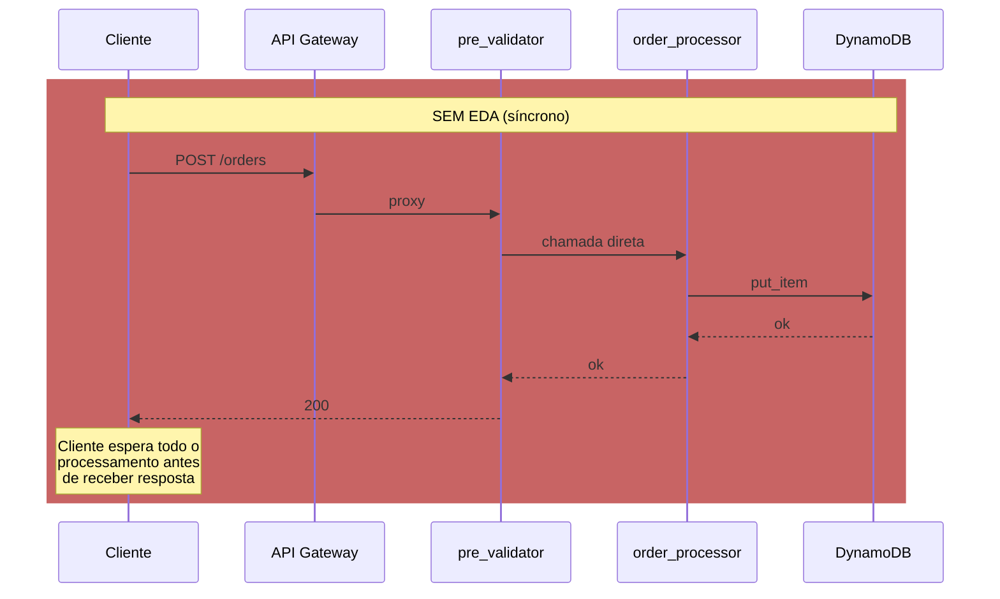
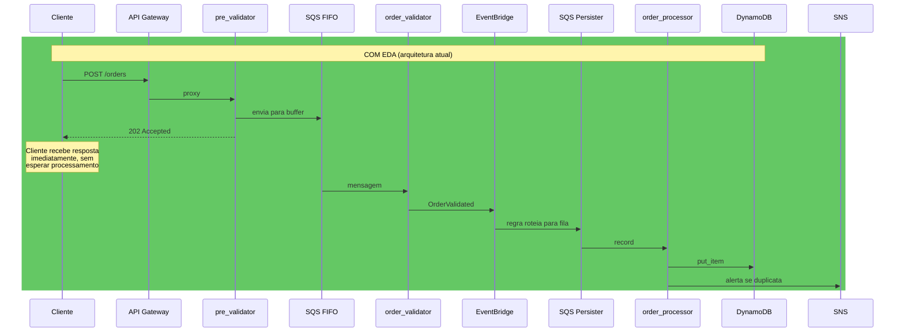
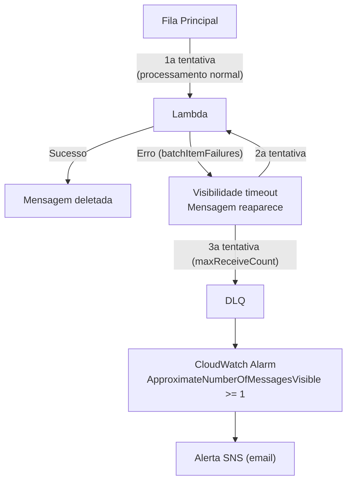
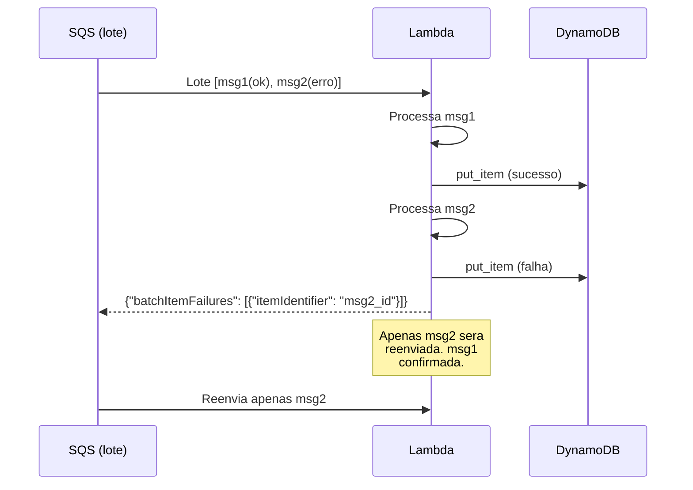
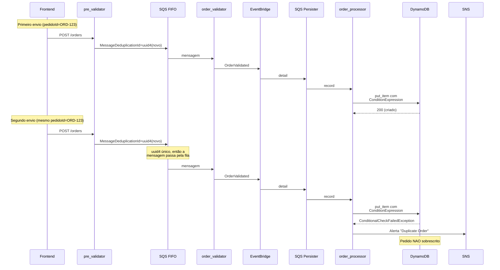
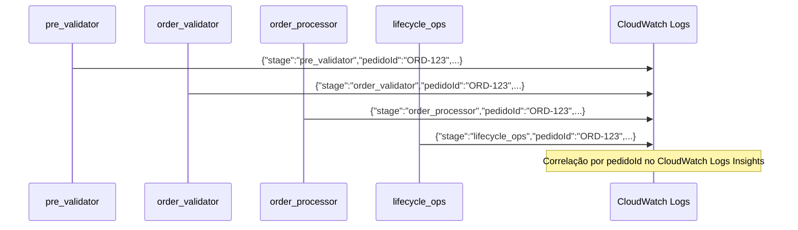
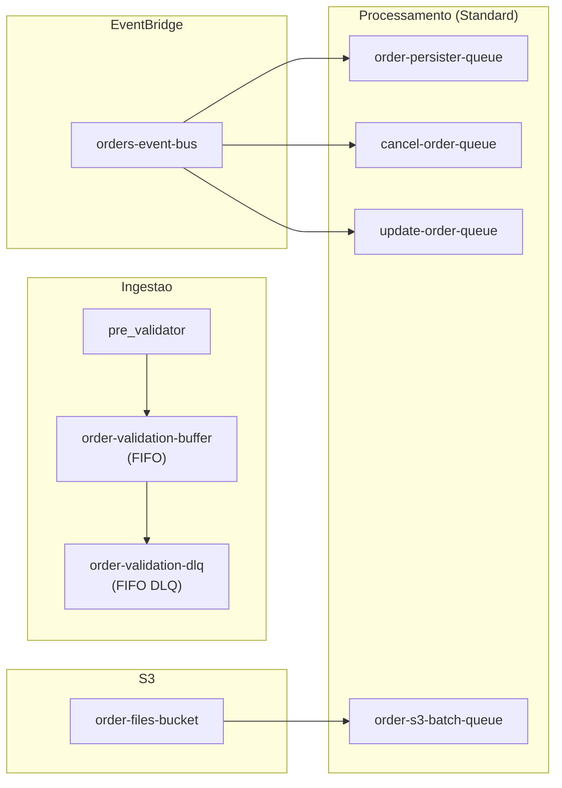
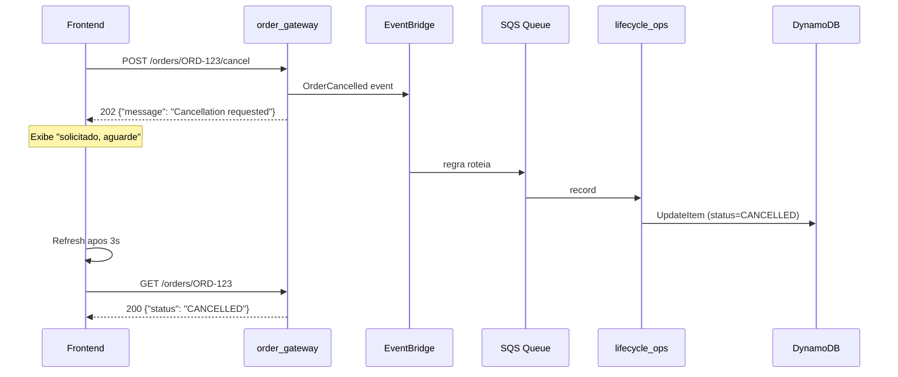

# Decisões de Arquitetura

## Sumário

1.  [Por que Event-Driven Architecture?](#1-por-que-event-driven-architecture)
2.  [Resiliência: DLQ, batchItemFailures e VisibilityTimeout](#2-resiliência-dlq-batchitemfailures-e-visibilitytimeout)
3.  [Idempotência: ConditionExpression vs deduplicação na fila](#3-idempotência-conditionexpression-vs-deduplicação-na-fila)
4.  [Seguranca sem WAF, Cognito e KMS](#4-seguranca-sem-waf-cognito-e-kms)
5.  [Observabilidade sem X-Ray](#5-observabilidade-sem-x-ray)
6.  [Controle de custo em conta de laboratório](#6-controle-de-custo-em-conta-de-laboratório)
7.  [IaC com shell scripts: escolha e limites](#7-iac-com-shell-scripts-escolha-e-limites)
8.  [FIFO vs Standard: quando usar cada um](#8-fifo-vs-standard-quando-usar-cada-um)
9.  [Frontend: localStorage, JWT e operações assincronas](#9-frontend-localstorage-jwt-e-operações-assincronas)
10. [O que seria diferente em produção real](#10-o-que-seria-diferente-em-produção-real)

---

## 1. Por que Event-Driven Architecture?

### Diagrama comparativo

O fluxo abaixo mostra a diferença entre uma abordagem síncrona (sem barramento de eventos) e a arquitetura atual com EventBridge como orquestrador central.





### Benefícios da abordagem EDA

- **Desacoplamento:** `pre_validator` não conhece `order_processor`. A resposta 202 e retornada antes do pedido ser persistido.
- **Resiliência a falhas:** Se o DynamoDB estiver indisponível, a mensagem permanece na fila SQS com VisibilityTimeout, aguardando nova tentativa. Nenhum dado e perdido.
- **Escalabilidade independente:** Cada consumidor pode escalar separadamente (reserved_concurrency=5 para processamento, 10 para leitura).

### Trade-off aceito

Complexidade de observabilidade: um pedido atravessa 4+ Lambdas (pre_validator, order_validator, order_processor, lifecycle_ops). Rastrear uma única transação exige correlação manual por `pedidoId` via CloudWatch Logs Insights. A função `log_event()` em `src/common/utils.py` produz JSON estruturado com `pedidoId` para permitir essa correlação.

---

## 2. Resiliência: DLQ, batchItemFailures e VisibilityTimeout

### DLQ e maxReceiveCount

Cada fila SQS tem uma Dead Letter Queue (DLQ) associada com `maxReceiveCount=3`.



Cinco DLQs ativas: `validation-dlq`, `persister-dlq`, `cancel-dlq`, `update-dlq`, `s3-batch-dlq`. Cada uma tem um CloudWatch Alarm exclusivo.

### batchItemFailures

Todas as 4 Lambdas acionadas por SQS implementam o padrão `batchItemFailures`:



Retorno esperado: `{"batchItemFailures": [{"itemIdentifier": "messageId"}]}`. Sem a configuração, uma única falha derrubaria o lote inteiro de 5 mensagens.

### VisibilityTimeout

Formula: `VT > batch_size x lambda_timeout`. Configuração: `VT=360s, batch_size=5, lambda_timeout=60s`. Calculo: `360 > 5 x 60 = 300`. Margem de 60s para propagação de rede e overhead.

---

## 3. Idempotência: ConditionExpression vs deduplicação na fila

### Diagrama de duplicidade



### Por que não usar MessageDeduplicationId baseado no pedidoId?

Em versões iniciais, `MessageDeduplicationId = pedidoId`. Isso impedia que reenvios do mesmo pedido chegassem ao DynamoDB por 5 minutos (janela de deduplicação do SQS FIFO). Um frontend que tentasse reenviar o mesmo pedido não veria o alerta SNS, pois a mensagem não passava da fila.

A correção foi usar `MessageDeduplicationId = uuid4()` (sempre único) e mover a responsabilidade de deduplicação de negócio inteiramente para o DynamoDB:

| Aspecto | SQS FIFO | DynamoDB |
|---------|----------|----------|
| Janela | 5 minutos | Permanente |
| Efeito | Impede reenvio | Impede sobrescrita |
| Alerta | Nenhum | SNS com detalhes |

A `ConditionExpression: attribute_not_exists(orderId)` garante que mesmo com reenvios, o pedido original nunca e sobrescrito. Se o reenvio chegar ao `order_processor`, um alerta SNS e publicado.

---

## 4. Seguranca sem WAF, Cognito e KMS

### Tabela de compensações

| Requisito | Solução padrão de produção | Solução adotada (conta de laboratório) |
|---|---|---|
| Autenticação de usuário | Cognito User Pools | JWT HS256 manual com stdlib Python |
| Rotação de segredo JWT | Secrets Manager | Arquivo `.jwt-secret` local (idempotente) |
| Restrição de IP no endpoint /test | WAF IP Set | API Gateway Resource Policy com `NotIpAddress` |
| Rate limiting | WAF Rate Rule | Usage Plan com throttle rateLimit=5, burstLimit=10 |
| Signing de requests entre serviços | IAM Roles + SigV4 | Lambda IAM Roles com least privilege |
| Isolamento de dados por cliente | Cognito groups + DynamoDB FK | GSI `clientId-index` + validação ownership inline |

### JWT manual: decisões de implementação

O modulo `src/common/auth.py` implementa JWT HS256 sem dependencias externas:

- **Hash de senha:** PBKDF2-SHA256 com 200.000 iterações e salt de 16 bytes (`os.urandom`).
- **Criação do JWT:** Header `{"alg":"HS256","typ":"JWT"}`, payload com `iat`/`exp`, assinatura HMAC-SHA256, codificação base64url sem padding.
- **Validação do JWT:** `hmac.compare_digest` previne timing attack. Expiração checada por `time.time()`.
- **Ausência de dependencias:** Nenhum `requirements.txt` ou camada Lambda. O empacotamento zip contem apenas o codigo do projeto.

### Isolamento de dados por cliente

O GSI `clientId-index` na tabela `order-production-data` permite listar pedidos por `clientId` com `KeyConditionExpression`, sem scan.

A Lambda `order_gateway` valida ownership em todas as operações:

```python
def _get_owned_order(table, order_id, client_id):
    result = table.get_item(Key={"orderId": order_id})
    item = result.get("Item")
    if not item or item.get("clientId") != client_id:
        return None  # retorna 404 - mesmo codigo para "não encontrado" e "de outro cliente"
    return item
```

O retorno 404 genérico previne information disclosure: um cliente não consegue distinguir entre um pedido que não existe e um pedido que existe mas pertence a outro cliente.

---

## 5. Observabilidade sem X-Ray

### Correlação por pedidoId



A função `log_event(stage, pedido_id, message)` em `src/common/utils.py` produz JSON estruturado que permite queries de correlação no CloudWatch Logs Insights:

```
fields @timestamp, stage, pedidoId, message
| filter pedidoId = "ORD-123"
| sort @timestamp asc
```

### Por que não X-Ray?

X-Ray não esta disponível na conta de laboratório. Em produção, X-Ray com sampling ativo substituiria o log estruturado para rastreamento distribuído, mantendo o log estruturado apenas para auditoria de negócio.

### Logs de erro vs logs de sucesso

Logs de sucesso contem apenas `pedidoId` e estagio (sem payload completo). Logs de erro (blocos `except`) mantem detalhes completos do evento, pois ocorrem com baixa frequência. Essa estrategia reduz custo de ingestao do CloudWatch.

---

## 6. Controle de custo em conta de laboratório

### Decisões e configurações

| Decisão | Impacto | Configuração |
|---|---|---|
| Reserved Concurrency | Limita execuções simultaneas | 5 por Lambda de processamento, 10 para read/catalog |
| Log retention | Elimina acumulo indefinido de logs | 14 dias em todos os log groups |
| DynamoDB PAY_PER_REQUEST | Sem custo de capacidade ociosa | Todas as tabelas |
| TTL na tabela de auditoria | Remove registros antigos automaticamente | 90 dias, campo `expiresAt` |
| S3 Static Website | Sem custo de servidor web | Frontend servido diretamente do S3 |
| Lambda timeout 60s | Evita cobranca por execuções longas | Todas as funções |

### Reserved Concurrency como proteção de custo

O `reserved_concurrency` limita o numero maximo de execuções simultaneas de cada Lambda. Nao se trata de otimização de performance, mas de proteção de custo em conta compartilhada de laboratório. Sem WAF ou Usage Plan obrigatório em todas as rotas, um volume alto de chamadas poderia gerar custo inesperado.

---

## 7. IaC com shell scripts: escolha e limites

### O que os scripts fazem

Cada script de deploy segue o padrão `ensure_*`: verifica se o recurso ja existe antes de criar (check-before-create). Exemplo de funções:

| Função | Comportamento |
|---|---|
| `ensure_lambda_function` | `aws lambda get-function` -> se existe, `update-function-code`; se não, `create-function` |
| `ensure_sqs_queue` | `aws sqs get-queue-url` -> cria com DLQ, VisibilityTimeout, URL/ARN |
| `ensure_iam_lambda_role` | `aws iam get-role` -> cria com trust policy e inline permissions |
| `poll_resource` | Polling genérico com timeout para aguardar recursos ficarem prontos |

### Comparação com Terraform

| Aspecto | Shell + AWS CLI | Terraform |
|---|---|---|
| Preview de mudancas | Nenhum (sem plan) | `terraform plan` |
| Grafo de dependencias | Manual (ordem dos scripts) | Automático |
| State management | Nenhum (idempotência via check) | `terraform.tfstate` |
| Portabilidade multi-cloud | Nenhuma | Alta (providers) |
| Curva de aprendizado | Baixa (AWS CLI direto) | Media |
| Exposição ao serviço AWS | Alta (cada parâmetro explicito) | Baixa (abstraida pelo provider) |

### Por que shell scripts?

A escolha foi intencional para fins educacionais. Cada script expoe os parâmetros reais da API AWS. Por exemplo, ao configurar um target EventBridge para SQS FIFO, o script passa explicitamente `SqsParameters={"MessageGroupId":"..."}`, `ContentBasedDeduplication`, e a Resource-Based Policy da fila. Em um projeto de produção com equipe, Terraform ou CDK seriam preferidos pelo plan preview e state management.

---

## 8. FIFO vs Standard: quando usar cada um

### Mapa de filas no sistema



### Tabela de tipos

| Fila | Tipo | Motivo |
|---|---|---|
| order-validation-buffer | FIFO | Ordenação por pedido (MessageGroupId=pedidoId), ContentBasedDeduplication |
| order-validation-dlq | FIFO | DLQ de fila FIFO deve ser FIFO |
| order-persister-queue | Standard | Idempotência garantida pelo DynamoDB, paralelismo desejado |
| cancel-order-queue | Standard | Idem |
| update-order-queue | Standard | Idem |
| order-s3-batch-queue | Standard | Notificações S3 não garantem ordem, Standard e suficiente |

### O bug de Rodada 4

Inicialmente, as filas de processamento (persister, cancel, update) eram FIFO com `MessageGroupId` estático. Isso forcava processamento sequencial: mesmo que dois pedidos fossem independentes, um precisava terminar para o outro comecar. Como a idempotência ja era garantida pelo DynamoDB, não havia ganho de corretude com a ordenação estrita. A conversão para Standard restaurou o paralelismo sem perda de integridade.

---

## 9. Frontend: localStorage, JWT e operações assincronas

### JWT em localStorage

O token JWT e armazenado em `localStorage` (chave `oms_token`). A escolha e motivada pela arquitetura do frontend:

- **E uma SPA servida por S3 Static Website** - não ha um servidor Node para fazer `Set-Cookie` com flag HttpOnly.
- **Nao ha backend de sessão** - todo o estado de autenticação e gerenciado no cliente.
- **Risco aceito:** XSS pode ler `localStorage`. Em produção, mitigações incluiriam Content Security Policy, HttpOnly cookie com BFF (Backend for Frontend) pattern.

### Operações assincronas (202)

Cancelamento e atualização de pedidos retornam HTTP 202, não 200:



O frontend exibe feedback imediato ("solicitado, aguarde") e faz refresh apos 3 segundos para mostrar o estado atual, sem polling agressivo.

### Ponte clienteId/clientId

O campo `clienteId` no JWT (payload do token) corresponde ao campo `clientId` no DynamoDB. A ponte funciona em tres camadas:

1. **Frontend:** injeta `{"pedidoId","clienteId","itens"}` no `POST /orders` extraindo `clienteId` do `localStorage`.
2. **order_processor:** armazena o atributo `clientId` no DynamoDB (o nome do campo e diferente na tabela).
3. **order_gateway:** faz a ponte explicitamente: extrai `clienteId` do JWT e busca por `clientId` no GSI.

---

## 10. O que seria diferente em produção real

### Itens de melhoria para ambiente de produção

| Item | Solução atual | Produção real | Motivo da não adoção |
|---|---|---|---|
| Autenticação | JWT HS256 manual em `common/auth.py` | Cognito User Pools com Lambda Authorizer | Conta de laboratório sem Cognito |
| Gerenciamento de segredo | Arquivo `.jwt-secret` local | AWS Secrets Manager com rotação automática | Conta de laboratório sem Secrets Manager |
| Autorização de endpoints | Validação JWT inline em cada Lambda | Lambda Authorizer ou Cognito Authorizer centralizado | Simplicidade em sistema pequeno |
| Restrição de rede | API Gateway Resource Policy + Usage Plan | WAF com IP Set e Rate Rule | Conta de laboratório sem WAF |
| Rastreamento distribuído | `log_event()` com JSON estruturado | AWS X-Ray com sampling ativo | Conta de laboratório sem X-Ray |
| IaC | Shell scripts com `ensure_*` idempotente | Terraform ou CDK com plan preview | Escopo educacional (expor APIs AWS reais) |
| CDN e HTTPS | S3 Static Website direto | CloudFront com OAI para HTTPS e cache de borda | Simplicidade; LocalStack não suporta CloudFront |
| Seguranca de rede | Lambdas em VPC default | VPC com endpoints privados e NAT Gateway | Custo e complexidade desnecessários para laboratório |
| Pagamento real | Sem integração de pagamento | Stripe, PagSeguro ou Gateway de pagamento como etapa entre PROCESSED | Escopo do projeto e gerenciamento de pedidos |
| Testes unitários | `validate-flow.sh` E2E via AWS CLI | pytest com moto para testes unitários e de integração | Escopo educacional; E2E cobre cenários principais |
