# AWS Serverless Order Management System

[](LICENSE)
[](https://www.python.org/downloads/release/python-3120/)
[](https://aws.amazon.com/serverless/)
[](https://localstack.cloud/)

## Sobre o Projeto

Um sistema serverless de gerenciamento de pedidos para cursos e vouchers de certificação em nuvem. Clientes se cadastram, navegam por um catálogo de cursos (AWS, Azure, GCP), compram com um clique e acompanham o ciclo de vida completo do pedido (processamento, atualização, cancelamento). O sistema foi construído em 11 rodadas iterativas, cada uma adicionando uma camada de complexidade, e documenta decisões de design conscientes em cada etapa.

A arquitetura e orientada a eventos: o barramento central EventBridge desacopla produtores de consumidores, filas SQS absorvem picos de carga e garantem resiliência a falhas temporárias, e o DynamoDB lida com idempotência via ConditionExpression. Nenhuma chamada síncrona cruza fronteiras de serviço. O projeto opera exclusivamente via AWS CLI e shell scripts, sem frameworks de Infrastructure as Code, expondo os parâmetros reais de cada serviço AWS.

Este projeto e material de portfolio. Cada decisão técnica foi tomada com consciência dos trade-offs, documentada em [ARCHITECTURE.md](ARCHITECTURE.md), e revisada ao longo das rodadas. O objetivo e demonstrar pensamento sistêmico sobre arquitetura serverless, não apenas a implementação funcional.

## Demo Rapida

**Fluxo completo:** cadastro > catálogo > compra > meus pedidos > cancelar

1. Acesse o frontend (URL exibida apos deploy).
2. Cadastre-se com email e senha.
3. Navegue pelo catálogo, filtre por provedor (AWS/Azure/GCP) ou tipo (Curso/Voucher).
4. Clique em "Comprar" em qualquer curso.
5. Va para "Meus Pedidos" para ver o status.
6. Clique em um pedido para detalhe: cancele ou atualize os itens.

**Links apos deploy:**
- [Frontend CloudCert]($FRONTEND_URL)
- [QA Dashboard]($FRONTEND_URL/qa.html)

## Arquitetura

```mermaid
%%{init: {'flowchart': {'nodeSpacing': 15, 'rankSpacing': 25, 'padding': 6}}}%%
flowchart LR
    Browser["Browser index.html"]:::s_cliente
    QA["Browser qa.html"]:::s_qa
    STATICSITE["S3 Static Website"]:::s_s3fe

    subgraph APIGW["API Gateway (order-ingestion-api)"]
        GW_POST["/orders POST"]
        GW_GET["/orders GET"]
        GW_GET_ID["/orders/{id} GET"]
        GW_CANCEL["/orders/{id}/cancel POST"]
        GW_PATCH["/orders/{id} PATCH"]
        GW_CAT["/catalog GET"]
        GW_CAT_ID["/catalog/{id} GET"]
        GW_REG["/customers/register POST"]
        GW_LOGIN["/customers/login POST"]
        GW_ME["/customers/me GET"]
        GW_TEST["/test POST (API Key)"]
    end

    subgraph LambdaIngestao["Lambdas de Ingestao"]
        PRE["pre_validator"]
        VAL["order_validator"]
    end

    subgraph LambdaProduto["Lambdas de Produto"]
        GWL["order_gateway"]
        CAT["catalog_reader"]
        AUTH["customer_auth"]
        CTRL["test_controller"]
    end

    subgraph LambdaProcessamento["Lambdas de Processamento"]
        PROC["order_processor"]
        CANCEL["lifecycle_ops (cancel)"]
        UPDATE["lifecycle_ops (update)"]
        BATCH["batch_processor"]
    end

    subgraph SQS_Filas["Filas SQS"]
        FIFO["order-validation-buffer (FIFO)"]
        PERSQ["order-persister-queue (Standard)"]
        CANCELQ["cancel-order-queue (Standard)"]
        UPDATEQ["update-order-queue (Standard)"]
        BATCHQUEUE["order-s3-batch-queue (Standard)"]
    end

    subgraph DynamoDB_Tables["DynamoDB"]
        PROD["order-production-data + GSI clientId-index"]
        AUDIT["order-batch-audit (TTL 90 dias)"]
        CATALOG["course-catalog"]
        CUSTOMERS["customer-data"]
    end

    EB["orders-event-bus"]:::s_eb

    subgraph SNS_CW["SNS + CloudWatch"]
        SNS["order-notifications (email)"]
        CW["CloudWatch Alarms (5 DLQs)"]
    end

    DATABUCKET["order-files-bucket"]:::s_s3d

    Browser --> STATICSITE
    QA --> STATICSITE
    Browser --> GW_POST & GW_GET & GW_GET_ID & GW_CANCEL & GW_PATCH & GW_CAT & GW_CAT_ID & GW_REG & GW_LOGIN & GW_ME
    QA --> GW_TEST

    GW_POST --> PRE --> FIFO --> VAL --> EB
    GW_GET & GW_GET_ID & GW_CANCEL & GW_PATCH --> GWL
    GW_CAT & GW_CAT_ID --> CAT
    GW_REG & GW_LOGIN & GW_ME --> AUTH
    GW_TEST --> CTRL

    GWL --> PROD
    GWL --> EB
    CAT --> CATALOG
    AUTH --> CUSTOMERS
    CTRL --> EB & DATABUCKET

    EB --> PERSQ --> PROC --> PROD
    EB --> CANCELQ --> CANCEL --> PROD
    EB --> UPDATEQ --> UPDATE --> PROD
    DATABUCKET --> BATCHQUEUE --> BATCH --> AUDIT

    subgraph Legend["Legenda"]
        L1["Acesso do Cliente (HTTP)"]:::l_http
        L2["Pipeline de Ingestao"]:::l_ing
        L3["Roteamento para Lambdas de Dominio"]:::l_route
        L4["Consultas e Persistencia em Dados"]:::l_data
        L5["Processamento Orientado a Eventos"]:::l_event
        L6["Processamento Batch S3"]:::l_batch
    end

    style APIGW fill:#3F51B5,color:#fff,stroke:#3949AB
    style LambdaIngestao fill:#3949AB,color:#fff,stroke:#303F9F
    style LambdaProduto fill:#303F9F,color:#fff,stroke:#283593
    style LambdaProcessamento fill:#283593,color:#fff,stroke:#1A237E
    style SQS_Filas fill:#00838F,color:#fff,stroke:#006064
    style DynamoDB_Tables fill:#1A237E,color:#fff,stroke:#283593
    style SNS_CW fill:#37474F,color:#fff,stroke:#455A64
    style Legend fill:#F5F5F5,color:#333,stroke:#9E9E9E

    classDef s_cliente fill:#7986CB,color:#fff,stroke:#5C6BC0
    classDef s_qa fill:#9FA8DA,color:#fff,stroke:#7986CB
    classDef s_s3fe fill:#5C6BC0,color:#fff,stroke:#3F51B5
    classDef s_eb fill:#006064,color:#fff,stroke:#00838F
    classDef s_s3d fill:#283593,color:#fff,stroke:#1A237E
    classDef l_http fill:#5C6BC0,color:#fff,stroke:#5C6BC0
    classDef l_ing fill:#3949AB,color:#fff,stroke:#3949AB
    classDef l_route fill:#303F9F,color:#fff,stroke:#303F9F
    classDef l_data fill:#1A237E,color:#fff,stroke:#1A237E
    classDef l_event fill:#00838F,color:#fff,stroke:#00838F
    classDef l_batch fill:#006064,color:#fff,stroke:#006064

    linkStyle 0,1,2,3,4,5,6,7,8,9,10,11,12 stroke:#5C6BC0,stroke-width:2px
    linkStyle 13,14,15,16 stroke:#3949AB,stroke-width:2px
    linkStyle 17,18,19,20,21,22,23,24,25,26 stroke:#303F9F,stroke-width:2px
    linkStyle 27,28,29,30,31,32 stroke:#1A237E,stroke-width:2px
    linkStyle 33,34,35,36,37,38,39,40,41 stroke:#00838F,stroke-width:2px
    linkStyle 42,43,44 stroke:#006064,stroke-width:2px
```



Para decisões detalhadas de design, veja [ARCHITECTURE.md](ARCHITECTURE.md).

## Stack e Servicos AWS

| Servico | Papel no sistema | Alternativa avaliada |
|---|---|---|
| **API Gateway** | Ponto de entrada REST (11 endpoints) com Request Validator, CORS, API Key para /test | N/A (único serviço de API HTTP serverless da AWS) |
| **Lambda** | 11 funções Python 3.12 para lógica de negócio serverless | ECS/Fargate: overhead operacional desnecessário para funções de curta duração |
| **SQS FIFO** | Buffer de validação com ordenação por pedido e ContentBasedDeduplication | Processamento síncrono: sem resiliência a falhas temporárias |
| **SQS Standard** | 3 filas de processamento + 1 fila S3 batch, paralelismo garantido | FIFO para processamento: forjava sequencial sem ganho de corretude |
| **EventBridge** | Barramento central de eventos, roteia por detail-type e source | SNS fanout: menor expressividade de filtro e sem suporte a Content-Based Filtering |
| **DynamoDB** | 4 tabelas: pedidos (com GSI), auditoria (TTL 90d), catálogo, clientes | RDS: custo e operação mais altos para volume variável de laboratório |
| **SNS** | Notificações de erro (duplicata, schema inválido, DLQ) para email | N/A (único serviço de pub/sub email da AWS) |
| **S3** | 2 buckets: dados (batch files) e frontend (static website) | EFS: sem necessidade de sistema de arquivos compartilhado |
| **IAM** | 11 roles com politicas de menor privilegio, inline e gerenciadas | N/A (único serviço de autorização AWS) |
| **CloudWatch** | Logs (retenção 14d), Alarmes (5 DLQs), métricas | X-Ray: não disponível na conta de laboratório |
| **LocalStack** | Emulação local de serviços AWS via Docker | AWS real: custo para desenvolvimento iterativo |

## Estrutura do Repositorio

```text
.
├── scripts/              # IaC: deploy, validação, utilitários (26 funções lib.sh)
├── src/                  # Codigo-fonte das 11 Lambdas + modulo common/
├── frontend/             # 2 frontends: CloudCert (index.html) + QA Dashboard (qa.html)
├── samples/              # Payloads de teste (api_request.json, batch JSONs)
├── docs/                 # Documentação individual por componente (16 arquivos)
├── ARCHITECTURE.md       # Decisões de design por tema (este documento)
├── run.sh                # Orquestrador principal: deploy completo + validação
└── cleanup.sh            # Remoção completa de recursos (idempotente)
```

## Como Executar

### Pre-requisitos

- AWS CLI v2 configurado
- Python 3.12
- Docker e Docker Compose (para LocalStack)
- Utilitário `zip`

### Deploy Local (LocalStack)

```bash
cp .env.example .env
docker-compose up -d
./run.sh
```

### Deploy na AWS

Edite `.env`: defina `DEPLOY_TARGET=aws`, preencha `AWS_REGION`, `RESOURCE_SUFFIX`, `NOTIFICATION_EMAIL`.

```bash
./run.sh
```

### Executar testes E2E

```bash
./scripts/validate-flow.sh
```

25 testes que cobrem: criação de pedidos, processamento S3 batch, lifecycle (cancelar/atualizar), duplicatas, consultas, alertas SNS, filas DLQ, catálogo, autenticação JWT, gateway de pedidos, e frontends.

## Decisões de Design em Destaque

**Idempotência por ConditionExpression no DynamoDB em vez de deduplicação na fila.** A janela de 5 minutos do SQS FIFO impedia testes de duplicidade no frontend. A solução foi usar `MessageDeduplicationId = uuid4()` (sempre único) e delegar a deduplicação de negócio ao `ConditionExpression: attribute_not_exists(orderId)` no DynamoDB, que e permanente e gera alerta SNS. Detalhes em [ARCHITECTURE.md#3-idempotência-conditionexpression-vs-deduplicação-na-fila](ARCHITECTURE.md#3-idempotência-conditionexpression-vs-deduplicação-na-fila).

**JWT implementado manualmente em stdlib Python sem dependencias externas.** A conta de laboratório não tem Cognito, Secrets Manager nem KMS CMK. O modulo `common/auth.py` implementa PBKDF2-SHA256 (200.000 iterações), HMAC-SHA256, e `compare_digest` contra timing attack. Sem `requirements.txt` ou camada Lambda. Detalhes em [ARCHITECTURE.md#4-seguranca-sem-waf-cognito-e-kms](ARCHITECTURE.md#4-seguranca-sem-waf-cognito-e-kms).

**Resource Policy do API Gateway com padrão Allow geral + Deny condicional.** A implementação inicial usava Allow-only com `IpAddress`, que bloqueava endpoints públicos (`POST /orders`, `GET /orders`) quando a restrição de IP era ativada. A correção (Rodada 7) usou o padrão Allow geral para toda a API + Deny condicional restrito a `*/*/POST/test`, respeitando a precedência do Deny sobre Allow. Detalhes em [ARCHITECTURE.md#4-seguranca-sem-waf-cognito-e-kms](ARCHITECTURE.md#4-seguranca-sem-waf-cognito-e-kms).

**batchItemFailures em todas as Lambdas SQS para reprocessamento parcial de lote.** Sem essa configuração, uma falha em uma das 5 mensagens do lote derrubava o lote inteiro, reprocessando mensagens ja bem-sucedidas. Com `ReportBatchItemFailures`, apenas os `messageId` com erro retornam na resposta, e as mensagens bem-sucedidas são confirmadas. Detalhes em [ARCHITECTURE.md#2-resiliência-dlq-batchitemfailures-e-visibilitytimeout](ARCHITECTURE.md#2-resiliência-dlq-batchitemfailures-e-visibilitytimeout).

## Historico de Evolução

| Rodada | Foco | Principal entrega |
|---|---|---|
| 1 | API + Validação | API Gateway, pre_validator, order_validator, SQS FIFO, EventBridge |
| 2 | S3 + Auditoria | batch_processor, S3 data lake, DynamoDB audit, SNS alerts |
| 3 | Polimento | Restrição de permissões, mensagens malformadas com SNS, correções de logging |
| 4 | Lifecycle | lifecycle_ops (cancelar/atualizar), estado terminal CANCELLED, dedup movida para DynamoDB |
| 5 | Seguranca e custo | Usage Plan + API Key, Resource Policy, Request Validator, DLQ alarms, TTL audit, Reserved Concurrency |
| 6 | Correções | Diagrama Mermaid corrigido, Resource Policy refinada, cleanup completo |
| 7 | Resource Policy | Allow geral + Deny condicional, padrão parse_body centralizado |
| 8 | Identidade | customer_auth (cadastro/login/JWT), common/auth.py, tabela customer-data |
| 9 | Catalogo | catalog_reader (vitrine pública), tabela course-catalog, seed de 11 cursos |
| 10 | Gateway | order_gateway (CRUD autenticado), GSI clientId-index, ownership validation |
| 11 | Frontend | CloudCert (produto), QA Dashboard preservado, deploy com 6 arquivos |
| 12 | Documentação | README orientado a portfolio, ARCHITECTURE.md, diagrama consolidado |

## Licenca e Contato

Distribuido sob licença MIT. Projeto desenvolvido por [Jose Anderson](https://github.com/DessimA).
