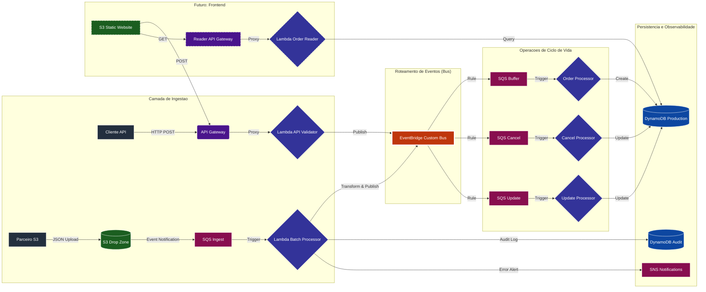
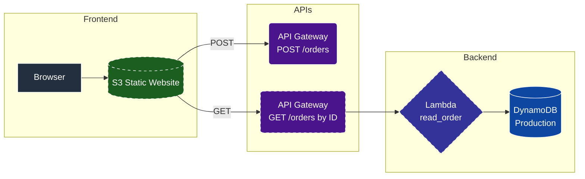

# AWS Serverless Order Management System

## 1. Introdução
Este projeto documenta a construção de um sistema de gerenciamento de pedidos escalável e resiliente, utilizando uma arquitetura orientada a eventos (Event-Driven Architecture - EDA). A solução foi projetada para lidar com alta concorrência, garantindo a integridade dos dados e o desacoplamento entre os produtores de pedidos e os processadores de negócio.

O sistema suporta múltiplos canais de entrada e gerencia o ciclo de vida completo de um pedido, desde a validação inicial até estados finais como alteração de itens ou cancelamento.

## 2. Arquitetura do Sistema

A arquitetura utiliza o padrão de barramento de eventos para permitir que o sistema cresça de forma modular. Abaixo, o fluxograma técnico da solução:



## 3. Stack Tecnológica
*   **Linguagem de Programação:** Python 3.12 utilizando o SDK Boto3.
*   **Infraestrutura como Código (IaC):** Automação via Shell Scripting e AWS CLI.
*   **Serviços AWS:**
    *   **Amazon API Gateway:** Ponto de entrada REST para integração síncrona.
    *   **AWS Lambda:** Execução de lógica de negócio serverless.
    *   **Amazon S3:** Armazenamento de objetos para processamento em lote.
    *   **Amazon SQS:** Filas FIFO para garantia de ordem e Standard para buffer de processamento.
    *   **Amazon EventBridge:** Orquestrador de eventos para desacoplamento total.
    *   **Amazon DynamoDB:** Banco de dados NoSQL para persistência de alta performance.
    *   **Amazon SNS:** Serviço de notificações para alertas de erro.
    *   **AWS IAM:** Gerenciamento de permissões baseado no princípio de menor privilégio.
*   **Ambiente Local:** LocalStack Pro (via Docker) para emulação de serviços AWS.

---

## 4. Detalhamento dos Componentes

### 4.1. Camada de Ingestão Síncrona (API)
O fluxo inicia no **Amazon API Gateway**, que expõe um endpoint REST. A requisição é encaminhada para a Lambda `api_validator`. Esta função realiza o parse do JSON e valida a presença de campos obrigatórios (`pedidoId` e `clienteId`). Uma vez validado, o pedido é publicado no **Amazon EventBridge Custom Bus**. O uso do EventBridge aqui garante que a API responda rapidamente ao cliente, enquanto o processamento pesado ocorre de forma assíncrona.

### 4.2. Camada de Ingestão Assíncrona (S3 Batch)
Projetada para integração com sistemas legados ou parceiros que exportam arquivos. Quando um arquivo JSON é carregado no **Amazon S3**, uma notificação de evento é enviada para uma fila **SQS Standard**. A Lambda `batch_processor` consome esta fila, baixa o arquivo, valida o schema e extrai os pedidos individuais. 
*   **Auditoria:** Cada arquivo processado tem seu status (PROCESSED ou ERROR) registrado na tabela DynamoDB de auditoria.
*   **Alertas:** Em caso de falha no schema do arquivo, um alerta é disparado via **Amazon SNS** para o e-mail do administrador.

### 4.3. Barramento de Eventos (EventBridge)
Atua como o sistema nervoso central da arquitetura. Ele recebe eventos de ambas as fontes de ingestão. Através de **Regras (Rules)** baseadas em padrões de eventos (`source` e `detail-type`), o EventBridge roteia os dados para as filas SQS específicas de cada operação (Criação, Alteração ou Cancelamento).

### 4.4. Camada de Persistência e Ciclo de Vida
As Lambdas de processamento final são acionadas por filas SQS que atuam como buffers de carga.
*   **Order Processor:** Cria o registro inicial na tabela `orders-production-db` com `ConditionExpression: attribute_not_exists(orderId)` para impedir sobrescrita de pedidos duplicados.
*   **Update Processor:** Atualiza itens de pedidos existentes utilizando `UpdateExpression` e `ConditionExpression: attribute_exists(orderId)` para garantir que o pedido existe antes de alterá-lo.
*   **Cancel Processor:** Altera o status do pedido para `CANCELLED` com `ConditionExpression: attribute_exists(orderId)`, prevenindo criação de registros fantasmas.

## 5. Estrutura do Projeto

A organização do repositório segue padrões de modularidade para facilitar a manutenção e o deploy independente de componentes:

```text
aws-serverless-order-ingestion/
├── scripts/                    # Infraestrutura como Codigo (IaC) e Deploy
│   ├── lib.sh                  # Funcoes utilitarias (wait IAM, validate env, load env)
│   ├── deploy-api-flow.sh      # Provisiona API Gateway e Ingestao Sincrona
│   ├── deploy-s3-flow.sh       # Provisiona S3, Auditoria e Alertas SNS
│   ├── deploy-order-processor.sh # Provisiona o Processador Central
│   ├── deploy-lifecycle-ops.sh # Provisiona fluxos de Alterar e Cancelar
│   ├── deploy-frontend.sh      # (Planejado) Frontend S3 + API de consulta
│   └── validate-flow.sh        # Script automatizado de testes E2E
├── src/                        # Codigo-fonte das funcoes AWS Lambda
│   ├── api_validator/          # Logica de validacao e producao de eventos
│   ├── batch_processor/        # Logica de extracao de arquivos e auditoria
│   ├── order_processor/        # Persistencia do estado inicial do pedido
│   ├── lifecycle_ops/          # Operacoes de atualizacao e cancelamento
│   └── read_order/             # (Planejado) Leitura de pedidos para o frontend
├── frontend/                   # (Planejado) Arquivos estaticos do frontend
│   ├── index.html
│   ├── style.css
│   └── app.js
├── samples/                    # Exemplos de payloads para testes e integracao
│   ├── api_request.json        # Modelo de requisicao para o API Gateway
│   ├── valid_batch.json        # Modelo de arquivo para processamento S3
│   └── invalid_batch.json      # Modelo para teste de falha e alerta SNS
├── .env.example                # Template de variaveis de ambiente
├── docker-compose.yaml         # Orquestracao do ambiente LocalStack Pro
├── run.sh                      # Script principal de automacao do Lab
└── README.md                   # Documentacao tecnica completa
```

---

## 6. Pré-requisitos Técnicos

Antes de iniciar a implantação, certifique-se de ter as seguintes ferramentas instaladas e configuradas:

*   **AWS CLI v2:** Configurado com credenciais válidas (`aws configure`).
*   **Python 3.12:** Necessário para a execução das funções Lambda.
*   **Docker e Docker Compose:** Obrigatórios para a execução via LocalStack.
*   **Utilitário Zip:** Utilizado pelos scripts de automação para empacotar o código-fonte das Lambdas.
*   **JQ (Opcional):** Recomendado para formatar as saídas JSON no terminal.

## 7. Configuração do Ambiente

O projeto utiliza um arquivo de variáveis de ambiente para centralizar as configurações e evitar a exposição de dados sensíveis.

1.  Localize o arquivo `.env.example` na raiz do projeto.
2.  Crie uma cópia chamada `.env`:
    ```bash
    cp .env.example .env
    ```
3.  Preencha as variáveis conforme as instruções abaixo:
    *   `AWS_REGION`: Região de destino (ex: `us-east-2`).
    *   `RESOURCE_SUFFIX`: Identificador único para evitar conflitos de nomes (ex: seu nome).
    *   `NOTIFICATION_EMAIL`: E-mail que receberá os alertas do Amazon SNS.
    *   `LOCALSTACK_AUTH_TOKEN`: Seu token de acesso (necessário para recursos Pro no LocalStack).

## 8. Execução via LocalStack (Desenvolvimento Local)

Este projeto foi validado utilizando o LocalStack Pro, permitindo um ciclo de desenvolvimento rápido e sem custos de infraestrutura.

1.  **Subir o container:**
    ```bash
    docker-compose up -d
    ```
2.  **Verificar a saúde do ambiente:**
    Acesse `http://localhost:4566/_localstack/health` para garantir que os serviços (Lambda, SQS, S3, DynamoDB, EventBridge) estão prontos.
3.  **Configurar o endpoint local (Opcional):**
    Para facilitar o uso do CLI apontando para o LocalStack, você pode utilizar o alias `awslocal` ou configurar o endpoint manualmente nos comandos.

## 9. Implantação Automatizada

O projeto conta com um orquestrador principal (`run.sh`) que gerencia a ordem de precedência das dependências (ex: criar o Event Bus antes das Regras).

Para realizar o deploy completo, execute:

```bash
chmod +x run.sh
./run.sh
```

### O que o script realiza:
1.  **Validação de Permissões:** Garante que todos os scripts na pasta `scripts/` são executáveis.
2.  **Deploy Fase 1 (API):** Provisiona o API Gateway, a Lambda de validação e o Custom Event Bus.
3.  **Deploy Fase 2 (S3):** Cria o bucket de Drop Zone, a tabela de auditoria e o tópico SNS.
4.  **Deploy Fase 3 (Processor):** Provisiona a Lambda de persistência final e a tabela de produção.
5.  **Deploy Fase 4 (Lifecycle):** Configura as Lambdas de Alteração e Cancelamento e suas respectivas regras no EventBridge.
6.  **Validação E2E:** Dispara automaticamente o script `validate-flow.sh` para testar todos os componentes.

### Utilitários (scripts/lib.sh)
Os scripts de deploy compartilham uma biblioteca de funções comum:
- **`load_env`**: Carrega o `.env` de forma segura utilizando `set -a` + `source`.
- **`validate_env`**: Valida que variáveis obrigatórias estão definidas antes de prosseguir.
- **`wait_for_iam_role`**: Polling ativo (12 tentativas, 5s intervalo) que substitui `sleep` arbitrário, garantindo que a Role IAM esteja propagada antes de criar recursos dependentes.
- **`wait_for_lambda_active`**: Aguarda a Lambda atingir o estado `Active`.
- **`wait_for_sqs_queue`**: Aguarda a fila SQS ficar disponível após criação.

---

## 10. Guia de Testes e Validação

O sistema pode ser validado através de testes manuais ou utilizando o script automatizado `scripts/validate-flow.sh`.

### 10.1. Teste de Ingestão via API
Envie um pedido síncrono para o endpoint gerado pelo API Gateway:
```bash
curl -k -X POST <URL_DO_ENDPOINT>/prod/orders \
     -H "Content-Type: application/json" \
     -d '{"pedidoId": "ORD-001", "clienteId": "CLIENTE-TESTE", "itens": [{"sku": "PROD-A", "qtd": 1}]}'
```

### 10.2. Teste de Ingestão via S3 (Batch)
Faça o upload de um arquivo JSON para o bucket de Drop Zone:
```bash
aws s3 cp samples/valid_batch.json s3://order-drop-zone-<seu-sufixo>/
```

### 10.3. Teste de Operações de Ciclo de Vida
Simule eventos de alteração ou cancelamento diretamente no EventBridge:
```bash
aws events put-events --entries "[{
    \"Source\": \"app.orders.operations\",
    \"DetailType\": \"AlterarPedido\",
    \"Detail\": \"{\\\"pedidoId\\\": \\\"ORD-001\\\", \\\"novosItens\\\": [{\\\"sku\\\": \\\"PROD-B\\\", \\\"qtd\\\": 2}]}\",
    \"EventBusName\": \"pedidos-event-bus-<seu-sufixo>\"
}]"
```

## 11. Troubleshooting e Resolução de Problemas

Durante o desenvolvimento e implantação em ambientes reais da AWS ou LocalStack, alguns comportamentos comuns podem surgir. Abaixo estão as soluções aplicadas neste projeto:

### 11.1. Atraso na Propagação de IAM (Eventual Consistency)
**Problema:** O comando de criação da Lambda falha alegando que a Role não existe, mesmo após o comando de criação da Role ter retornado sucesso. </br>
**Solução:** Substituição de `sleep` fixo por polling ativo com `aws iam wait role-exists` (função `wait_for_iam_role` em `scripts/lib.sh`). O polling tenta a cada 5 segundos por até 60 segundos, garantindo que a propagação ocorreu sem desperdiçar tempo quando é mais rápida.

### 11.2. Erro de AccessDenied no S3 ou DynamoDB
**Problema:** A Lambda é executada, mas falha ao tentar ler um arquivo no S3 ou gravar no DynamoDB. </br>
**Causa:** Geralmente causada pela falta do caractere curinga `/*` no ARN do recurso na política IAM ou falta de permissões de leitura na Role. </br>
**Solução:** Revisão das políticas inline para garantir que o recurso seja `arn:aws:s3:::bucket-name/*` e inclusão de permissões explícitas para `s3:GetObject` e `dynamodb:PutItem`.

### 11.3. EventBridge não entrega mensagens no SQS
**Problema:** O evento é publicado com sucesso no barramento, mas a fila SQS de destino permanece vazia. </br>
**Causa:** A fila SQS precisa de uma **Resource-Based Policy** que autorize o serviço `events.amazonaws.com` a executar a ação `sqs:SendMessage`. </br>
**Solução:** O script `deploy-order-processor.sh` configura automaticamente a política da fila utilizando o atributo `Condition` para restringir o acesso apenas à regra específica (SourceArn).

### 11.4. Conflito de Mapeamento de Eventos (LocalStack)
**Problema:** Erro `ResourceConflictException` ao tentar criar um gatilho SQS para uma Lambda que já possui esse mapeamento. </br>
**Solução:** Adição de lógica de verificação idempotente nos scripts de deploy, utilizando queries JMESPath para verificar se o `UUID` do mapeamento já existe antes de tentar criá-lo.

### 11.5. Erro de Resolução de Host (LocalStack)
**Problema:** O comando `curl` falha com `Could not resolve host` ao tentar acessar o API Gateway localmente. </br>
**Solução:** No ambiente LocalStack, a URL deve seguir o padrão `https://{api-id}.execute-api.localhost.localstack.cloud:4566`. O script de validação foi ajustado para detectar o ambiente e montar a URL correta.

## 12. Resiliência com Dead Letter Queues (DLQ)

Todas as filas SQS deste projeto (Ingestão, Processamento, Alteração e Cancelamento) possuem uma DLQ associada. 
*   **Configuração:** `maxReceiveCount` definido como 3.
*   **Funcionamento:** Se uma Lambda falhar repetidamente ao processar uma mensagem (devido a erros de código ou indisponibilidade de recursos externos), a mensagem é movida para a DLQ após a terceira tentativa. Isso evita o bloqueio da fila principal e permite a análise posterior do dado corrompido sem perda de informação.

## 13. Próximos Passos (Frontend)

O sistema atualmente não possui uma interface gráfica para o usuário final. As seguintes melhorias estão planejadas:

### 13.1. Frontend via S3 Static Website
- Criação de um bucket S3 com Static Website Hosting para servir arquivos HTML/CSS/JS.
- Formulário de criação de pedidos que consome a API POST `/orders` existente.
- Consulta de pedidos por ID via uma nova API GET `/orders/{orderId}`.

### 13.2. Lambda de Leitura (`read_order`)
- Nova função Lambda para consultar pedidos na tabela `orders-production-db` via `GetItem`.
- Respostas com headers CORS para integração com o frontend.

### 13.3. API Gateway Separado para Leitura
- Novo REST API (`order-reader-api-{SUFFIX}`) com endpoint GET `/orders/{orderId}` e integração proxy Lambda.
- Recurso OPTIONS configurado para CORS preflight.

### 13.4. Script de Deploy (`deploy-frontend.sh`)
- Criação/atualização do bucket S3 de frontend com política de leitura pública.
- Upload dos arquivos estáticos com injeção das URLs das APIs via `sed`.
- Provisionamento da Lambda de leitura e do API Gateway de consulta.
- Integração ao pipeline do `run.sh`.

### Arquitetura Planejada



---
**Desenvolvido por [José Anderson](https://github.com/DessimA)**

---

