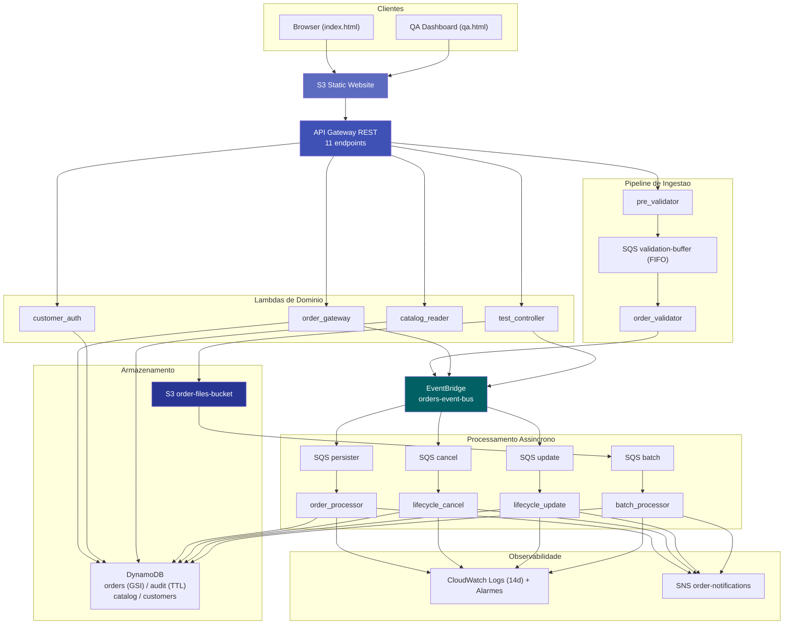

# AWS Serverless Order Management System

[](LICENSE)
[](https://www.python.org/downloads/release/python-3120/)
[](https://aws.amazon.com/serverless/)
[](https://localstack.cloud/)

## Sobre o Projeto

Um sistema serverless de gerenciamento de pedidos para cursos e vouchers de certificação em nuvem. Clientes se cadastram, navegam por um catálogo de cursos (AWS, Azure, GCP), compram com um clique e acompanham o ciclo de vida completo do pedido (processamento, atualização, cancelamento). A arquitetura e orientada a eventos: o barramento central EventBridge desacopla produtores de consumidores, filas SQS absorvem picos de carga e garantem resiliência a falhas temporárias, e o DynamoDB lida com idempotência via ConditionExpression. Nenhuma chamada síncrona cruza fronteiras de serviço. O provisionamento da infraestrutura e feito com Terraform, e os scripts shell orquestram o ciclo de deploy e validacao.

Este projeto e material de portfolio. Cada decisão técnica foi tomada com consciência dos trade-offs, documentada em [ARCHITECTURE.md](ARCHITECTURE.md), O objetivo e demonstrar pensamento sistêmico sobre arquitetura serverless, não apenas a implementação funcional.

## Demo Rapida

**Fluxo completo:** cadastro > catálogo > compra > meus pedidos > cancelar

1. Acesse o frontend (URL exibida apos deploy).
2. Cadastre-se com email e senha.
3. Navegue pelo catálogo, filtre por provedor (AWS/Azure/GCP) ou tipo (Curso/Voucher).
4. Clique em "Comprar" em qualquer curso.
5. Va para "Meus Pedidos" para ver o status.
6. Clique em um pedido para detalhe: cancele ou atualize os itens.

**Links apos deploy:** Os endpoints sao exibidos no terminal ao final do deploy (./run.sh).

## Arquitetura



Para decisões detalhadas de design, veja [ARCHITECTURE.md](ARCHITECTURE.md).

## Stack e Servicos AWS

| Servico | Papel no sistema | Alternativa avaliada |
|---|---|---|
| **API Gateway** | Ponto de entrada REST (11 endpoints) com Request Validator, CORS, API Key para /test | N/A (único serviço de API HTTP serverless da AWS) |
| **Lambda** | 10 funções Python 3.12 para lógica de negócio serverless | ECS/Fargate: overhead operacional desnecessário para funções de curta duração |
| **SQS FIFO** | Buffer de validação com ordenação por pedido e ContentBasedDeduplication | Processamento síncrono: sem resiliência a falhas temporárias |
| **SQS Standard** | 3 filas de processamento + 1 fila S3 batch, paralelismo garantido | FIFO para processamento: forjava sequencial sem ganho de corretude |
| **EventBridge** | Barramento central de eventos, roteia por detail-type e source | SNS fanout: menor expressividade de filtro e sem suporte a Content-Based Filtering |
| **DynamoDB** | 4 tabelas: pedidos (com GSI), auditoria (TTL 90d), catálogo, clientes | RDS: custo e operação mais altos para volume variável de laboratório |
| **SNS** | Notificações de erro (duplicata, schema inválido, DLQ) para email | N/A (único serviço de pub/sub email da AWS) |
| **S3** | 2 buckets: dados (batch files) e frontend (static website) | EFS: sem necessidade de sistema de arquivos compartilhado |
| **IAM** | 10 roles com politicas de menor privilegio, inline e gerenciadas | N/A (único serviço de autorização AWS) |
| **CloudWatch** | Logs (retenção 14d), Alarmes (5 DLQs), métricas | X-Ray: não disponível na conta de laboratório |
| **LocalStack** | Emulação local de serviços AWS via Docker | AWS real: custo para desenvolvimento iterativo |

## Estrutura do Repositorio

```text
.
├── scripts/              # Scripts de orquestração, validação e utilitários (lib.sh)
├── terraform/            # IaC: infraestrutura como código (Terraform)
├── src/                  # Codigo-fonte das 10 Lambdas + modulo common/
├── frontend/             # 2 frontends: CloudCert (index.html) + QA Dashboard (qa.html)
├── samples/              # Payloads de teste (api_request.json, batch JSONs)
├── docs/                 # Documentação individual por componente (17 arquivos)
├── ARCHITECTURE.md       # Decisões de design por tema (este documento)
├── run.sh                # Orquestrador principal: deploy completo + validação
└── cleanup.sh            # Remoção completa de recursos (Terraform destroy)
```

## Como Executar

### Pre-requisitos

- Docker e Docker Compose (para LocalStack e containers Terraform)
- AWS CLI v2 configurado
- Python 3.12

### Configuracao do Ambiente

Copie o template e preencha as variaveis:

```bash
cp .env.example .env
```

Variaveis obrigatorias no `.env`:

| Variavel | Descricao | Exemplo |
|---|---|---|
| `DEPLOY_TARGET` | `localstack` (local) ou `aws` | `localstack` |
| `AWS_REGION` | Regiao AWS | `us-east-1` |
| `RESOURCE_SUFFIX` | Sufixo unico para nomes de recursos (letras minusculas, numeros e hifens, max 20) | `meu-nome` |

Variaveis opcionais:

| Variavel | Descricao | Padrao |
|---|---|---|
| `NOTIFICATION_EMAIL` | Email para alertas SNS (DLQ, erros) | vazio (sem notificacao) |
| `ALLOWED_SOURCE_IP` | CIDR para restringir acesso ao endpoint `/test` | vazio (sem restricao) |

### Fluxo de Deploy

O script `run.sh` executa o pipeline completo:

1. **Gera tfvars** — `scripts/generate-tfvars.sh` le o `.env` e cria `terraform/terraform.tfvars`
2. **Terraform init + apply** (via Docker) — provisiona toda a infraestrutura (SQS, DynamoDB, Lambdas, API Gateway, S3, SNS, EventBridge, IAM) no LocalStack ou AWS real
3. **Seed catalogo** — `scripts/seed-catalog.sh` popula a tabela `course-catalog` com 11 cursos
4. **25 testes E2E** — valida cada fluxo do sistema (criacao de pedido, S3 batch, lifecycle, autenticacao, catalog, frontend)

### Deploy Local (LocalStack)

```bash
cp .env.example .env
# edite .env com seus valores (DEPLOY_TARGET=localstack, RESOURCE_SUFFIX, AWS_REGION)
docker compose up -d
./run.sh
```

### Deploy na AWS

Edite `.env` com `DEPLOY_TARGET=aws`, preencha `AWS_REGION`, `RESOURCE_SUFFIX` e opcionalmente `NOTIFICATION_EMAIL` e `ALLOWED_SOURCE_IP`.

```bash
./run.sh
```

### Deploy incremental (re-aplicar)

Terraform e idempotente: execute `./run.sh` novamente para atualizar apenas recursos modificados. O state e preservado em `terraform/terraform.tfstate`.

### Executar apenas os testes (sem deploy)

```bash
./scripts/validate-flow.sh
```

25 testes que cobrem: criação de pedidos, processamento S3 batch, lifecycle (cancelar/atualizar), duplicatas, consultas, alertas SNS, filas DLQ, catálogo, autenticação JWT, gateway de pedidos, e frontends.

### Limpeza

```bash
./cleanup.sh
```

Remove todos os recursos AWS provisionados (tabelas, filas, funcoes, buckets, API Gateway) via `terraform destroy` (executado em container Docker).

## Decisões de Design em Destaque

**Idempotência por ConditionExpression no DynamoDB em vez de deduplicação na fila.** A janela de 5 minutos do SQS FIFO impedia testes de duplicidade no frontend. A solução foi usar `MessageDeduplicationId = uuid4()` (sempre único) e delegar a deduplicação de negócio ao `ConditionExpression: attribute_not_exists(orderId)` no DynamoDB, que e permanente e gera alerta SNS. Detalhes em [ARCHITECTURE.md#3-idempotência-conditionexpression-vs-deduplicação-na-fila](ARCHITECTURE.md#3-idempotência-conditionexpression-vs-deduplicação-na-fila).

**JWT implementado manualmente em stdlib Python sem dependencias externas.** A conta de laboratório não tem Cognito, Secrets Manager nem KMS CMK. O modulo `common/auth.py` implementa PBKDF2-SHA256 (200.000 iterações), HMAC-SHA256, e `compare_digest` contra timing attack. Sem `requirements.txt` ou camada Lambda. Detalhes em [ARCHITECTURE.md#4-seguranca-sem-waf-cognito-e-kms](ARCHITECTURE.md#4-seguranca-sem-waf-cognito-e-kms).

**Resource Policy do API Gateway com padrão Allow geral + Deny condicional.** A implementação inicial usava Allow-only com `IpAddress`, que bloqueava endpoints públicos (`POST /orders`, `GET /orders`) quando a restrição de IP era ativada. A correção usou o padrão Allow geral para toda a API + Deny condicional restrito a `*/*/POST/test`, respeitando a precedência do Deny sobre Allow. Detalhes em [ARCHITECTURE.md#4-seguranca-sem-waf-cognito-e-kms](ARCHITECTURE.md#4-seguranca-sem-waf-cognito-e-kms).

**batchItemFailures em todas as Lambdas SQS para reprocessamento parcial de lote.** Sem essa configuração, uma falha em uma das 5 mensagens do lote derrubava o lote inteiro, reprocessando mensagens ja bem-sucedidas. Com `ReportBatchItemFailures`, apenas os `messageId` com erro retornam na resposta, e as mensagens bem-sucedidas são confirmadas. Detalhes em [ARCHITECTURE.md#2-resiliência-dlq-batchitemfailures-e-visibilitytimeout](ARCHITECTURE.md#2-resiliência-dlq-batchitemfailures-e-visibilitytimeout).

## Licenca e Contato

Distribuido sob licença MIT. Projeto desenvolvido por [Jose Anderson](https://github.com/DessimA).
