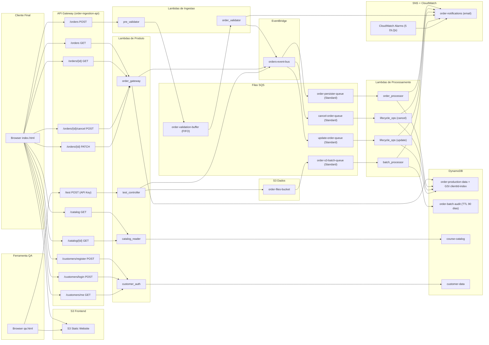

# AWS Serverless Order Management System

[](LICENSE)
[](https://www.python.org/downloads/release/python-3120/)
[](https://aws.amazon.com/serverless/)
[](https://localstack.cloud/)

## Sobre o Projeto

Um sistema serverless de gerenciamento de pedidos para cursos e vouchers de certificacao em nuvem. Clientes se cadastram, navegam por um catalogo de cursos (AWS, Azure, GCP), compram com um clique e acompanham o ciclo de vida completo do pedido (processamento, atualizacao, cancelamento). O sistema foi construido em 11 rodadas iterativas, cada uma adicionando uma camada de complexidade, e documenta decisoes de design conscientes em cada etapa.

A arquitetura e orientada a eventos: o barramento central EventBridge desacopla produtores de consumidores, filas SQS absorvem picos de carga e garantem resiliencia a falhas temporarias, e o DynamoDB lida com idempotencia via ConditionExpression. Nenhuma chamada sincrona cruza fronteiras de servico. O projeto opera exclusivamente via AWS CLI e shell scripts, sem frameworks de Infrastructure as Code, expondo os parametros reais de cada servico AWS.

Este projeto e material de portfolio. Cada decisao tecnica foi tomada com consciencia dos trade-offs, documentada em [ARCHITECTURE.md](ARCHITECTURE.md), e revisada ao longo das rodadas. O objetivo e demonstrar pensamento sistemico sobre arquitetura serverless, nao apenas a implementacao funcional.

## Demo Rapida

**Fluxo completo:** cadastro > catalogo > compra > meus pedidos > cancelar

1. Acesse o frontend (URL exibida apos deploy).
2. Cadastre-se com email e senha.
3. Navegue pelo catalogo, filtre por provedor (AWS/Azure/GCP) ou tipo (Curso/Voucher).
4. Clique em "Comprar" em qualquer curso.
5. Va para "Meus Pedidos" para ver o status.
6. Clique em um pedido para detalhe: cancele ou atualize os itens.

**Links apos deploy:**
- [Frontend CloudCert]($FRONTEND_URL)
- [QA Dashboard]($FRONTEND_URL/qa.html)

## Arquitetura



Para decisoes detalhadas de design, veja [ARCHITECTURE.md](ARCHITECTURE.md).

## Stack e Servicos AWS

| Servico | Papel no sistema | Alternativa avaliada |
|---|---|---|
| **API Gateway** | Ponto de entrada REST (11 endpoints) com Request Validator, CORS, API Key para /test | N/A (unico servico de API HTTP serverless da AWS) |
| **Lambda** | 11 funcoes Python 3.12 para logica de negocio serverless | ECS/Fargate: overhead operacional desnecessario para funcoes de curta duracao |
| **SQS FIFO** | Buffer de validacao com ordenacao por pedido e ContentBasedDeduplication | Processamento sincrono: sem resiliencia a falhas temporarias |
| **SQS Standard** | 3 filas de processamento + 1 fila S3 batch, paralelismo garantido | FIFO para processamento: forjava sequencial sem ganho de corretude |
| **EventBridge** | Barramento central de eventos, roteia por detail-type e source | SNS fanout: menor expressividade de filtro e sem suporte a Content-Based Filtering |
| **DynamoDB** | 4 tabelas: pedidos (com GSI), auditoria (TTL 90d), catalogo, clientes | RDS: custo e operacao mais altos para volume variavel de laboratorio |
| **SNS** | Notificacoes de erro (duplicata, schema invalido, DLQ) para email | N/A (unico servico de pub/sub email da AWS) |
| **S3** | 2 buckets: dados (batch files) e frontend (static website) | EFS: sem necessidade de sistema de arquivos compartilhado |
| **IAM** | 11 roles com politicas de menor privilegio, inline e gerenciadas | N/A (unico servico de autorizacao AWS) |
| **CloudWatch** | Logs (retencao 14d), Alarmes (5 DLQs), metricas | X-Ray: nao disponivel na conta de laboratorio |
| **LocalStack** | Emulacao local de servicos AWS via Docker | AWS real: custo para desenvolvimento iterativo |

## Estrutura do Repositorio

```text
.
├── scripts/              # IaC: deploy, validacao, utilitarios (26 funcoes lib.sh)
├── src/                  # Codigo-fonte das 11 Lambdas + modulo common/
├── frontend/             # 2 frontends: CloudCert (index.html) + QA Dashboard (qa.html)
├── samples/              # Payloads de teste (api_request.json, batch JSONs)
├── docs/                 # Documentacao individual por componente (16 arquivos)
├── ARCHITECTURE.md       # Decisoes de design por tema (este documento)
├── run.sh                # Orquestrador principal: deploy completo + validacao
└── cleanup.sh            # Remocao completa de recursos (idempotente)
```

## Como Executar

### Pre-requisitos

- AWS CLI v2 configurado
- Python 3.12
- Docker e Docker Compose (para LocalStack)
- Utilitario `zip`

### Deploy Local (LocalStack)

```bash
cp .env.example .env
docker-compose up -d
./run.sh
```

### Deploy na AWS

Edite `.env`: defina `DEPLOY_TARGET=aws`, preencha `AWS_REGION`, `RESOURCE_SUFFIX`, `NOTIFICATION_EMAIL`.

```bash
./run.sh
```

### Executar testes E2E

```bash
./scripts/validate-flow.sh
```

25 testes que cobrem: criacao de pedidos, processamento S3 batch, lifecycle (cancelar/atualizar), duplicatas, consultas, alertas SNS, filas DLQ, catalogo, autenticacao JWT, gateway de pedidos, e frontends.

## Decisoes de Design em Destaque

**Idempotencia por ConditionExpression no DynamoDB em vez de deduplicacao na fila.** A janela de 5 minutos do SQS FIFO impedia testes de duplicidade no frontend. A solucao foi usar `MessageDeduplicationId = uuid4()` (sempre unico) e delegar a deduplicacao de negocio ao `ConditionExpression: attribute_not_exists(orderId)` no DynamoDB, que e permanente e gera alerta SNS. Detalhes em [ARCHITECTURE.md#3-idempotencia-conditionexpression-vs-deduplicacao-na-fila](ARCHITECTURE.md#3-idempotencia-conditionexpression-vs-deduplicacao-na-fila).

**JWT implementado manualmente em stdlib Python sem dependencias externas.** A conta de laboratorio nao tem Cognito, Secrets Manager nem KMS CMK. O modulo `common/auth.py` implementa PBKDF2-SHA256 (200.000 iteracoes), HMAC-SHA256, e `compare_digest` contra timing attack. Sem `requirements.txt` ou camada Lambda. Detalhes em [ARCHITECTURE.md#4-seguranca-sem-waf-cognito-e-kms](ARCHITECTURE.md#4-seguranca-sem-waf-cognito-e-kms).

**Resource Policy do API Gateway com padrao Allow geral + Deny condicional.** A implementacao inicial usava Allow-only com `IpAddress`, que bloqueava endpoints publicos (`POST /orders`, `GET /orders`) quando a restricao de IP era ativada. A correcao (Rodada 7) usou o padrao Allow geral para toda a API + Deny condicional restrito a `*/*/POST/test`, respeitando a precedencia do Deny sobre Allow. Detalhes em [ARCHITECTURE.md#4-seguranca-sem-waf-cognito-e-kms](ARCHITECTURE.md#4-seguranca-sem-waf-cognito-e-kms).

**batchItemFailures em todas as Lambdas SQS para reprocessamento parcial de lote.** Sem essa configuracao, uma falha em uma das 5 mensagens do lote derrubava o lote inteiro, reprocessando mensagens ja bem-sucedidas. Com `ReportBatchItemFailures`, apenas os `messageId` com erro retornam na resposta, e as mensagens bem-sucedidas sao confirmadas. Detalhes em [ARCHITECTURE.md#2-resiliencia-dlq-batchitemfailures-e-visibilitytimeout](ARCHITECTURE.md#2-resiliencia-dlq-batchitemfailures-e-visibilitytimeout).

## Historico de Evolucao

| Rodada | Foco | Principal entrega |
|---|---|---|
| 1 | API + Validacao | API Gateway, pre_validator, order_validator, SQS FIFO, EventBridge |
| 2 | S3 + Auditoria | batch_processor, S3 data lake, DynamoDB audit, SNS alerts |
| 3 | Polimento | Restricao de permissoes, mensagens malformadas com SNS, correcoes de logging |
| 4 | Lifecycle | lifecycle_ops (cancelar/atualizar), estado terminal CANCELLED, dedup movida para DynamoDB |
| 5 | Seguranca e custo | Usage Plan + API Key, Resource Policy, Request Validator, DLQ alarms, TTL audit, Reserved Concurrency |
| 6 | Correcoes | Diagrama Mermaid corrigido, Resource Policy refinada, cleanup completo |
| 7 | Resource Policy | Allow geral + Deny condicional, padrao parse_body centralizado |
| 8 | Identidade | customer_auth (cadastro/login/JWT), common/auth.py, tabela customer-data |
| 9 | Catalogo | catalog_reader (vitrine publica), tabela course-catalog, seed de 11 cursos |
| 10 | Gateway | order_gateway (CRUD autenticado), GSI clientId-index, ownership validation |
| 11 | Frontend | CloudCert (produto), QA Dashboard preservado, deploy com 6 arquivos |
| 12 | Documentacao | README orientado a portfolio, ARCHITECTURE.md, diagrama consolidado |

## Licenca e Contato

Distribuido sob licenca MIT. Projeto desenvolvido por [Jose Anderson](https://github.com/DessimA).
