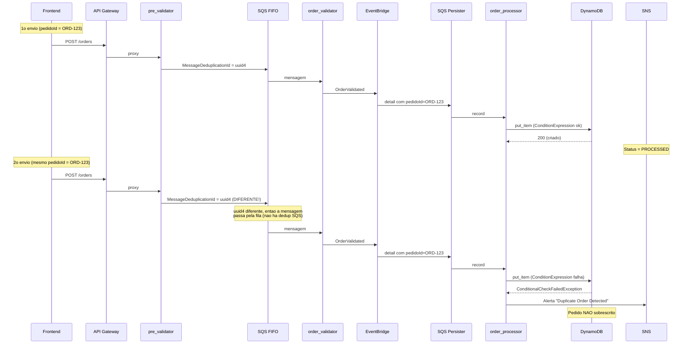
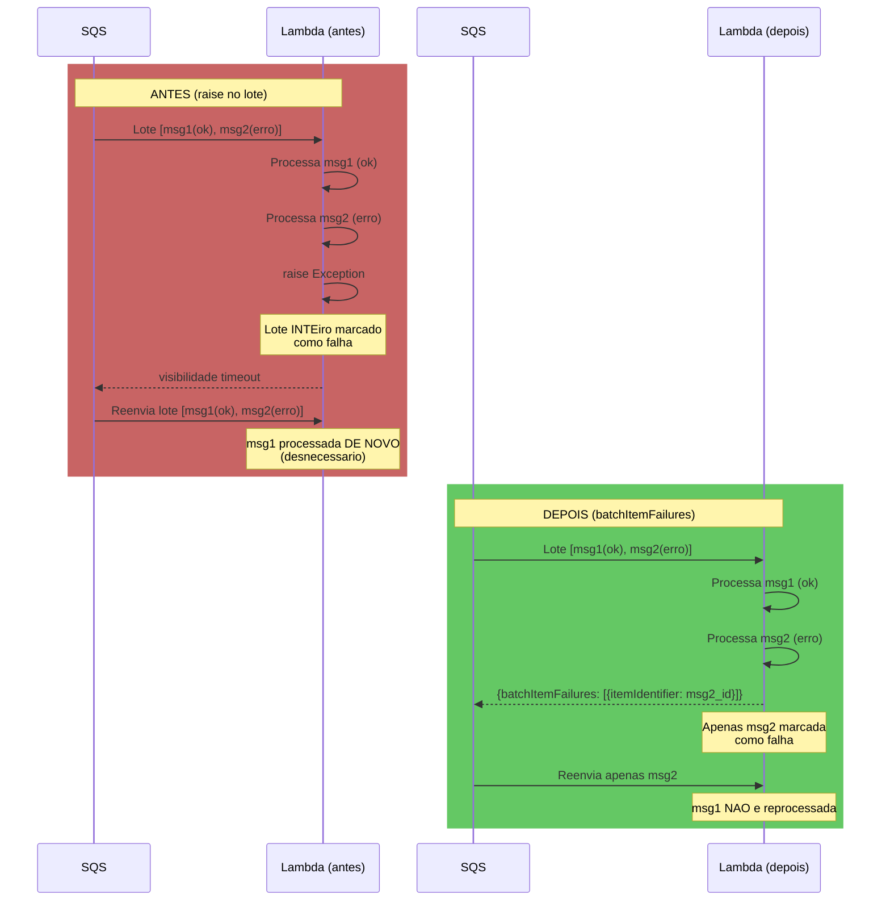
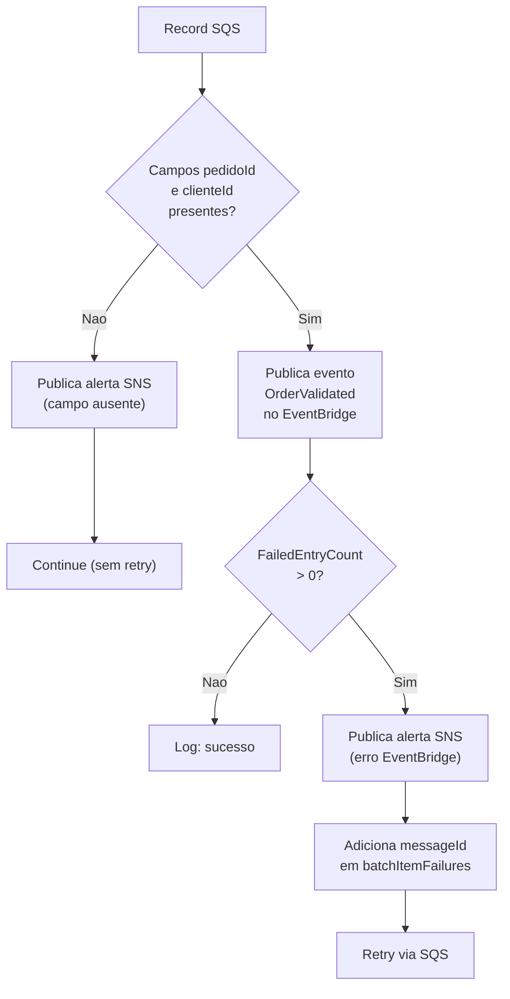
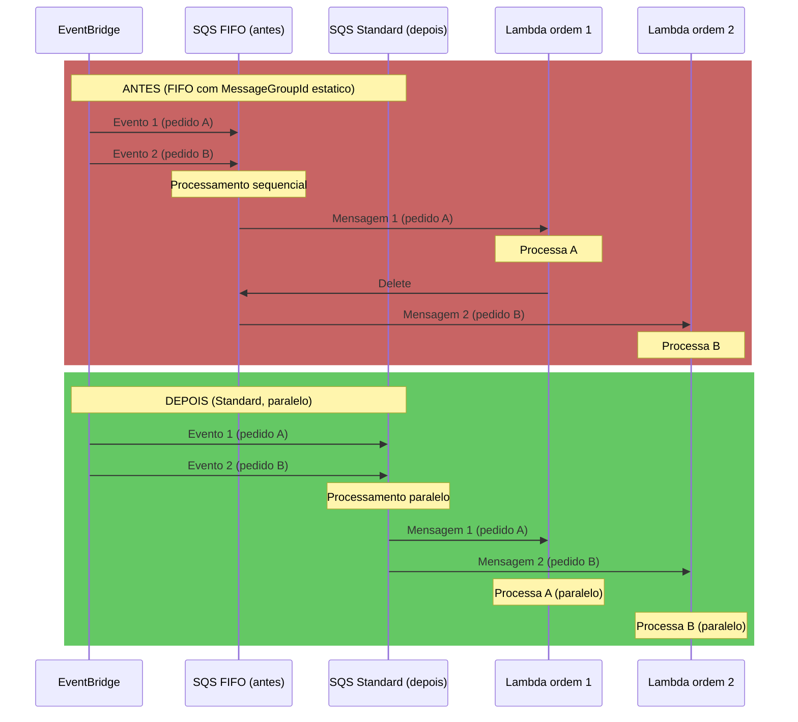
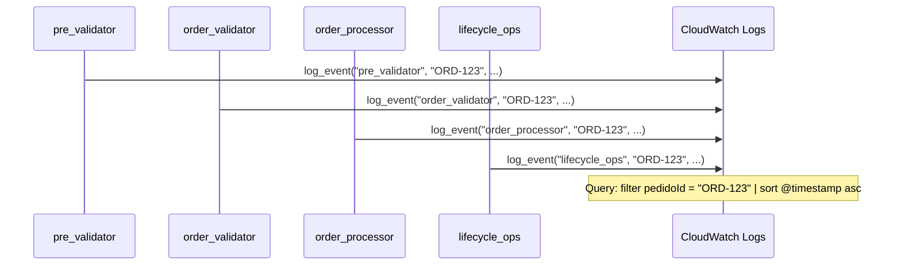

# Correcoes Aplicadas

## Resumo Geral

Este documento descreve cada problema identificado, a correcao aplicada e a justificativa tecnica da escolha.

---

## Sumario

1. [Frontend - Cenario Duplicata](#1-frontend---cenario-duplicata)
2. [Deduplicacao SQS FIFO](#2-deduplicacao-sqs-fifo)
3. [Tratamento de Duplicidade/Inexistencia](#3-tratamento-de-duplicidadeinexistencia)
4. [Report Batch Item Failures](#4-report-batch-item-failures)
5. [VisibilityTimeout Parametrizavel](#5-visibilitytimeout-parametrizavel)
6. [Validacao de RESOURCE_SUFFIX](#6-validacao-de-resource_suffix)
7. [Remocao de Codigo Morto](#7-remocao-de-codigo-morto)
8. [Padronizacao de Logging](#8-padronizacao-de-logging)
9. [Paginacao em handle_list_files](#9-paginacao-em-handle_list_files)

---

## 1. Frontend - Cenario Duplicata

### Problema
O botao "Enviar Duplicata" gerava um novo `pedidoId` aleatorio a cada clique, impossibilitando o teste real da `ConditionExpression: attribute_not_exists(orderId)` no `order_processor`.

### Correcao
O cenario `duplicate` em `frontend/app.js:buildOrderPayload` agora reutiliza `lastOrderId` (com fallback para `'ORD-TEST-DUP'`), permitindo que o mesmo ID seja reenviado e exercite de fato a condicao de duplicidade no DynamoDB.

### Fluxo de duplicidade corrigido

---

## 2. Deduplicacao SQS FIFO

### Problema
O `MessageDeduplicationId` era definido como `str(order_id)`, o que impedia que reenvios do mesmo pedidoId chegassem ate o `order_processor` devido a janela de 5 minutos de deduplicacao do SQS FIFO. Isso tornava o teste de duplicidade no frontend ineficaz por 5 minutos.

### Correcao
`MessageDeduplicationId` alterado para `str(uuid.uuid4())`, gerando um identificador unico por requisicao. A deduplicacao de negocio passa a ser inteiramente responsabilidade do `ConditionExpression: attribute_not_exists(orderId)` no DynamoDB.

### Estrategia de deduplicacao

| Aspecto | Antes | Depois |
|---------|-------|--------|
| Dedup SQS | `MessageDeduplicationId = pedidoId` | `MessageDeduplicationId = uuid4` |
| Dedup negocios | SQS impedia reenvio por 5min | DynamoDB rejeita duplicatas |
| Visibilidade | Duplicatas somiam sem rastro | Duplicatas geram alerta SNS |

---

## 3. Tratamento de Duplicidade/Inexistencia

### Problema
As excecoes `ConditionalCheckFailedException` no `order_processor` e `lifecycle_ops` eram apenas logadas e engolidas, sem alerta SNS, dando visibilidade zero a tentativas de duplicata ou operacao em pedido inexistente. A documentacao (README) divergia do comportamento real.

### Correcao
- Adicionado `from common.sns import publish_error` em ambos os arquivos.
- `SNS_TOPIC_ARN` resolvido nos scripts de deploy e passado como variavel de ambiente.
- Permissao `sns:Publish` adicionada as roles IAM correspondentes.
- O alerta SNS e publicado com detalhes do pedido e operacao, sem re-lancar a excecao (comportamento intencional de idempotencia).

---

## 4. Report Batch Item Failures

### Problema
As Lambdas acionadas por SQS usavam `raise` para sinalizar falha, o que derrubava o lote inteiro (batch_size=5). Mensagens ja processadas com sucesso no mesmo lote eram reprocessadas desnecessariamente.

### Correcao
- Todas as 4 Lambdas SQS (`order_validator`, `order_processor`, `lifecycle_ops`, `batch_processor`) agora coletam `messageId` dos registros que falham e retornam `{"batchItemFailures": [{"itemIdentifier": "..."}]}`.
- `scripts/lib.sh:ensure_event_source_mapping` agora cria/atualiza o mapeamento com `--function-response-types "ReportBatchItemFailures"`.
- Mensagens com erro sao reprocessadas individualmente; as bem-sucedidas sao confirmadas.

### Fluxo antes e depois

---

## 5. VisibilityTimeout Parametrizavel

### Problema
O `VisibilityTimeout` era hardcoded como `90` segundos em tres locais diferentes do `lib.sh`, sem margem segura em relacao ao timeout de 60s das Lambdas e batch_size.

### Correcao
- Variavel `VISIBILITY_TIMEOUT=360` adicionada no topo do `lib.sh`, com valor padrao de 360s (~6x o timeout da Lambda).
- Todas as referencias ao valor `90` foram substituidas pela variavel.
- A validacao em `validate_sqs_queue` usa o mesmo valor.

### Calculo da margem
- Lambda timeout: 60s
- Batch size maximo: 5
- Pior caso teorico: 5 registros x 60s = 300s
- Margem de seguranca: 360s (6x o timeout individual, permitindo 1 registro falhar + retry antes do visibility timeout expirar)

---

## 6. Validacao de RESOURCE_SUFFIX

### Problema
Nao havia validacao de formato do `RESOURCE_SUFFIX`. Caracteres invalidos (maiusculas, underscores, caracteres especiais) causavam erros tardios e confusos na criacao de buckets S3, filas SQS, etc.

### Correcao
- Funcao `validate_resource_suffix()` criada em `lib.sh`, verificando: (a) nao vazio, (b) apenas `[a-z0-9-]`.
- Chamada automaticamente dentro de `validate_env()` quando `RESOURCE_SUFFIX` esta entre as variaveis validadas.

---

## 7. Remocao de Codigo Morto (batch_processor)

### Problema
`batch_processor/index.py` tinha um ramo de desembrulhamento de notificacao SNS (`if 'Records' not in notification_message and 'Message' in notification_message`), que so era necessario se a notificacao S3 passasse por SNS antes de chegar ao SQS. A arquitetura atual usa notificacao S3 -> SQS direta.

### Correcao
O ramo foi removido, simplificando o fluxo. Atualmente a Lambda assume que o corpo da mensagem SQS e diretamente o evento S3 `Records`.

---

## 8. Padronizacao de Logging (read_order)

### Problema
O bloco `except ClientError` em `read_order/index.py` nao logava a excecao, dificultando diagnostico de problemas de permissao ou throttling no DynamoDB.

### Correcao
Adicionado `print(f"DynamoDB ClientError reading order: {e}")` no bloco `except ClientError`, seguindo o padrao usado nas demais Lambdas.

---

## 9. Paginacao em handle_list_files

### Problema
`handle_list_files` em `test_controller/index.py` nao tratava `IsTruncated` / `ContinuationToken` do `list_objects_v2`, retornando no maximo 1000 objetos e perdendo o restante.

### Correcao
Implementado loop com `ContinuationToken` que percorre todas as paginas. O limite de 1000 objetos por pagina e mantido como padrao do S3 (`MaxKeys`). Para buckets com muitos objetos, todas as paginas sao retornadas sem limite artificial.

---

## Rodada 3

### 1. [IMPORTANTE] Escopo amplo de permissao Lambda pre_validator

**Localizacao:** `scripts/deploy-api-flow.sh:122`

**Problema:** `source-arn` usava `"arn:aws:execute-api:$AWS_REGION:$ACCOUNT_ID:$REST_API_ID/*"`, permitindo que qualquer metodo/recurso invocasse a Lambda.

**Correcao:** Restrito para `"arn:aws:execute-api:$AWS_REGION:$ACCOUNT_ID:$REST_API_ID/*/POST/orders"`.

**Justificativa:** Segue o padrao de least privilege ja aplicado em `deploy-frontend.sh` para `read_order` (`/*/GET/orders/{orderId}`) e `test_controller` (`/*/POST/test`).

---

### 2. [IMPORTANTE] Descarte silencioso de mensagens malformadas no order_validator

**Localizacao:** `src/order_validator/index.py:24-26`

**Problema:** Record sem `pedidoId` ou `clienteId` era apenas logado com `print()` e descartado via `continue`, sem alerta SNS e sem rastreabilidade.

**Correcao:** Adicionada chamada a `publish_error(sns_client, SNS_TOPIC_ARN, ...)` com o conteudo do record antes do `continue`. Nao adiciona a `messageId` em `batchItemFailures` pois reenvio nao resolve payload malformado.

**Justificativa:** Mesmo padrao de correcao aplicado nas rodadas 1 e 2 para `order_processor` e `lifecycle_ops`. Garante rastreabilidade mesmo para mensagens inseridas diretamente na fila (replay manual, bug futuro).

**Fluxo de erros:**

---

### 3. [MENOR] Mensagem de log de validate_sqs_queue desatualizada

**Localizacao:** `scripts/lib.sh:235`

**Problema:** `echo "  OK: Fila SQS VisibilityTimeout=90"` com valor hardcoded de antes da parametrizacao.

**Correcao:** Substituido por `echo "  OK: Fila SQS VisibilityTimeout=$VISIBILITY_TIMEOUT"`.

**Justificativa:** A mensagem agora reflete o valor real parametrizavel (padrao 360s).

---

### 4. [MENOR] VisibilityTimeout desatualizado no README

**Localizacao:** `README.md`, secao 9, tabela de utilitarios.

**Problema:** `validate_sqs_queue` documentava "Valida VisibilityTimeout=90".

**Correcao:** Atualizado para "Valida VisibilityTimeout=$VISIBILITY_TIMEOUT (padrao 360s) e ContentBasedDeduplication (se FIFO)".

**Justificativa:** Consistencia com o valor real parametrizado.

---

### 5. [MENOR] Contagem incorreta de Lambdas no docs/common.md

**Localizacao:** `docs/common.md:25`

**Problema:** "Seis das oito Lambdas precisam de logica de resposta HTTP e/ou publicacao SNS."

**Correcao:** "Todas as oito Lambdas dependem de common.http e/ou common.sns."

**Justificativa:** Auditoria de imports mostra que as 8 Lambdas dependem de `common.http` ou `common.sns`.

---

### 6. [MENOR] Contagem de funcoes utilitarias desatualizada no README

**Localizacao:** `README.md`, secao 9.

**Problema:** Texto citava "19 funcoes utilitarias" e tabela listava 19 linhas, mas `scripts/lib.sh` tem 22 funcoes. `validate_resource_suffix`, `get_endpoint_url` e `poll_resource` estavam ausentes.

**Correcao:** Atualizado texto para "22 funcoes" e adicionadas as 3 funcoes faltantes a tabela.

**Justificativa:** Contagem real do codigo fonte.

---

### 7. [MENOR] Codigo morto e duplicacao de timestamp

**Arquivos:** `src/common/utils.py`, `src/order_processor/index.py`, `src/lifecycle_ops/index.py`, `src/batch_processor/index.py`, `src/order_validator/index.py`

**Problema:** `generate_id()` em `common/utils.py` nunca era usado. `utcnow_iso()` nao era importado por nenhuma Lambda. Tres (na verdade quatro) Lambdas reimplementavam `datetime.utcnow().isoformat() + "Z"` manualmente. `datetime.utcnow()` e depreciado no Python 3.12.

**Correcao:**
- `generate_id()` removido.
- `utcnow_iso()` alterado para usar `datetime.now(timezone.utc)` com `.replace("+00:00", "Z")`.
- `order_processor`, `lifecycle_ops`, `batch_processor` e `order_validator` agora importam `utcnow_iso` de `common.utils`.

**Justificativa:** Elimina duplicacao e uso de API depreciada. Centraliza logica de timestamp no modulo `common` conforme proposto em `docs/common.md`.

---

### 8. [MENOR] Caracteres travessao em documentacao

**Arquivos:** `README.md` (secao 4.2, duas ocorrencias do titulo e uma ocorrencia no texto), `CONTRIBUTING.md` (uma ocorrencia).

**Problema:** Uso do caractere "--" (em dash).

**Correcao:** Substituido por dois-pontos e virgula conforme o contexto.

**Justificativa:** Padrao de escrita do projeto.

---

### 9. [MENOR] Item de checklist duplicado no PR template

**Localizacao:** `.github/PULL_REQUEST_TEMPLATE.md:23-24`

**Problema:** "Shell scripts use `set -euo pipefail`" e "`set -euo pipefail` is present where required" verificam a mesma coisa.

**Correcao:** Removido o segundo item duplicado.

**Justificativa:** Checklist sem redundancia.

---

### 10. [MENOR] Campos de valid_batch.json com nomenclatura divergente

**Localizacao:** `samples/valid_batch.json`

**Problema:** Usava `id_pedido_arquivo`, `id_cliente_arquivo`, `itens_pedido_arquivo` em vez de `pedidoId`, `clienteId`, `itens`.

**Correcao:** Renomeado para `pedidoId`, `clienteId`, `itens`, alinhado com `samples/api_request.json`.

**Justificativa:** Consistencia de nomenclatura em todo o sistema.

---

### 11. [MENOR] Dependencia implicita sem checagem amigavel

**Arquivos:** `scripts/deploy-order-processor.sh`, `scripts/deploy-lifecycle-ops.sh`

**Problema:** `SNS_TOPIC_ARN` era resolvido com `get-topic-attributes ... || echo ""`, resultando em variavel vazia e erro generico se `deploy-api-flow.sh` nao tivesse rodado antes.

**Correcao:** Adicionada checagem explicita no inicio de ambos os scripts, falhando com mensagem clara se o topico SNS nao existir.

**Justificativa:** Padrao ja usado em `scripts/deploy-frontend.sh` para verificacao de dependencias (tabela DynamoDB, EventBus). Falha cedo com mensagem acionavel.

---

## Rodada 4

### 1. [CRITICO] Status CANCELLED nao tratado como estado terminal

**Localizacao:** `src/lifecycle_ops/index.py`

**Problema:** update_handler usava `ConditionExpression="attribute_exists(orderId)"` sem verificar status. Pedido CANCELLED podia ser atualizado para UPDATED, revertendo cancelamento.

**Correcao:** Adicionado parametro `extra_condition` em `_process()`. A operacao de update passa `#s <> :cancelledStatus` como condicao extra, com `:cancelledStatus = "CANCELLED"` nos valores. Mensagem SNS ajustada para "Order does not exist or is already cancelled". Cancelamento permanece idempotente.

**Justificativa:** CANCELLED deve ser terminal. A idempotencia do DynamoDB por si so nao impoe restricao de estado.

**Validacao:**
- Teste 4b em `scripts/validate-flow.sh`: cancela pedido, tenta atualizar, verifica que status continua CANCELLED.
- Cenario "Atualizar Pedido Cancelado" no frontend (aba Gerenciar, Cenarios de Erro).
- `docs/lifecycle_status.md`: diagrama Mermaid stateDiagram.

---

### 2. [IMPORTANTE] Cenario "Inexistente" do frontend usava ID do campo

**Localizacao:** `frontend/app.js`, funcao `buildManagePayload`

**Problema:** ignorava o parametro `scenario` e usava o valor do campo `lifecycleOrderId`, que podia conter um pedido real.

**Correcao:** Quando `scenario` contem `"nonexistent"`, `buildManagePayload` sempre gera um novo ID via `generateId('ORD-NONEXISTENT-')`, ignorando o campo.

**Justificativa:** Cenario de erro deve operar sobre ID garantidamente inexistente, nao sobre o valor do campo.

**Validacao:** Botao "Cancelar Inexistente" ou "Atualizar Inexistent" sempre gera ID novo, mesmo com pedido real no campo.

---

### 3. [IMPORTANTE] Aba Consultar sem cenario de pedido inexistente

**Localizacao:** `frontend/index.html`, `frontend/app.js`

**Problema:** Todas as demais abas tinham collapsible "Cenarios de Erro", mas Consultar nao, apesar do README secoes 13.1 listar Pedido Inexistente como cenario esperado.

**Correcao:** Adicionado collapsible "Cenarios de Erro" na aba Consultar com botao "Pedido Inexistente". O cenario `nonexistent` em `testRead()` sempre gera um ID novo via `generateId('ORD-NONEXISTENT-')`.

**Justificativa:** Consistencia com as demais abas e com o README.

**Validacao:** Clicar em "Pedido Inexistente" sempre retorna 404, independente do campo `readOrderId` ou `lastOrderId`.

---

### 4. [IMPORTANTE] MessageGroupId estatico serializava filas de processamento

**Arquivos:** `scripts/lib.sh`, `scripts/deploy-order-processor.sh`, `scripts/deploy-lifecycle-ops.sh`, `cleanup.sh`, `README.md`

**Problema:** Filas `order-persister-queue`, `cancel-order-queue` e `update-order-queue` eram FIFO com `MessageGroupId` estatico, forçando processamento sequencial sem ganho de correcao (a idempotencia ja e garantida pelo DynamoDB).

**Correcao:**
- Convertidas para Standard SQS (removido `.fifo` dos nomes e `FifoQueue` dos atributos).
- `put_eventbridge_target` e `validate_eventbridge_target` em `lib.sh` agora aceitam 6o parametro `is_fifo` (padrao `true`). Para filas Standard, omitem `SqsParameters.MessageGroupId` e nao validam sua presenca.
- Chamadas nos scripts de deploy passam `"false"` para as tres filas convertidas.
- `cleanup.sh`: separado em loop para Standard (sem sufixo) e FIFO (com `.fifo`).
- `README.md` secoes 4.3 e 4.4 atualizadas (removidas referencias a FIFO para essas filas).

**Justificativa:** Elimina gargalo de paralelismo desnecessario. A correcao do sistema (idempotencia via ConditionExpression) independe da ordenacao SQS.

**Fluxo antes vs depois:**

---

### 5. [IMPORTANTE] CONTRIBUTING.md instruia json.loads direto em detail

**Localizacao:** `CONTRIBUTING.md`

**Problema:** Instruia `json.loads(event['detail'])`, que falha com TypeError quando detail chega como dict nativo.

**Correcao:** Substituido por orientacao de usar `common.sqs.parse_body()` e `common.sqs.parse_detail()`, com referencia a `docs/common.md`.

**Justificativa:** Reintroduziria o bug corrigido na Rodada 1/2 se seguido literalmente.

---

### 6. [IMPORTANTE] .env.example apontava para AWS real

**Localizacao:** `.env.example`

**Problema:** `DEPLOY_TARGET=aws` como padrao. Novo contribuidor copiando sem alterar implantaria em conta real.

**Correcao:** Alterado para `DEPLOY_TARGET=localstack`.

**Justificativa:** Fluxo de desenvolvimento e LocalStack-first conforme README e CONTRIBUTING.

---

### 7. [MEDIO] README contradizia exclusividade do EventBridge

**Localizacao:** `README.md`, secao 4.3

**Problema:** Afirmava "recebe eventos exclusivamente da Lambda order_validator", contradito pela secao 4.6 (test_controller).

**Correcao:** Substituido "exclusivamente" por descricao que inclui ambas as fontes.

**Justificativa:** Consistencia interna do README.

---

### 8. [MENOR] docs/read_order.md descrevia OPTIONS inexistente

**Localizacao:** `docs/read_order.md`

**Problema:** "Trata requisicoes OPTIONS (CORS) diretamente", mas a Lambda nao tem tratamento de OPTIONS.

**Correcao:** Descricao atualizada para "Requisicoes OPTIONS sao tratadas pela integracao MOCK do API Gateway (setup_api_cors) antes de chegar a Lambda."

**Justificativa:** Alinhamento com o codigo real.

---

### 9. [MENOR] Nome de deploy do order_processor nao documentado

**Localizacao:** `README.md`, secao 4.4

**Problema:** batch_processor tinha nota explicando ser implantado como file_validator, mas order_processor nao explicitava ser implantado como order-persister.

**Correcao:** Adicionado "(implantado como `order-persister-*`)" na descricao do Order Processor.

**Justificativa:** Consistencia com a nota ja existente para batch_processor/file_validator.

---

### 10. [MENOR] Variavel nao utilizada em validate-flow.sh

**Localizacao:** `scripts/validate-flow.sh:84`

**Problema:** `DUP_ITEMS` era calculada mas nunca utilizada.

**Correcao:** Linha removida.

**Justificativa:** Codigo morto.

---

### 11. [MENOR] cleanup.sh nao removia log groups do CloudWatch

**Localizacao:** `cleanup.sh`

**Problema:** Log groups `/aws/lambda/<nome>` acumulavam-se apos cada deploy.

**Correcao:** Adicionado `aws logs delete-log-group --log-group-name "/aws/lambda/$name"` no laco de exclusao de Lambdas, com `2>/dev/null || true`.

**Justificativa:** Cleanup completo seguindo padrao idempotente ja usado no restante do script.

---

## Rodada 5

### 1. [ALTA] Usage Plan + API Key obrigatoria na rota POST /test

**Localizacao:** `scripts/lib.sh` (nova funcao `ensure_usage_plan_with_api_key`), `scripts/deploy-frontend.sh`, `frontend/app.js`, `frontend/config.template.js`, `scripts/validate-flow.sh`, `.gitignore`

**Problema:** A rota `POST /test` (test_controller) permitia `publish_event` arbitrario no EventBridge e `upload_file` arbitrario no S3 sem nenhuma autenticacao. Qualquer pessoa com a URL podia usar a rota.

**Correcao:**
- Criada funcao `ensure_usage_plan_with_api_key()` em `lib.sh` que cria API Key, Usage Plan com throttle (rateLimit=5, burstLimit=10) e quota (1000 req/dia), e associa a chave ao plan.
- Metodo POST /test alterado para `--api-key-required` em `deploy-frontend.sh`.
- API Key salva em `scripts/.api-key` (adicionado ao `.gitignore`).
- Placeholder `__TEST_API_KEY__` adicionado ao `config.template.js` e substituido via sed no deploy.
- `frontend/app.js` envia header `x-api-key` em todas as chamadas para `TEST_ENDPOINT`.
- `validate-flow.sh` inclui `x-api-key` nos testes 6-8 e adiciona teste 6a para confirmar 403 sem chave.

**Justificativa:** Sem WAF ou Cognito disponiveis na conta de laboratorio, Usage Plan com API Key e a unica forma nativa de autenticacao do API Gateway que atende ao requisito. O Usage Plan tambem protege contra abuso com throttle e quota.

**Validacao:**
- Teste 6a em `validate-flow.sh`: chamada POST /test sem `x-api-key` retorna 403.
- Testes 6-8 em `validate-flow.sh`: chamadas com `x-api-key` funcionam normalmente.
- POST /orders e GET /orders continuam sem API Key (demonstracao publica).

---

### 2. [ALTA] Resource Policy no API Gateway restringindo /test por IP de origem

**Localizacao:** `scripts/lib.sh` (nova funcao `ensure_api_resource_policy`), `scripts/deploy-api-flow.sh`, `.env.example`

**Problema:** Mesmo com API Key, a rota /test ainda estava acessivel publicamente na internet.

**Correcao:**
- Variavel `ALLOWED_SOURCE_IP` adicionada ao `.env.example` com comentario explicando que e opcional (vazio = sem restricao).
- Funcao `ensure_api_resource_policy()` criada em `lib.sh` que aplica Resource Policy via `aws apigateway update-rest-api` com condicao `aws:SourceIp`.
- Chamada em `deploy-api-flow.sh` apos criacao do REST API.

**Justificativa:** Resource Policy do API Gateway e o mecanismo nativo para restricao por IP. Nao requer servicos adicionais. Quando a variavel esta vazia, o comportamento atual e preservado (sem regressao). Sem WAF disponivel, esta e a unica camada de protecao por rede.

**Validacao:** Documentada em `docs/deploy_scripts.md` como teste manual (nao automatizavel sem trocar de IP). Com `ALLOWED_SOURCE_IP` definido, chamadas de outro IP retornam 403. Com variavel vazia, comportamento inalterado.

---

### 3. [ALTA] Request Validator (JSON Schema) no metodo POST /orders

**Localizacao:** `scripts/schemas/order-request.json` (novo), `scripts/deploy-api-flow.sh`

**Problema:** A validacao de `pedidoId`/`clienteId` ocorria apenas dentro da Lambda pre_validator. Payloads malformados geravam invocacao completa da Lambda antes de serem rejeitados.

**Correcao:**
- Criado `scripts/schemas/order-request.json` com JSON Schema exigindo `pedidoId` (string) e `clienteId` (string) como obrigatorios.
- Model `OrderRequestModel` criado no API Gateway referenciando o schema.
- Request Validator `OrderRequestValidator` criado com `validate-request-body=true`.
- Associados ao metodo POST /orders via `--request-validator-id` e `--request-models`.

**Justificativa:** O Request Validator do API Gateway rejeita payloads malformados antes de invocar a Lambda, economizando invocacoes e reduzindo latencia para clientes com payload invalido. A Lambda pre_validator mantem sua validacao como camada adicional de seguranca (defense in depth).

**Validacao:** Adicionado no `validate-flow.sh`: enviar POST /orders sem `pedidoId` retorna 400 com "Invalid request body" (mensagem padrao do API Gateway), nao a mensagem customizada da Lambda.

---

### 4. [MEDIA] Retencao de logs do CloudWatch em todas as Lambdas

**Localizacao:** `scripts/lib.sh` (funcao `ensure_lambda_function`), `scripts/deploy-frontend.sh` (funcao `deploy_lambda`)

**Problema:** Os log groups `/aws/lambda/*` nao tinham politica de retencao, ficando como "Never Expire" e acumulando custo indefinidamente.

**Correcao:**
- Em `ensure_lambda_function()`, adicionado `aws logs put-retention-policy` com 14 dias apos criacao/atualizacao da funcao.
- Mesma chamada adicionada em `deploy_lambda()` em `deploy-frontend.sh`, que nao usa `ensure_lambda_function`.

**Justificativa:** 14 dias e um periodo razoavel para depuracao sem acumular custo significativo. Logs de erro sao preservados por tempo suficiente para investigacao. O `2>/dev/null || true` trata o caso do log group ainda nao existir na primeira execucao.

**Validacao:** Teste 10 em `validate-flow.sh` verifica `retentionInDays=14` para `order-persister-*` e `order-pre-validator-*`.

---

### 5. [MEDIA] Reduzir payload logado nas Lambdas (custo de ingestao CloudWatch Logs)

**Localizacao:** `src/order_processor/index.py`, `src/order_validator/index.py`, `src/lifecycle_ops/index.py`, `src/batch_processor/index.py`, `src/pre_validator/index.py`

**Problema:** Varias Lambdas faziam `print(f"... {json.dumps(event)}")`, logando o payload SQS/API completo a cada invocacao, incluindo dados de cliente. Essa era a maior fonte de custo de ingestao de logs.

**Correcao:** Em cada uma das 5 Lambdas, substituido o `print()` que logava o event completo por `print()` que loga apenas a quantidade de records e, dentro do loop, o `pedidoId` do record atual via `log_event()`.

**Justificativa:** Logs de sucesso/info raramente precisam do payload completo para depuracao. Logs de erro (blocos `except`) mantem detalhes completos por ocorrerem com baixa frequencia. A reducao de volume de logs reduz custo de ingestao do CloudWatch.

**Validacao:** Revisao manual de cada arquivo confirma que nenhum `print()` de sucesso/info contem `json.dumps(event)` do payload completo. Convencao documentada em `docs/common.md`.

---

### 6. [MEDIA] Logging estruturado com pedidoId como correlacao entre Lambdas

**Localizacao:** `src/common/utils.py` (nova funcao `log_event`), `src/order_processor/index.py`, `src/order_validator/index.py`, `src/lifecycle_ops/index.py`, `src/pre_validator/index.py`

**Problema:** Sem AWS X-Ray disponivel, nao havia como correlacionar o fluxo completo de um pedido atraves das 4+ Lambdas que ele atravessa, exceto lendo manualmente cada log group.

**Correcao:**
- Adicionada funcao `log_event(stage, pedido_id, message)` em `src/common/utils.py` que produz `print()` em formato JSON: `{"stage": stage, "pedidoId": pedido_id, "message": message, "timestamp": utcnow_iso()}`.
- `print()` informativos relevantes substituidos por `log_event()` nas 4 Lambdas (pre_validator, order_validator, order_processor, lifecycle_ops), sempre passando `pedidoId` do record sendo processado.

**Justificativa:** O formato JSON estruturado permite usar CloudWatch Logs Insights para correlacionar eventos pelo `pedidoId`, compensando a ausencia de X-Ray. Cada Lambda emite logs com o mesmo `pedidoId`, permitindo queries de filtro e ordenacao temporal.

**Fluxo de correlacao:**

**Validacao:** Documentado em `docs/observability.md` com query de exemplo do CloudWatch Logs Insights e diagrama Mermaid.

---

### 7. [BAIXA] CloudWatch Alarm nas DLQs com notificacao via SNS

**Localizacao:** `scripts/lib.sh` (nova funcao `ensure_dlq_alarm`), `scripts/deploy-api-flow.sh`, `scripts/deploy-s3-flow.sh`, `scripts/deploy-order-processor.sh`, `scripts/deploy-lifecycle-ops.sh`

**Problema:** Nao existia alerta automatico quando mensagens comecavam a cair nas DLQs, dependendo de verificacao manual.

**Correcao:**
- Criada funcao `ensure_dlq_alarm()` em `lib.sh` que cria CloudWatch Alarm monitorando `ApproximateNumberOfMessagesVisible` com threshold >= 1, period 300, evaluation-periods 1, acao SNS.
- Chamada para cada uma das 5 DLQs: `validation-dlq`, `persister-dlq`, `cancel-dlq`, `update-dlq`, `s3-batch-dlq`.

**Justificativa:** Alerta proativo evita que mensagens acumulem silenciosamente nas DLQs. O SNS Topic ja existente no projeto e reutilizado para as notificacoes, sem criar nova infraestrutura.

**Validacao:** Teste 11 em `validate-flow.sh` confirma existencia dos 5 alarmes via `aws cloudwatch describe-alarms`.

---

### 8. [BAIXA] Reserved Concurrency em todas as Lambdas

**Localizacao:** `scripts/lib.sh` (funcao `ensure_lambda_function`), `scripts/deploy-frontend.sh`, `scripts/deploy-api-flow.sh`, `scripts/deploy-s3-flow.sh`, `scripts/deploy-order-processor.sh`, `scripts/deploy-lifecycle-ops.sh`

**Problema:** Sem WAF ou Usage Plan obrigatorio em todas as rotas, um volume alto de chamadas podia gerar custo inesperado em uma conta de laboratorio compartilhada.

**Correcao:**
- Adicionado 7o parametro opcional `reserved_concurrency` a `ensure_lambda_function()`, aplicando `put-function-concurrency` quando definido.
- `reserved_concurrency=5` para todas as Lambdas (pre_validator, order_validator, file_validator, order_persister, cancel, update, test_controller).
- `reserved_concurrency=10` para `read_order` (consultada com mais frequencia pelo frontend).
- Em `deploy-frontend.sh` (que nao usa `ensure_lambda_function`), adicionado `put-function-concurrency` separadamente.

**Justificativa:** Reserved Concurrency limita o numero maximo de execucoes simultaneas de cada Lambda, protegendo contra custo excessivo em caso de pico de chamadas. Nao se trata de otimizacao de performance, mas de protecao de custo em conta compartilhada de laboratorio.

**Validacao:** Teste 12 em `validate-flow.sh` confirma `ReservedConcurrentExecutions=5` para `order-persister-*` e `=10` para `order-reader-*`.

---

### 9. [BAIXA] TTL na tabela de auditoria DynamoDB

**Localizacao:** `scripts/deploy-s3-flow.sh`, `src/batch_processor/index.py`, `src/common/utils.py`

**Problema:** `order-batch-audit-*` armazenava registros de auditoria indefinidamente, sem expiracao.

**Correcao:**
- Em `deploy-s3-flow.sh`, apos criacao da tabela, habilitado TTL via `aws dynamodb update-time-to-live` com `AttributeName=expiresAt`.
- Funcao `utcnow_plus_days_epoch(days)` adicionada a `src/common/utils.py`.
- Em `src/batch_processor/index.py`, `expiresAt` = `utcnow_plus_days_epoch(90)` adicionado ao Item do `put_item`.

**Justificativa:** 90 dias e um periodo adequado para auditoria. Apos esse periodo, o DynamoDB remove automaticamente os registros sem custo de armazenamento. O TTL e idempotente (checagem `describe-time-to-live` antes de ativar).

**Validacao:** Teste 13 em `validate-flow.sh` confirma `TimeToLiveStatus=ENABLED` via `aws dynamodb describe-time-to-live`. Documentado em `docs/batch_processor.md`.

---
