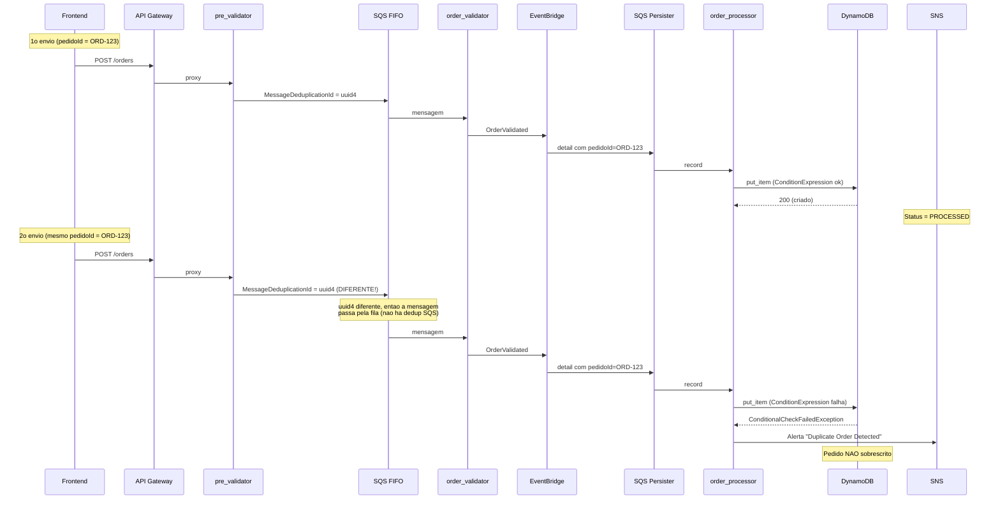
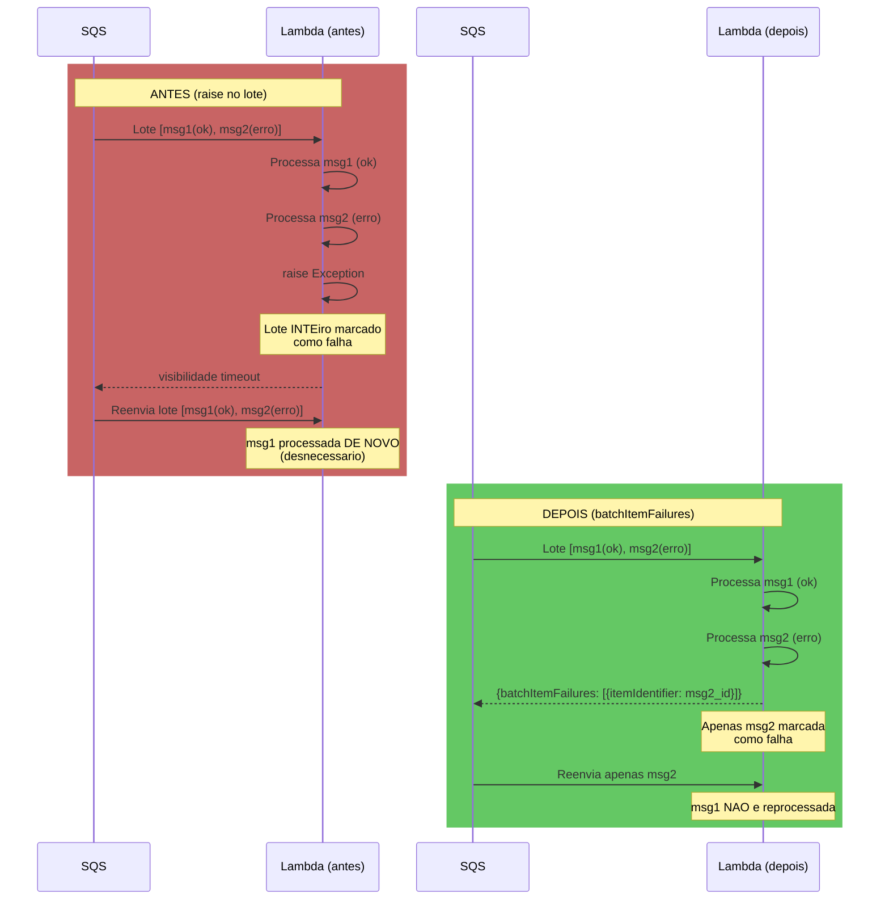

# Correcoes Aplicadas

## Resumo Geral

Este documento descreve cada problema identificado, a correcao aplicada e a justificativa tecnica da escolha.

---

## Sumario

1. [Frontend - Cenario Duplicata](#1-frontend---cenario-duplicata)
2. [Deduplicacao SQS FIFO](#2-deduplicacao-sqs-fifo)
3. [Tratamento de Duplicidade/Inexistencia](#3-tratamento-de-duplicidadeinexistencia)
4. [Report Batch Item Failures](#4-report-batch-item-failures)
5. [VisibilityTimeout Parametrizavel](#5-visibilitytimeout-parametrizavel)
6. [Validacao de RESOURCE_SUFFIX](#6-validacao-de-resource_suffix)
7. [Remocao de Codigo Morto](#7-remocao-de-codigo-morto)
8. [Padronizacao de Logging](#8-padronizacao-de-logging)
9. [Paginacao em handle_list_files](#9-paginacao-em-handle_list_files)

---

## 1. Frontend - Cenario Duplicata

### Problema
O botao "Enviar Duplicata" gerava um novo `pedidoId` aleatorio a cada clique, impossibilitando o teste real da `ConditionExpression: attribute_not_exists(orderId)` no `order_processor`.

### Correcao
O cenario `duplicate` em `frontend/app.js:buildOrderPayload` agora reutiliza `lastOrderId` (com fallback para `'ORD-TEST-DUP'`), permitindo que o mesmo ID seja reenviado e exercite de fato a condicao de duplicidade no DynamoDB.

### Fluxo de duplicidade corrigido

---

## 2. Deduplicacao SQS FIFO

### Problema
O `MessageDeduplicationId` era definido como `str(order_id)`, o que impedia que reenvios do mesmo pedidoId chegassem ate o `order_processor` devido a janela de 5 minutos de deduplicacao do SQS FIFO. Isso tornava o teste de duplicidade no frontend ineficaz por 5 minutos.

### Correcao
`MessageDeduplicationId` alterado para `str(uuid.uuid4())`, gerando um identificador unico por requisicao. A deduplicacao de negocio passa a ser inteiramente responsabilidade do `ConditionExpression: attribute_not_exists(orderId)` no DynamoDB.

### Estrategia de deduplicacao

| Aspecto | Antes | Depois |
|---------|-------|--------|
| Dedup SQS | `MessageDeduplicationId = pedidoId` | `MessageDeduplicationId = uuid4` |
| Dedup negocios | SQS impedia reenvio por 5min | DynamoDB rejeita duplicatas |
| Visibilidade | Duplicatas somiam sem rastro | Duplicatas geram alerta SNS |

---

## 3. Tratamento de Duplicidade/Inexistencia

### Problema
As excecoes `ConditionalCheckFailedException` no `order_processor` e `lifecycle_ops` eram apenas logadas e engolidas, sem alerta SNS, dando visibilidade zero a tentativas de duplicata ou operacao em pedido inexistente. A documentacao (README) divergia do comportamento real.

### Correcao
- Adicionado `from common.sns import publish_error` em ambos os arquivos.
- `SNS_TOPIC_ARN` resolvido nos scripts de deploy e passado como variavel de ambiente.
- Permissao `sns:Publish` adicionada as roles IAM correspondentes.
- O alerta SNS e publicado com detalhes do pedido e operacao, sem re-lancar a excecao (comportamento intencional de idempotencia).

---

## 4. Report Batch Item Failures

### Problema
As Lambdas acionadas por SQS usavam `raise` para sinalizar falha, o que derrubava o lote inteiro (batch_size=5). Mensagens ja processadas com sucesso no mesmo lote eram reprocessadas desnecessariamente.

### Correcao
- Todas as 4 Lambdas SQS (`order_validator`, `order_processor`, `lifecycle_ops`, `batch_processor`) agora coletam `messageId` dos registros que falham e retornam `{"batchItemFailures": [{"itemIdentifier": "..."}]}`.
- `scripts/lib.sh:ensure_event_source_mapping` agora cria/atualiza o mapeamento com `--function-response-types "ReportBatchItemFailures"`.
- Mensagens com erro sao reprocessadas individualmente; as bem-sucedidas sao confirmadas.

### Fluxo antes e depois

---

## 5. VisibilityTimeout Parametrizavel

### Problema
O `VisibilityTimeout` era hardcoded como `90` segundos em tres locais diferentes do `lib.sh`, sem margem segura em relacao ao timeout de 60s das Lambdas e batch_size.

### Correcao
- Variavel `VISIBILITY_TIMEOUT=360` adicionada no topo do `lib.sh`, com valor padrao de 360s (~6x o timeout da Lambda).
- Todas as referencias ao valor `90` foram substituidas pela variavel.
- A validacao em `validate_sqs_queue` usa o mesmo valor.

### Calculo da margem
- Lambda timeout: 60s
- Batch size maximo: 5
- Pior caso teorico: 5 registros x 60s = 300s
- Margem de seguranca: 360s (6x o timeout individual, permitindo 1 registro falhar + retry antes do visibility timeout expirar)

---

## 6. Validacao de RESOURCE_SUFFIX

### Problema
Nao havia validacao de formato do `RESOURCE_SUFFIX`. Caracteres invalidos (maiusculas, underscores, caracteres especiais) causavam erros tardios e confusos na criacao de buckets S3, filas SQS, etc.

### Correcao
- Funcao `validate_resource_suffix()` criada em `lib.sh`, verificando: (a) nao vazio, (b) apenas `[a-z0-9-]`.
- Chamada automaticamente dentro de `validate_env()` quando `RESOURCE_SUFFIX` esta entre as variaveis validadas.

---

## 7. Remocao de Codigo Morto (batch_processor)

### Problema
`batch_processor/index.py` tinha um ramo de desembrulhamento de notificacao SNS (`if 'Records' not in notification_message and 'Message' in notification_message`), que so era necessario se a notificacao S3 passasse por SNS antes de chegar ao SQS. A arquitetura atual usa notificacao S3 -> SQS direta.

### Correcao
O ramo foi removido, simplificando o fluxo. Atualmente a Lambda assume que o corpo da mensagem SQS e diretamente o evento S3 `Records`.

---

## 8. Padronizacao de Logging (read_order)

### Problema
O bloco `except ClientError` em `read_order/index.py` nao logava a excecao, dificultando diagnostico de problemas de permissao ou throttling no DynamoDB.

### Correcao
Adicionado `print(f"DynamoDB ClientError reading order: {e}")` no bloco `except ClientError`, seguindo o padrao usado nas demais Lambdas.

---

## 9. Paginacao em handle_list_files

### Problema
`handle_list_files` em `test_controller/index.py` nao tratava `IsTruncated` / `ContinuationToken` do `list_objects_v2`, retornando no maximo 1000 objetos e perdendo o restante.

### Correcao
Implementado loop com `ContinuationToken` que percorre todas as paginas. O limite de 1000 objetos por pagina e mantido como padrao do S3 (`MaxKeys`). Para buckets com muitos objetos, todas as paginas sao retornadas sem limite artificial.

---
