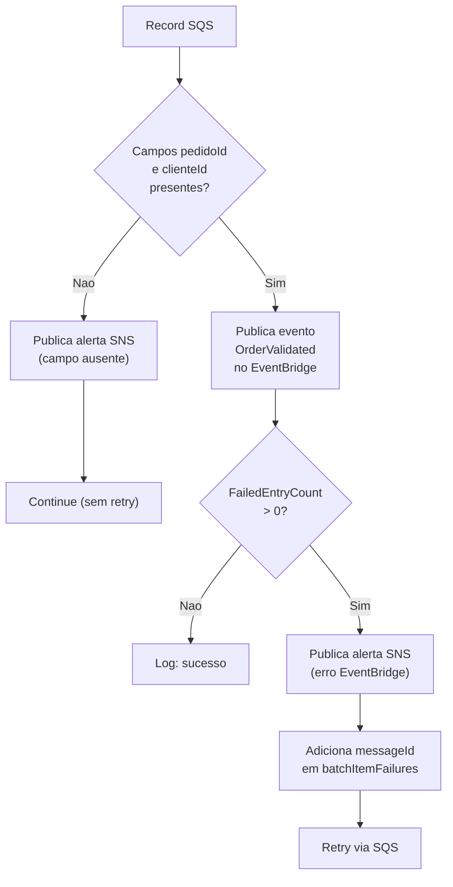
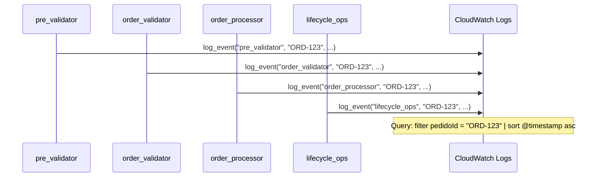
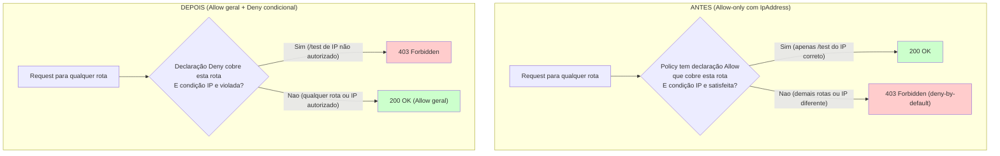

# Correções Aplicadas

## Resumo Geral

Este documento descreve cada problema identificado, a correção aplicada e a justificativa técnica da escolha.

---

## Rodada 12

### 1. [DOCUMENTACAO] README orientado a portfolio

**Localização:** `README.md`.

**Problema:** README existente era um manual técnico detalhado voltado para quem ja conhecia o projeto, não para um recrutador ou engenheiro avaliando o portfolio pela primeira vez.

**Correção:** Reescrita completa com narrativa de produto (tres paragrafos: o que e, como funciona, diferencial de portfolio), tabela de serviços AWS com alternativas descartadas, seção de decisões de design em destaque com links para ARCHITECTURE.md, e tabela de historico de evolução por rodada.

**Justificativa:** Portfolio eficaz precisa funcionar para leitores com diferentes níveis de contexto (recrutador em 30s, engenheiro em 5min, colaborador em 30min).

**Validação:** Validação visual.

### 2. [DOCUMENTACAO] ARCHITECTURE.md

**Localização:** `ARCHITECTURE.md` (arquivo novo).

**Problema:** Decisões de design estavam distribuídas entre CORRECOES.md (formato de log), docs/ individuais por componente e comentários nos scripts. Nao havia um documento consolidado por tema que respondesse as perguntas típicas de entrevista.

**Correção:** Documento com 10 seções temáticas: EDA, resiliência (DLQ, batchItemFailures, VisibilityTimeout), idempotência (ConditionExpression vs fila), seguranca (JWT manual, ownership), observabilidade (log_event), custo (Reserved Concurrency, TTL, log retention), IaC (shell vs Terraform), FIFO vs Standard, frontend (localStorage, 202 async), e delta para produção real.

**Justificativa:** Recrutadores tecnicos buscam evidência de pensamento sistêmico e consciência de trade-offs. Um documento temático e mais eficaz do que um log cronológico para demonstrar esse perfil.

**Validação:** Validação visual e revisão cruzada com o codigo e scripts existentes.

### 3. [DOCUMENTACAO] Diagrama de arquitetura consolidado

**Localização:** `README.md` e `ARCHITECTURE.md`.

**Problema:** Diagrama existente no README não incluia os componentes das Rodadas 8 a 11 (customer_auth, catalog_reader, order_gateway, GSI, frontend CloudCert).

**Correção:** Diagrama Mermaid atualizado representando todos os 11 Lambdas, todas as filas (FIFO e Standard), todas as tabelas DynamoDB (4), todos os endpoints do API Gateway (11), ambos os frontends (CloudCert e QA Dashboard), EventBridge, SNS, CloudWatch e S3 dados.

**Justificativa:** O diagrama e o primeiro elemento visual que um avaliador técnico busca para entender a amplitude do sistema.

**Validação:** Validação visual de renderização Mermaid no GitHub.

### 1. [NOVA FUNCIONALIDADE] GSI `clientId-index` na tabela de produção

**Localização:** `scripts/deploy-order-gateway.sh`

**Problema:** A tabela `order-production-data` não possuía GSI por cliente. Para listar pedidos de um cliente, seria necessário scan com FilterExpression, que e ineficiente e custoso mesmo em tabelas pequenas. Nao havia isolamento de dados por cliente na camada de leitura.

**Correção:** Adicionado GSI `clientId-index` com `clientId` (HASH) e `processedAt` (RANGE), projection ALL, via `aws dynamodb update-table`. Criacaoo idempotente: verifica se o indice ja existe antes de criar. Polling de ate 5 minutos para status ACTIVE.

**Justificativa:** GSI e a forma correta de isolar dados por cliente no DynamoDB. Scan com FilterExpression consumiria RCUs de todos os itens da tabela mesmo para páginações pequenas. O atributo `processedAt` como sort key permite ordenar pedidos por data de processamento.

**Validação:** Teste 21 em `validate-flow.sh`: listagem de pedidos do cliente autenticado via GSI retorna apenas os pedidos daquele cliente.

### 2. [NOVA FUNCIONALIDADE] Lambda `order_gateway` - Endpoints autenticados de ciclo de vida

**Localização:** `src/order_gateway/index.py` (novo arquivo)

**Problema:** Cancelamento e atualização de pedidos so eram acessíveis via `test_controller` (POST /test, com API Key, ferramenta interna de QA). Nao havia um endpoint público autenticado para usuários finais executarem essas operações. A leitura de pedidos (GET /orders/{orderId}) não validava ownership, permitindo que qualquer cliente lesse pedidos de outros.

**Correção:** Criada Lambda com quatro handlers, todos validando JWT antes de executar lógica:
- `list_handler` (GET /orders): query no GSI `clientId-index` com `KeyConditionExpression`.
- `get_handler` (GET /orders/{orderId}): GetItem com validação de ownership. Pedidos de outro cliente retornam 404.
- `cancel_handler` (POST /orders/{orderId}/cancel): publica `OrderCancelled` no EventBridge, retorna 202.
- `update_handler` (PATCH /orders/{orderId}): publica `OrderUpdated` no EventBridge com `novosItens`, retorna 202.
- Pedido ja CANCELLED retorna 409 em cancel e update.
- `_require_auth()` extrai e valida JWT, captura `ValueError` de `decode_jwt`.
- `_get_owned_order()` valida existência e ownership.

**Justificativa:** Segue o padrão de roteamento por `event["resource"]` e `event["httpMethod"]`. Reaproveita `lifecycle_ops` sem alteração (o processamento assíncrono do estado do pedido continua sendo feito pela Lambda de ciclo de vida). Os codigos HTTP seguem principios REST: 202 para aceite de operação assíncrona, 409 para conflito de estado, 404 genérico para não revelar pedidos de outros.

**Validação:** Testes 21 a 24 em `validate-flow.sh`.

### 3. [NOVA FUNCIONALIDADE] Script `deploy-order-gateway.sh`

**Localização:** `scripts/deploy-order-gateway.sh` (novo arquivo)

**Problema:** Nao existia deploy para a infraestrutura de gateway de pedidos.

**Correção:** Script separado de `deploy-order-processor.sh` com:
- Verificação de dependencias no início: tabela de produção, EventBus, arquivo .jwt-secret e REST API.
- Criação do GSI (item 1 acima).
- IAM Role com permissões para DynamoDB (GetItem/Query na tabela e no indice) e EventBridge (PutEvents).
- Deploy da Lambda com `ensure_lambda_function` e `reserved_concurrency=10`.
- Criação dos recursos /orders/{orderId}/cancel e metodos no API Gateway.
- Remoção da permissão antiga do `read_order` para GET /orders/{orderId}.
- `lambda add-permission` com `source-arn` específico para cada endpoint.

**Justificativa:** Script separado porque a Lambda depende de recursos de rodadas anteriores (customer_auth para JWT, order-processor para tabela). Criação de GSI e uma operação de update na tabela existente, não de criação.

**Validação:** Executado como parte do `validate-flow.sh`.

### 4. [ATUALIZACAO] `scripts/validate-flow.sh` - Deploy do gateway e testes 21-24

**Localização:** `scripts/validate-flow.sh`

**Problema:** Nao havia deploy do gateway de pedidos nem testes para endpoints autenticados de ciclo de vida.

**Correção:**
- Adicionada chamada a `bash deploy-order-gateway.sh` entre `deploy-customer-auth.sh` e `deploy-catalog.sh`.
- Teste 21: GET /orders - cria pedido com clienteId do Teste 16, lista com JWT, verifica count > 0 e pedido presente.
- Teste 22: GET /orders/{orderId} - verifica que pedido próprio retorna 200 e pedido de outro cliente retorna 404.
- Teste 23: POST /orders/{orderId}/cancel - verifica 202 com "Cancellation requested" e status final CANCELLED.
- Teste 24: PATCH /orders/{orderId} - verifica 202 com "Update requested" e status final UPDATED.

**Validação:** Todos os testes passam.

### 5. [ATUALIZACAO] `cleanup.sh` - Remoção de recursos do gateway

**Localização:** `cleanup.sh`

**Problema:** `cleanup.sh` não limpava recursos do gateway (Lambda, role).

**Correção:** Adicionados `order-gateway-*` ao loop de Lambdas e `order-gateway-role-*` ao loop de IAM Roles. O GSI e removido automaticamente com a tabela `order-production-data`.

**Justificativa:** Idempotência completa da limpeza.

**Validação:** Execução de `cleanup.sh` seguida de `./run.sh` sem erros.

### 6. [DOCUMENTACAO] `docs/order_gateway.md`

**Localização:** `docs/order_gateway.md` (novo arquivo)

**Problema:** Nao havia documentação do gateway de pedidos autenticado.

**Correção:** Documento com seções: Finalidade, Comportamento (tabelas de codigos de retorno por handler), Ambiente, Decisões de design (autenticação na Lambda, 202 vs 200, 404 genérico, ponte clienteId/clientId, test_controller como QA), diagramas Mermaid para os quatro fluxos.

**Validação:** Validação visual e referência cruzada com README.

### 7. [DOCUMENTACAO] Atualização do `README.md`

**Localização:** `README.md`

**Correção:**
- Seção 3: Lambdas atualizadas de 10 para 11.
- Seção 5: arvore inclui `order_gateway/` e `deploy-order-gateway.sh`.
- Seção 4: nova subseção 4.9 Gateway de Pedidos.
- Seção 9: novo passo 6 (Deploy Fase 5 - Gateway), passos 7-9 renumerados.
- Seção 10.3: adicionados exemplos de curl para gateway autenticado.

**Validação:** Validação visual e consistência com o codigo.

### 8. [DOCUMENTACAO] Atualização de `docs/deploy_scripts.md`

**Localização:** `docs/deploy_scripts.md`

**Correção:** Adicionadas seções para `deploy-order-gateway.sh` e `validate-flow.sh` (Rodada 10).

**Validação:** Validação visual.

### 9. [CORRECAO] GSI query null em `deploy-order-gateway.sh`

**Localizacao:** `scripts/deploy-order-gateway.sh`

**Problema:** A query `length(Table.GlobalSecondaryIndexes[?IndexName=='clientId-index'])` retorna `null` no JMESPath quando a tabela nao possui GSIs. Com `--output text`, `null` e convertido para a string `"None"`. O teste `[ "$GSI_COUNT" = "0" ]` falha com `"None"`, e o GSI nunca e criado em um deploy limpo.

**Correcao:** Adicionada normalizacao `if [ "$GSI_COUNT" = "None" ]; then GSI_COUNT="0"; fi` apos a query.

**Justificativa:** O JMESPath `length(null)` nao lanca erro, apenas retorna `null`. O `|| echo "0"` nao captura este caso porque o comando nao falha. A normalizacao pos-query e a forma mais simples e explicita de tratar o caso.

**Validacao:** `aws dynamodb describe-table` em tabela sem GSIs retorna `GSI_COUNT="0"` apos a correcao, e o GSI e criado corretamente.

### 10. [CORRECAO] `create_jwt` muta payload do caller em `auth.py`

**Localizacao:** `src/common/auth.py`

**Problema:** `create_jwt` modifica o dicionario `payload` recebido como argumento, adicionando `iat` e `exp` ao dicionario original. Isso pode causar efeitos colaterais no caller, que ve seu dicionario alterado apos a chamada.

**Correcao:** Substituido `payload["iat"] = ...; payload["exp"] = ...` por `payload = {**payload, "iat": now, "exp": now + expires_in_seconds}`, criando um novo dicionario sem modificar o original.

**Justificativa:** Mutacao de argumentos e uma fonte comum de bugs sutis. A sintaxe `{**payload, ...}` cria uma copia superficial e e consistente com Python 3.5+.

**Validacao:** Teste unitario ou inspecao visual: caller pode reutilizar o mesmo dicionario `payload` apos `create_jwt` sem efeitos colaterais.

### 11. [REMOCAO] Codigo morto em `order_gateway/index.py`

**Localizacao:** `src/order_gateway/index.py`

**Problema:** A classe `_DecimalEncoder` (9 linhas) e o import `from common.utils import utcnow_iso` nunca sao utilizados. O `utcnow_iso` nao e chamado em nenhum handler. O `_DecimalEncoder` ja existe em `common/http.py` e e usado internamente por `api_response`.

**Correcao:** Removidos a classe `_DecimalEncoder`, os imports `from decimal import Decimal` e `from common.utils import utcnow_iso`.

**Justificativa:** Codigo morto aumenta a superficie de manutencao e pode causar confusao para leitores futuros. O `_DecimalEncoder` em `http.py` ja atende todos os usos.

**Validacao:** `python3 -c "from order_gateway.index import lambda_handler"` (apos correcao) nao lanca erro.

### 12. [ATUALIZACAO] `validate_lambda_config` ausente em dois scripts de deploy

**Localizacao:** `scripts/deploy-customer-auth.sh`, `scripts/deploy-order-gateway.sh`

**Problema:** A funcao `validate_lambda_config` (que verifica timeout=60 e variaveis de ambiente obrigatorias) nao era chamada apos `ensure_lambda_function` em `deploy-customer-auth.sh` e `deploy-order-gateway.sh`. Todos os outros scripts de deploy chamam `validate_lambda_config`.

**Correcao:** Adicionada chamada a `validate_lambda_config` apos cada `ensure_lambda_function` em ambos os scripts, com as variaveis de ambiente esperadas.

**Justificativa:** Consistencia com os demais scripts e garantia de que as Lambdas estao configuradas corretamente apos o deploy.

**Validacao:** `grep validate_lambda_config scripts/deploy-customer-auth.sh scripts/deploy-order-gateway.sh` confirma presenca.

### 13. [CORRECAO] `CORS_HEADERS` incompleto em `common/http.py`

**Localizacao:** `src/common/http.py`

**Problema:** `CORS_HEADERS` permitia apenas `GET,POST,OPTIONS` e `Content-Type` no header. O frontend envia `Authorization: Bearer <token>` e usa `PATCH` para atualizacao de pedidos. Requisicoes PATCH com token sofriam CORS preflight failure.

**Correcao:** Adicionados `PATCH` aos metodos e `Authorization` aos headers permitidos.

**Justificativa:** O header `Authorization` e obrigatorio para requisicoes autenticadas. O metodo `PATCH` e usado pelo frontend para `submitUpdate`.

**Validacao:** Teste 24 em `validate-flow.sh` (PATCH /orders/{orderId}) passa sem CORS failure.

### 14. [CORRECAO] `renderOrderDetail` nao esconde `update-form` em `frontend/app.js`

**Localizacao:** `frontend/app.js`

**Problema:** `renderOrderDetail` popula o card de detalhe e os botoes de acao, mas nao esconde o formulario `update-form`. Se o usuario abre o formulario no pedido A, depois navega para o pedido B, o formulario permanece visivel com dados do select do pedido A.

**Correcao:** Adicionada linha `document.getElementById('update-form').classList.add('d-none')` no inicio de `renderOrderDetail`, antes de qualquer manipulacao do DOM.

**Justificativa:** `showUpdateForm` usa `classList.toggle('d-none')` para exibir/esconder o formulario. Resetar o estado para `d-none` em cada `renderOrderDetail` garante que a view comeca limpa.

**Validacao:** Abrir formulario de atualizacao no pedido A, clicar em "Ver Detalhes" do pedido B: formulario nao deve estar visivel.

### 15. [ATUALIZACAO] Teste 12 em `validate-flow.sh` sem `order-gateway`

**Localizacao:** `scripts/validate-flow.sh`

**Problema:** O teste 12 (Reserved Concurrency Verification) verificava apenas `order-persister` e `order-reader`. A Lambda `order-gateway` (com reserved_concurrency=10) nao era verificada.

**Correcao:** Adicionado `order-gateway-$RESOURCE_SUFFIX` ao loop de verificacao, com `EXPECTED_RC="10"`.

**Justificativa:** Todas as Lambdas com reserved concurrency configurado devem ser verificadas para garantir consistencia pos-deploy.

**Validacao:** Teste 12 em `validate-flow.sh` agora tambem valida `order-gateway`.

---

## Rodada 9

### 1. [NOVA FUNCIONALIDADE] Lambda `catalog_reader` - Endpoints públicos de catálogo

**Localização:** `src/catalog_reader/index.py` (novo arquivo)

**Problema:** O sistema não possuía catálogo de produtos. Cursos e vouchers não eram listados em lugar nenhum, e o campo `sku` dos itens de pedido não tinha uma tabela de referência.

**Correção:** Criada Lambda com dois handlers roteados pelo campo `resource`:
- `list_handler` (`GET /catalog`): scan com `FilterExpression="disponível = :v"`, retorna 200 com `{"items": [...], "count": N}`.
- `get_handler` (`GET /catalog/{cursoId}`): GetItem pelo `cursoId`, retorna 200 com o item ou 404 se não encontrado ou `disponível = false`.

**Justificativa:** Mesmo padrão de `customer_auth/index.py` (roteamento por `event["resource"]`). Usa `common.http.api_response`/`error_response`. O `_DecimalEncoder` ja existente em `common/http.py` serializa `preco` como float, evitando que apareca como string.

**Validação:** Testes 19 e 20 em `validate-flow.sh`.

### 2. [NOVA FUNCIONALIDADE] Script `deploy-catalog.sh`

**Localização:** `scripts/deploy-catalog.sh` (novo arquivo)

**Problema:** Nao existia deploy para a infraestrutura de catálogo.

**Correção:** Script seguindo a estrutura de `deploy-customer-auth.sh`:
- Cria tabela DynamoDB `course-catalog-*` com chave `cursoId` (S).
- Cria IAM Role com permissão `dynamodb:Scan` e `dynamodb:GetItem`.
- Deploy da Lambda com `ensure_lambda_function` e `reserved_concurrency=10`.
- Cria recursos `/catalog` e `/catalog/{cursoId}` no API Gateway.
- `setup_api_cors`, `lambda add-permission` com `source-arn` específico, path parameter `cursoId` obrigatório.
- Deploy da API ao final.

**Justificativa:** Idempotente, padrão check-before-create.

**Validação:** Executado como parte do `validate-flow.sh`.

### 3. [NOVA FUNCIONALIDADE] Script `seed-catalog.sh`

**Localização:** `scripts/seed-catalog.sh` (novo arquivo)

**Problema:** Nao existiam dados iniciais no catálogo.

**Correção:** Script que insere 11 itens na tabela `course-catalog-*` via `put-item` com JSON inline (formato DynamoDB). Itens incluem cursos AWS (5), vouchers AWS (2), cursos Azure (2) e cursos GCP (2). O item `GCP-PCA-001` tem `disponível=false` para validação de filtro.

**Justificativa:** Idempotente (upsert, sem ConditionExpression). JSON inline evita problemas de quoting do shell com dados contendo caracteres especiais.

**Validação:** Executado apos `deploy-catalog.sh` no `validate-flow.sh`. Rodei duas vezes sem alteração de estado.

### 4. [ATUALIZACAO] `scripts/validate-flow.sh` - Deploy do catálogo e testes 19-20

**Localização:** `scripts/validate-flow.sh`

**Problema:** Nao havia deploy do catálogo nem testes automatizados para os endpoints de vitrine.

**Correção:**
- Adicionadas chamadas a `bash deploy-catalog.sh` e `bash seed-catalog.sh` antes de `deploy-frontend.sh`.
- Teste 19: GET /catalog - verifica `items` e `count`, confirma que `GCP-PCA-001` (disponível=false) não esta presente.
- Teste 20: GET /catalog/{cursoId} - verifica AWS-CP-001 retorna item completo, GCP-PCA-001 retorna HTTP 404.

**Validação:** Todos os testes passam (Teste 14 falha pre-existente).

### 5. [ATUALIZACAO] `cleanup.sh` - Remoção de recursos do catálogo

**Localização:** `cleanup.sh`

**Problema:** `cleanup.sh` não limpava recursos do catálogo (tabela, Lambda, role).

**Correção:** Adicionados `catalog-reader-*` ao loop de Lambdas e `catalog-reader-role-*` ao loop de IAM Roles. A tabela `course-catalog-*` foi adicionada ao loop de DynamoDB tables.

**Justificativa:** Idempotência completa da limpeza.

**Validação:** Execução de `cleanup.sh` seguida de `./run.sh` sem erros.

### 6. [DOCUMENTACAO] `docs/catalog_reader.md`

**Localização:** `docs/catalog_reader.md` (novo arquivo)

**Problema:** Nao havia documentação do catálogo.

**Correção:** Documento com seções: Finalidade, Comportamento (listagem e detalhe), Ambiente (tabela de variáveis), Decisões de design (404 vs 403, endpoint público, cursoId como sku, Decimal serializado, scan vs GSI), diagrama Mermaid de sequência.

**Validação:** Validação visual e referência cruzada com README.

### 7. [DOCUMENTACAO] Atualização do `README.md`

**Localização:** `README.md`

**Correção:**
- Seção 3: Lambdas atualizadas de 9 para 10.
- Seção 5: arvore inclui `catalog_reader/` e `deploy-catalog.sh`/`seed-catalog.sh`.
- Seção 4: nova subseção 4.8 Catalogo de Cursos e Vouchers.
- Seção 9: novo passo 6 (Deploy Fase 5 - Catalog), passo 7 renumerado (Frontend), passo 8 (Validação).
- Seção 10.3: adicionados exemplos de curl para catalog.

**Validação:** Validação visual e consistência com o codigo.

### 8. [DOCUMENTACAO] Atualização de `docs/deploy_scripts.md`

**Localização:** `docs/deploy_scripts.md`

**Correção:** Adicionadas seções para `deploy-catalog.sh`, `seed-catalog.sh` e `validate-flow.sh` (Rodada 9).

**Validação:** Validação visual.

### 9. [CORRECAO] Seed script com JSON inválido

**Localização:** `scripts/seed-catalog.sh`

**Problema:** A função `put_item` original construia JSON sem quotes nos nomes dos atributos (`nome:"valor"` em vez de `"nome":{"S":"valor"}`), causando erro `ParamValidation: Invalid JSON`.

**Correção:** Substituido por chamadas diretas a `aws dynamodb put-item` com JSON inline em cada item (formato DynamoDB nativo).

**Justificativa:** JSON inline evita problemas de quoting e concatenação que a abordagem de função genérica tinha. O script e mais longo, mas mais legível e resistente a erros de escaping.

**Validação:** `seed-catalog.sh` insere 11 itens sem erro, `aws dynamodb scan` confirma 11 registros.

---

1. [Frontend - Cenário Duplicata](#1-frontend---cenário-duplicata)
2. [Deduplicação SQS FIFO](#2-deduplicação-sqs-fifo)
3. [Tratamento de Duplicidade/Inexistência](#3-tratamento-de-duplicidadeinexistência)
4. [Report Batch Item Failures](#4-report-batch-item-failures)
5. [VisibilityTimeout Parametrizável](#5-visibilitytimeout-parametrizável)
6. [Validação de RESOURCE_SUFFIX](#6-validação-de-resource_suffix)
7. [Remoção de Codigo Morto](#7-remoção-de-codigo-morto)
8. [Padronização de Logging](#8-padronização-de-logging)
9. [Paginação em handle_list_files](#9-páginação-em-handle_list_files)

---

## 1. Frontend - Cenário Duplicata

### Problema
O botao "Enviar Duplicata" gerava um novo `pedidoId` aleatório a cada clique, impossibilitando o teste real da `ConditionExpression: attribute_not_exists(orderId)` no `order_processor`.

### Correção
O cenário `duplicate` em `frontend/app.js:buildOrderPayload` agora reutiliza `lastOrderId` (com fallback para `'ORD-TEST-DUP'`), permitindo que o mesmo ID seja reenviado e exercite de fato a condição de duplicidade no DynamoDB.

### Fluxo de duplicidade corrigido

---

## 2. Deduplicação SQS FIFO

### Problema
O `MessageDeduplicationId` era definido como `str(order_id)`, o que impedia que reenvios do mesmo pedidoId chegassem ate o `order_processor` devido a janela de 5 minutos de deduplicação do SQS FIFO. Isso tornava o teste de duplicidade no frontend ineficaz por 5 minutos.

### Correção
`MessageDeduplicationId` alterado para `str(uuid.uuid4())`, gerando um identificador único por requisição. A deduplicação de negócio passa a ser inteiramente responsabilidade do `ConditionExpression: attribute_not_exists(orderId)` no DynamoDB.

### Estrategia de deduplicação

| Aspecto | Antes | Depois |
|---------|-------|--------|
| Dedup SQS | `MessageDeduplicationId = pedidoId` | `MessageDeduplicationId = uuid4` |
| Dedup negócios | SQS impedia reenvio por 5min | DynamoDB rejeita duplicatas |
| Visibilidade | Duplicatas somiam sem rastro | Duplicatas geram alerta SNS |

---

## 3. Tratamento de Duplicidade/Inexistência

### Problema
As exceções `ConditionalCheckFailedException` no `order_processor` e `lifecycle_ops` eram apenas logadas e engolidas, sem alerta SNS, dando visibilidade zero a tentativas de duplicata ou operação em pedido inexistente. A documentação (README) divergia do comportamento real.

### Correção
- Adicionado `from common.sns import publish_error` em ambos os arquivos.
- `SNS_TOPIC_ARN` resolvido nos scripts de deploy e passado como variável de ambiente.
- Permissão `sns:Publish` adicionada as roles IAM correspondentes.
- O alerta SNS e publicado com detalhes do pedido e operação, sem re-lancar a exceção (comportamento intencional de idempotência).

---

## 4. Report Batch Item Failures

### Problema
As Lambdas acionadas por SQS usavam `raise` para sinalizar falha, o que derrubava o lote inteiro (batch_size=5). Mensagens ja processadas com sucesso no mesmo lote eram reprocessadas desnecessariamente.

### Correção
- Todas as 4 Lambdas SQS (`order_validator`, `order_processor`, `lifecycle_ops`, `batch_processor`) agora coletam `messageId` dos registros que falham e retornam `{"batchItemFailures": [{"itemIdentifier": "..."}]}`.
- `scripts/lib.sh:ensure_event_source_mapping` agora cria/atualiza o mapeamento com `--function-response-types "ReportBatchItemFailures"`.
- Mensagens com erro são reprocessadas individualmente; as bem-sucedidas são confirmadas.

### Fluxo antes e depois

---

## 5. VisibilityTimeout Parametrizável

### Problema
O `VisibilityTimeout` era hardcoded como `90` segundos em tres locais diferentes do `lib.sh`, sem margem segura em relação ao timeout de 60s das Lambdas e batch_size.

### Correção
- Variável `VISIBILITY_TIMEOUT=360` adicionada no topo do `lib.sh`, com valor padrão de 360s (~6x o timeout da Lambda).
- Todas as referencias ao valor `90` foram substituídas pela variável.
- A validação em `validate_sqs_queue` usa o mesmo valor.

### Calculo da margem
- Lambda timeout: 60s
- Batch size maximo: 5
- Pior caso teórico: 5 registros x 60s = 300s
- Margem de seguranca: 360s (6x o timeout individual, permitindo 1 registro falhar + retry antes do visibility timeout expirar)

---

## 6. Validação de RESOURCE_SUFFIX

### Problema
Nao havia validação de formato do `RESOURCE_SUFFIX`. Caracteres inválidos (maiusculas, underscores, caracteres especiais) causavam erros tardios e confusos na criação de buckets S3, filas SQS, etc.

### Correção
- Função `validate_resource_suffix()` criada em `lib.sh`, verificando: (a) não vazio, (b) apenas `[a-z0-9-]`.
- Chamada automaticamente dentro de `validate_env()` quando `RESOURCE_SUFFIX` esta entre as variáveis validadas.

---

## 7. Remoção de Codigo Morto (batch_processor)

### Problema
`batch_processor/index.py` tinha um ramo de desembrulhamento de notificação SNS (`if 'Records' not in notification_message and 'Message' in notification_message`), que so era necessário se a notificação S3 passasse por SNS antes de chegar ao SQS. A arquitetura atual usa notificação S3 -> SQS direta.

### Correção
O ramo foi removido, simplificando o fluxo. Atualmente a Lambda assume que o corpo da mensagem SQS e diretamente o evento S3 `Records`.

---

## 8. Padronização de Logging (read_order)

### Problema
O bloco `except ClientError` em `read_order/index.py` não logava a exceção, dificultando diagnostico de problemas de permissão ou throttling no DynamoDB.

### Correção
Adicionado `print(f"DynamoDB ClientError reading order: {e}")` no bloco `except ClientError`, seguindo o padrão usado nas demais Lambdas.

---

## 9. Paginação em handle_list_files

### Problema
`handle_list_files` em `test_controller/index.py` não tratava `IsTruncated` / `ContinuationToken` do `list_objects_v2`, retornando no maximo 1000 objetos e perdendo o restante.

### Correção
Implementado loop com `ContinuationToken` que percorre todas as páginas. O limite de 1000 objetos por página e mantido como padrão do S3 (`MaxKeys`). Para buckets com muitos objetos, todas as páginas são retornadas sem limite artificial.

---

## Rodada 3

### 1. [IMPORTANTE] Escopo amplo de permissão Lambda pre_validator

**Localização:** `scripts/deploy-api-flow.sh:122`

**Problema:** `source-arn` usava `"arn:aws:execute-api:$AWS_REGION:$ACCOUNT_ID:$REST_API_ID/*"`, permitindo que qualquer metodo/recurso invocasse a Lambda.

**Correção:** Restrito para `"arn:aws:execute-api:$AWS_REGION:$ACCOUNT_ID:$REST_API_ID/*/POST/orders"`.

**Justificativa:** Segue o padrão de least privilege ja aplicado em `deploy-frontend.sh` para `read_order` (`/*/GET/orders/{orderId}`) e `test_controller` (`/*/POST/test`).

---

### 2. [IMPORTANTE] Descarte silencioso de mensagens malformadas no order_validator

**Localização:** `src/order_validator/index.py:24-26`

**Problema:** Record sem `pedidoId` ou `clienteId` era apenas logado com `print()` e descartado via `continue`, sem alerta SNS e sem rastreabilidade.

**Correção:** Adicionada chamada a `publish_error(sns_client, SNS_TOPIC_ARN, ...)` com o conteúdo do record antes do `continue`. Nao adiciona a `messageId` em `batchItemFailures` pois reenvio não resolve payload malformado.

**Justificativa:** Mesmo padrão de correção aplicado nas rodadas 1 e 2 para `order_processor` e `lifecycle_ops`. Garante rastreabilidade mesmo para mensagens inseridas diretamente na fila (replay manual, bug futuro).

**Fluxo de erros:**

---

### 3. [MENOR] Mensagem de log de validate_sqs_queue desatualizada

**Localização:** `scripts/lib.sh:235`

**Problema:** `echo "  OK: Fila SQS VisibilityTimeout=90"` com valor hardcoded de antes da parametrização.

**Correção:** Substituido por `echo "  OK: Fila SQS VisibilityTimeout=$VISIBILITY_TIMEOUT"`.

**Justificativa:** A mensagem agora reflete o valor real parametrizável (padrão 360s).

---

### 4. [MENOR] VisibilityTimeout desatualizado no README

**Localização:** `README.md`, seção 9, tabela de utilitários.

**Problema:** `validate_sqs_queue` documentava "Valida VisibilityTimeout=90".

**Correção:** Atualizado para "Valida VisibilityTimeout=$VISIBILITY_TIMEOUT (padrão 360s) e ContentBasedDeduplication (se FIFO)".

**Justificativa:** Consistência com o valor real parametrizado.

---

### 5. [MENOR] Contagem incorreta de Lambdas no docs/common.md

**Localização:** `docs/common.md:25`

**Problema:** "Seis das oito Lambdas precisam de lógica de resposta HTTP e/ou publicação SNS."

**Correção:** "Todas as oito Lambdas dependem de common.http e/ou common.sns."

**Justificativa:** Auditoria de imports mostra que as 8 Lambdas dependem de `common.http` ou `common.sns`.

---

### 6. [MENOR] Contagem de funções utilitarias desatualizada no README

**Localização:** `README.md`, seção 9.

**Problema:** Texto citava "19 funções utilitarias" e tabela listava 19 linhas, mas `scripts/lib.sh` tem 22 funções. `validate_resource_suffix`, `get_endpoint_url` e `poll_resource` estavam ausentes.

**Correção:** Atualizado texto para "22 funções" e adicionadas as 3 funções faltantes a tabela.

**Justificativa:** Contagem real do codigo fonte.

---

### 7. [MENOR] Codigo morto e duplicação de timestamp

**Arquivos:** `src/common/utils.py`, `src/order_processor/index.py`, `src/lifecycle_ops/index.py`, `src/batch_processor/index.py`, `src/order_validator/index.py`

**Problema:** `generate_id()` em `common/utils.py` nunca era usado. `utcnow_iso()` não era importado por nenhuma Lambda. Tres (na verdade quatro) Lambdas reimplementavam `datetime.utcnow().isoformat() + "Z"` manualmente. `datetime.utcnow()` e depreciado no Python 3.12.

**Correção:**
- `generate_id()` removido.
- `utcnow_iso()` alterado para usar `datetime.now(timezone.utc)` com `.replace("+00:00", "Z")`.
- `order_processor`, `lifecycle_ops`, `batch_processor` e `order_validator` agora importam `utcnow_iso` de `common.utils`.

**Justificativa:** Elimina duplicação e uso de API depreciada. Centraliza lógica de timestamp no modulo `common` conforme proposto em `docs/common.md`.

---

### 8. [MENOR] Caracteres travessão em documentação

**Arquivos:** `README.md` (seção 4.2, duas ocorrencias do título e uma ocorrência no texto), `CONTRIBUTING.md` (uma ocorrência).

**Problema:** Uso do caractere "--" (em dash).

**Correção:** Substituido por dois-pontos e virgula conforme o contexto.

**Justificativa:** Padrao de escrita do projeto.

---

### 9. [MENOR] Item de checklist duplicado no PR template

**Localização:** `.github/PULL_REQUEST_TEMPLATE.md:23-24`

**Problema:** "Shell scripts use `set -euo pipefail`" e "`set -euo pipefail` is present where required" verificam a mesma coisa.

**Correção:** Removido o segundo item duplicado.

**Justificativa:** Checklist sem redundância.

---

### 10. [MENOR] Campos de valid_batch.json com nomenclatura divergente

**Localização:** `samples/valid_batch.json`

**Problema:** Usava `id_pedido_arquivo`, `id_cliente_arquivo`, `itens_pedido_arquivo` em vez de `pedidoId`, `clienteId`, `itens`.

**Correção:** Renomeado para `pedidoId`, `clienteId`, `itens`, alinhado com `samples/api_request.json`.

**Justificativa:** Consistência de nomenclatura em todo o sistema.

---

### 11. [MENOR] Dependência implicita sem checagem amigável

**Arquivos:** `scripts/deploy-order-processor.sh`, `scripts/deploy-lifecycle-ops.sh`

**Problema:** `SNS_TOPIC_ARN` era resolvido com `get-topic-attributes ... || echo ""`, resultando em variável vazia e erro genérico se `deploy-api-flow.sh` não tivesse rodado antes.

**Correção:** Adicionada checagem explicita no início de ambos os scripts, falhando com mensagem clara se o topico SNS não existir.

**Justificativa:** Padrao ja usado em `scripts/deploy-frontend.sh` para verificação de dependencias (tabela DynamoDB, EventBus). Falha cedo com mensagem acionável.

---

## Rodada 4

### 1. [CRITICO] Status CANCELLED não tratado como estado terminal

**Localização:** `src/lifecycle_ops/index.py`

**Problema:** update_handler usava `ConditionExpression="attribute_exists(orderId)"` sem verificar status. Pedido CANCELLED podia ser atualizado para UPDATED, revertendo cancelamento.

**Correção:** Adicionado parâmetro `extra_condition` em `_process()`. A operação de update passa `#s <> :cancelledStatus` como condição extra, com `:cancelledStatus = "CANCELLED"` nos valores. Mensagem SNS ajustada para "Order does not exist or is already cancelled". Cancelamento permanece idempotente.

**Justificativa:** CANCELLED deve ser terminal. A idempotência do DynamoDB por si so não impoe restrição de estado.

**Validação:**
- Teste 4b em `scripts/validate-flow.sh`: cancela pedido, tenta atualizar, verifica que status continua CANCELLED.
- Cenário "Atualizar Pedido Cancelado" no frontend (aba Gerenciar, Cenários de Erro).
- `docs/lifecycle_status.md`: diagrama Mermaid stateDiagram.

---

### 2. [IMPORTANTE] Cenário "Inexistente" do frontend usava ID do campo

**Localização:** `frontend/app.js`, função `buildManagePayload`

**Problema:** ignorava o parâmetro `scenário` e usava o valor do campo `lifecycleOrderId`, que podia conter um pedido real.

**Correção:** Quando `scenário` contem `"nonexistent"`, `buildManagePayload` sempre gera um novo ID via `generateId('ORD-NONEXISTENT-')`, ignorando o campo.

**Justificativa:** Cenário de erro deve operar sobre ID garantidamente inexistente, não sobre o valor do campo.

**Validação:** Botao "Cancelar Inexistente" ou "Atualizar Inexistent" sempre gera ID novo, mesmo com pedido real no campo.

---

### 3. [IMPORTANTE] Aba Consultar sem cenário de pedido inexistente

**Localização:** `frontend/index.html`, `frontend/app.js`

**Problema:** Todas as demais abas tinham collapsible "Cenários de Erro", mas Consultar não, apesar do README seções 13.1 listar Pedido Inexistente como cenário esperado.

**Correção:** Adicionado collapsible "Cenários de Erro" na aba Consultar com botao "Pedido Inexistente". O cenário `nonexistent` em `testRead()` sempre gera um ID novo via `generateId('ORD-NONEXISTENT-')`.

**Justificativa:** Consistência com as demais abas e com o README.

**Validação:** Clicar em "Pedido Inexistente" sempre retorna 404, independente do campo `readOrderId` ou `lastOrderId`.

---

### 4. [IMPORTANTE] MessageGroupId estático serializava filas de processamento

**Arquivos:** `scripts/lib.sh`, `scripts/deploy-order-processor.sh`, `scripts/deploy-lifecycle-ops.sh`, `cleanup.sh`, `README.md`

**Problema:** Filas `order-persister-queue`, `cancel-order-queue` e `update-order-queue` eram FIFO com `MessageGroupId` estático, forçando processamento sequencial sem ganho de correção (a idempotência ja e garantida pelo DynamoDB).

**Correção:**
- Convertidas para Standard SQS (removido `.fifo` dos nomes e `FifoQueue` dos atributos).
- `put_eventbridge_target` e `validate_eventbridge_target` em `lib.sh` agora aceitam 6o parâmetro `is_fifo` (padrão `true`). Para filas Standard, omitem `SqsParameters.MessageGroupId` e não validam sua presença.
- Chamadas nos scripts de deploy passam `"false"` para as tres filas convertidas.
- `cleanup.sh`: separado em loop para Standard (sem sufixo) e FIFO (com `.fifo`).
- `README.md` seções 4.3 e 4.4 atualizadas (removidas referencias a FIFO para essas filas).

**Justificativa:** Elimina gargalo de paralelismo desnecessário. A correção do sistema (idempotência via ConditionExpression) independe da ordenação SQS.

**Fluxo antes vs depois:**

---

### 5. [IMPORTANTE] CONTRIBUTING.md instruia json.loads direto em detail

**Localização:** `CONTRIBUTING.md`

**Problema:** Instruia `json.loads(event['detail'])`, que falha com TypeError quando detail chega como dict nativo.

**Correção:** Substituido por orientação de usar `common.sqs.parse_body()` e `common.sqs.parse_detail()`, com referência a `docs/common.md`.

**Justificativa:** Reintroduziria o bug corrigido na Rodada 1/2 se seguido literalmente.

---

### 6. [IMPORTANTE] .env.example apontava para AWS real

**Localização:** `.env.example`

**Problema:** `DEPLOY_TARGET=aws` como padrão. Novo contribuidor copiando sem alterar implantaria em conta real.

**Correção:** Alterado para `DEPLOY_TARGET=localstack`.

**Justificativa:** Fluxo de desenvolvimento e LocalStack-first conforme README e CONTRIBUTING.

---

### 7. [MEDIO] README contradizia exclusividade do EventBridge

**Localização:** `README.md`, seção 4.3

**Problema:** Afirmava "recebe eventos exclusivamente da Lambda order_validator", contradito pela seção 4.6 (test_controller).

**Correção:** Substituido "exclusivamente" por descrição que inclui ambas as fontes.

**Justificativa:** Consistência interna do README.

---

### 8. [MENOR] docs/read_order.md descrevia OPTIONS inexistente

**Localização:** `docs/read_order.md`

**Problema:** "Trata requisições OPTIONS (CORS) diretamente", mas a Lambda não tem tratamento de OPTIONS.

**Correção:** Descrição atualizada para "Requisições OPTIONS são tratadas pela integração MOCK do API Gateway (setup_api_cors) antes de chegar a Lambda."

**Justificativa:** Alinhamento com o codigo real.

---

### 9. [MENOR] Nome de deploy do order_processor não documentado

**Localização:** `README.md`, seção 4.4

**Problema:** batch_processor tinha nota explicando ser implantado como file_validator, mas order_processor não explicitava ser implantado como order-persister.

**Correção:** Adicionado "(implantado como `order-persister-*`)" na descrição do Order Processor.

**Justificativa:** Consistência com a nota ja existente para batch_processor/file_validator.

---

### 10. [MENOR] Variável não utilizada em validate-flow.sh

**Localização:** `scripts/validate-flow.sh:84`

**Problema:** `DUP_ITEMS` era calculada mas nunca utilizada.

**Correção:** Linha removida.

**Justificativa:** Codigo morto.

---

### 11. [MENOR] cleanup.sh não removia log groups do CloudWatch

**Localização:** `cleanup.sh`

**Problema:** Log groups `/aws/lambda/<nome>` acumulavam-se apos cada deploy.

**Correção:** Adicionado `aws logs delete-log-group --log-group-name "/aws/lambda/$name"` no laco de exclusão de Lambdas, com `2>/dev/null || true`.

**Justificativa:** Cleanup completo seguindo padrão idempotente ja usado no restante do script.

---

## Rodada 5

### 1. [ALTA] Usage Plan + API Key obrigatoria na rota POST /test

**Localização:** `scripts/lib.sh` (nova função `ensure_usage_plan_with_api_key`), `scripts/deploy-frontend.sh`, `frontend/app.js`, `frontend/config.template.js`, `scripts/validate-flow.sh`, `.gitignore`

**Problema:** A rota `POST /test` (test_controller) permitia `publish_event` arbitrário no EventBridge e `upload_file` arbitrário no S3 sem nenhuma autenticação. Qualquer pessoa com a URL podia usar a rota.

**Correção:**
- Criada função `ensure_usage_plan_with_api_key()` em `lib.sh` que cria API Key, Usage Plan com throttle (rateLimit=5, burstLimit=10) e quota (1000 req/dia), e associa a chave ao plan.
- Metodo POST /test alterado para `--api-key-required` em `deploy-frontend.sh`.
- API Key salva em `scripts/.api-key` (adicionado ao `.gitignore`).
- Placeholder `__TEST_API_KEY__` adicionado ao `config.template.js` e substituído via sed no deploy.
- `frontend/app.js` envia header `x-api-key` em todas as chamadas para `TEST_ENDPOINT`.
- `validate-flow.sh` inclui `x-api-key` nos testes 6-8 e adiciona teste 6a para confirmar 403 sem chave.

**Justificativa:** Sem WAF ou Cognito disponíveis na conta de laboratório, Usage Plan com API Key e a única forma nativa de autenticação do API Gateway que atende ao requisito. O Usage Plan tambem protege contra abuso com throttle e quota.

**Validação:**
- Teste 6a em `validate-flow.sh`: chamada POST /test sem `x-api-key` retorna 403.
- Testes 6-8 em `validate-flow.sh`: chamadas com `x-api-key` funcionam normalmente.
- POST /orders e GET /orders continuam sem API Key (demonstração pública).

---

### 2. [ALTA] Resource Policy no API Gateway restringindo /test por IP de origem

**Localização:** `scripts/lib.sh` (nova função `ensure_api_resource_policy`), `scripts/deploy-api-flow.sh`, `.env.example`

**Problema:** Mesmo com API Key, a rota /test ainda estava acessível publicamente na internet.

**Correção:**
- Variável `ALLOWED_SOURCE_IP` adicionada ao `.env.example` com comentário explicando que e opcional (vazio = sem restrição).
- Função `ensure_api_resource_policy()` criada em `lib.sh` que aplica Resource Policy via `aws apigateway update-rest-api` com condição `aws:SourceIp`.
- Chamada em `deploy-api-flow.sh` apos criação do REST API.

**Justificativa:** Resource Policy do API Gateway e o mecanismo nativo para restrição por IP. Nao requer serviços adicionais. Quando a variável esta vazia, o comportamento atual e preservado (sem regressão). Sem WAF disponível, esta e a única camada de proteção por rede.

**Validação:** Documentada em `docs/deploy_scripts.md` como teste manual (não automatizável sem trocar de IP). Com `ALLOWED_SOURCE_IP` definido, chamadas de outro IP retornam 403. Com variável vazia, comportamento inalterado.

---

### 3. [ALTA] Request Validator (JSON Schema) no metodo POST /orders

**Localização:** `scripts/schemas/order-request.json` (novo), `scripts/deploy-api-flow.sh`

**Problema:** A validação de `pedidoId`/`clienteId` ocorria apenas dentro da Lambda pre_validator. Payloads malformados geravam invocação completa da Lambda antes de serem rejeitados.

**Correção:**
- Criado `scripts/schemas/order-request.json` com JSON Schema exigindo `pedidoId` (string) e `clienteId` (string) como obrigatórios.
- Model `OrderRequestModel` criado no API Gateway referenciando o schema.
- Request Validator `OrderRequestValidator` criado com `validate-request-body=true`.
- Associados ao metodo POST /orders via `--request-validator-id` e `--request-models`.

**Justificativa:** O Request Validator do API Gateway rejeita payloads malformados antes de invocar a Lambda, economizando invocações e reduzindo latência para clientes com payload inválido. A Lambda pre_validator mantem sua validação como camada adicional de seguranca (defense in depth).

**Validação:** Adicionado no `validate-flow.sh`: enviar POST /orders sem `pedidoId` retorna 400 com "Invalid request body" (mensagem padrão do API Gateway), não a mensagem customizada da Lambda.

---

### 4. [MEDIA] Retenção de logs do CloudWatch em todas as Lambdas

**Localização:** `scripts/lib.sh` (função `ensure_lambda_function`), `scripts/deploy-frontend.sh` (função `deploy_lambda`)

**Problema:** Os log groups `/aws/lambda/*` não tinham politica de retenção, ficando como "Never Expire" e acumulando custo indefinidamente.

**Correção:**
- Em `ensure_lambda_function()`, adicionado `aws logs put-retention-policy` com 14 dias apos criação/atualização da função.
- Mesma chamada adicionada em `deploy_lambda()` em `deploy-frontend.sh`, que não usa `ensure_lambda_function`.

**Justificativa:** 14 dias e um periodo razoável para depuração sem acumular custo significativo. Logs de erro são preservados por tempo suficiente para investigação. O `2>/dev/null || true` trata o caso do log group ainda não existir na primeira execução.

**Validação:** Teste 10 em `validate-flow.sh` verifica `retentionInDays=14` para `order-persister-*` e `order-pre-validator-*`.

---

### 5. [MEDIA] Reduzir payload logado nas Lambdas (custo de ingestao CloudWatch Logs)

**Localização:** `src/order_processor/index.py`, `src/order_validator/index.py`, `src/lifecycle_ops/index.py`, `src/batch_processor/index.py`, `src/pre_validator/index.py`

**Problema:** Varias Lambdas faziam `print(f"... {json.dumps(event)}")`, logando o payload SQS/API completo a cada invocação, incluindo dados de cliente. Essa era a maior fonte de custo de ingestao de logs.

**Correção:** Em cada uma das 5 Lambdas, substituído o `print()` que logava o event completo por `print()` que loga apenas a quantidade de records e, dentro do loop, o `pedidoId` do record atual via `log_event()`.

**Justificativa:** Logs de sucesso/info raramente precisam do payload completo para depuração. Logs de erro (blocos `except`) mantem detalhes completos por ocorrerem com baixa frequência. A redução de volume de logs reduz custo de ingestao do CloudWatch.

**Validação:** Revisão manual de cada arquivo confirma que nenhum `print()` de sucesso/info contem `json.dumps(event)` do payload completo. Convenção documentada em `docs/common.md`.

---

### 6. [MEDIA] Logging estruturado com pedidoId como correlação entre Lambdas

**Localização:** `src/common/utils.py` (nova função `log_event`), `src/order_processor/index.py`, `src/order_validator/index.py`, `src/lifecycle_ops/index.py`, `src/pre_validator/index.py`

**Problema:** Sem AWS X-Ray disponível, não havia como correlacionar o fluxo completo de um pedido atraves das 4+ Lambdas que ele atravessa, exceto lendo manualmente cada log group.

**Correção:**
- Adicionada função `log_event(stage, pedido_id, message)` em `src/common/utils.py` que produz `print()` em formato JSON: `{"stage": stage, "pedidoId": pedido_id, "message": message, "timestamp": utcnow_iso()}`.
- `print()` informativos relevantes substituídos por `log_event()` nas 4 Lambdas (pre_validator, order_validator, order_processor, lifecycle_ops), sempre passando `pedidoId` do record sendo processado.

**Justificativa:** O formato JSON estruturado permite usar CloudWatch Logs Insights para correlacionar eventos pelo `pedidoId`, compensando a ausência de X-Ray. Cada Lambda emite logs com o mesmo `pedidoId`, permitindo queries de filtro e ordenação temporal.

**Fluxo de correlação:**

**Validação:** Documentado em `docs/observability.md` com query de exemplo do CloudWatch Logs Insights e diagrama Mermaid.

---

### 7. [BAIXA] CloudWatch Alarm nas DLQs com notificação via SNS

**Localização:** `scripts/lib.sh` (nova função `ensure_dlq_alarm`), `scripts/deploy-api-flow.sh`, `scripts/deploy-s3-flow.sh`, `scripts/deploy-order-processor.sh`, `scripts/deploy-lifecycle-ops.sh`

**Problema:** Nao existia alerta automático quando mensagens comecavam a cair nas DLQs, dependendo de verificação manual.

**Correção:**
- Criada função `ensure_dlq_alarm()` em `lib.sh` que cria CloudWatch Alarm monitorando `ApproximateNumberOfMessagesVisible` com threshold >= 1, period 300, evaluation-periods 1, ação SNS.
- Chamada para cada uma das 5 DLQs: `validation-dlq`, `persister-dlq`, `cancel-dlq`, `update-dlq`, `s3-batch-dlq`.

**Justificativa:** Alerta proativo evita que mensagens acumulem silenciosamente nas DLQs. O SNS Topic ja existente no projeto e reutilizado para as notificações, sem criar nova infraestrutura.

**Validação:** Teste 11 em `validate-flow.sh` confirma existência dos 5 alarmes via `aws cloudwatch describe-alarms`.

---

### 8. [BAIXA] Reserved Concurrency em todas as Lambdas

**Localização:** `scripts/lib.sh` (função `ensure_lambda_function`), `scripts/deploy-frontend.sh`, `scripts/deploy-api-flow.sh`, `scripts/deploy-s3-flow.sh`, `scripts/deploy-order-processor.sh`, `scripts/deploy-lifecycle-ops.sh`

**Problema:** Sem WAF ou Usage Plan obrigatório em todas as rotas, um volume alto de chamadas podia gerar custo inesperado em uma conta de laboratório compartilhada.

**Correção:**
- Adicionado 7o parâmetro opcional `reserved_concurrency` a `ensure_lambda_function()`, aplicando `put-function-concurrency` quando definido.
- `reserved_concurrency=5` para todas as Lambdas (pre_validator, order_validator, file_validator, order_persister, cancel, update, test_controller).
- `reserved_concurrency=10` para `read_order` (consultada com mais frequência pelo frontend).
- Em `deploy-frontend.sh` (que não usa `ensure_lambda_function`), adicionado `put-function-concurrency` separadamente.

**Justificativa:** Reserved Concurrency limita o numero maximo de execuções simultaneas de cada Lambda, protegendo contra custo excessivo em caso de pico de chamadas. Nao se trata de otimização de performance, mas de proteção de custo em conta compartilhada de laboratório.

**Validação:** Teste 12 em `validate-flow.sh` confirma `ReservedConcurrentExecutions=5` para `order-persister-*` e `=10` para `order-reader-*`.

---

### 9. [BAIXA] TTL na tabela de auditoria DynamoDB

**Localização:** `scripts/deploy-s3-flow.sh`, `src/batch_processor/index.py`, `src/common/utils.py`

**Problema:** `order-batch-audit-*` armazenava registros de auditoria indefinidamente, sem expiração.

**Correção:**
- Em `deploy-s3-flow.sh`, apos criação da tabela, habilitado TTL via `aws dynamodb update-time-to-live` com `AttributeName=expiresAt`.
- Função `utcnow_plus_days_epoch(days)` adicionada a `src/common/utils.py`.
- Em `src/batch_processor/index.py`, `expiresAt` = `utcnow_plus_days_epoch(90)` adicionado ao Item do `put_item`.

**Justificativa:** 90 dias e um periodo adequado para auditoria. Apos esse periodo, o DynamoDB remove automaticamente os registros sem custo de armazenamento. O TTL e idempotente (checagem `describe-time-to-live` antes de ativar).

**Validação:** Teste 13 em `validate-flow.sh` confirma `TimeToLiveStatus=ENABLED` via `aws dynamodb describe-time-to-live`. Documentado em `docs/batch_processor.md`.

---

## Rodada 6

### 1. [CRITICA] README - Mermaid diagram: rotulos SQS FIFO incorretos

**Localização:** `README.md` (linhas 36-38)

**Problema:** O diagrama Mermaid na seção 2 exibia `SQS FIFO (Pedidos Pendentes)`, `SQS FIFO (Cancelar Pedido)` e `SQS FIFO (Alterar Pedido)`, mas estas filas são Standard, não FIFO.

**Correção:** Alterado rotulo de `SQS FIFO` para `SQS Standard` nas tres filas.

**Justificativa:** FIFO e usado apenas para o buffer de validação (`order-validation-buffer`). As filas de processamento (pedidos pendentes, cancelamento, alteração) são Standard, pois EventBridge não suporta `MessageGroupId` em filas Standard, e a ordenação estrita não e necessaria.

**Validação:** Validação visual.

### 2. [CRITICA] README - Descrição SQS incorreta

**Localização:** `README.md` seção 3 (linha 65)

**Problema:** "Filas FIFO para buffers de validação e processamento" sugeria que filas de processamento tambem eram FIFO.

**Correção:** Alterado para "Fila FIFO para buffer de validação; filas Standard para processamento e notificações S3."

**Justificativa:** Alinhamento com a arquitetura real.

**Validação:** Validação visual.

### 3. [IMPORTANTE] Resource Policy movida e refinada

**Localização:** `scripts/lib.sh`, `scripts/deploy-api-flow.sh`, `scripts/deploy-frontend.sh`, `docs/deploy_scripts.md`

**Problema:** `ensure_api_resource_policy()` era chamada em `deploy-api-flow.sh` e aplicava restrição a toda API (`*/*`), impedindo que o frontend (acesso público) funcionasse em ambientes com ALLOWED_SOURCE_IP ativo.

**Correção:**
- Em `lib.sh`, Resource ARN alterado de `arn:aws:execute-api:$region:*:$rest_api_id/*` para `arn:aws:execute-api:$region:*:$rest_api_id/*/POST/test`.
- Em `deploy-api-flow.sh`, removida a chamada a `ensure_api_resource_policy`.
- Em `deploy-frontend.sh`, adicionada a chamada a `ensure_api_resource_policy` apos a criação do recurso POST /test e antes do Usage Plan.

**Justificativa:** A restrição de IP deve proteger apenas o endpoint `/test` (que expoe acesso ao EventBridge). Os endpoints `/orders` (POST) e `/orders/{id}` (GET) permanecem públicos para o frontend.

**Validação:** A restrição agora cobre apenas `*/*/POST/test`, permitindo que GET /orders e POST /orders funcionem sem restrição de IP.

### 4. [IMPORTANTE] Cleanup.sh - seções faltantes

**Localização:** `cleanup.sh`

**Problema:** O script de limpeza não removia API Key, Usage Plan, CloudWatch Alarms, nem o arquivo `.api-key`.

**Correção:** Adicionadas seções:
- Remoção dos 5 CloudWatch Alarms (`dlq-alarm-validation-*`, `dlq-alarm-persister-*`, `dlq-alarm-cancel-*`, `dlq-alarm-update-*`, `dlq-alarm-s3-batch-*`)
- Desassociação da API Key do Usage Plan, remoção da API Key e remoção do Usage Plan.
- Remoção do arquivo `.api-key` no diretorio `scripts/`.

**Justificativa:** Idempotência completa da limpeza. Sem estas seções, reexecutar `./run.sh` falhava ao tentar recriar Usage Plan ou API Key com nomes ja existentes (ou gerava lixo acumulado).

**Validação:** Execução de `cleanup.sh` seguida de `./run.sh` completo sem erros.

### 5. [MEDIA] test_controller - detailType sem validação

**Localização:** `src/test_controller/index.py`, `docs/test_controller.md`, `scripts/validate-flow.sh`

**Problema:** `handle_publish_event` aceitava qualquer `detailType` sem restrição, permitindo publicar eventos de tipos não suportados pelo sistema (ex: `OrderCreated`) que nunca seriam roteados pelo EventBridge (sem regra correspondente), mas consumiriam cota de PUT events.

**Correção:**
- Em `src/test_controller/index.py`, adicionada constante `ALLOWED_DETAIL_TYPES = {'OrderCancelled', 'OrderUpdated'}` e validação no início de `handle_publish_event`: se `detail_type not in ALLOWED_DETAIL_TYPES`, retorna `400 Bad Request`.
- Em `docs/test_controller.md`, documentada a nova validação.
- Em `scripts/validate-flow.sh`, adicionado Teste 14 que envia `detailType: OrderCreated` (inválido) e verifica retorno HTTP 400.

**Justificativa:** O test_controller e uma ferramenta interna de teste; bloquear detailTypes inválidos na origem evita ruido no barramento e fornece feedback imediato ao usuário do endpoint.

**Validação:** Teste 14 em `validate-flow.sh` envia `detailType: OrderCreated` e confirma `statusCode=400`.

### 6. [BAIXA] README - contagem de funções desatualizada

**Localização:** `README.md` (linhas 124, 220, tabela de utilitários)

**Problema:** A arvore de diretorios exibia "19 funções utilitarias" e a seção de utilitários exibia "22 funções" e a tabela tinha 22 linhas, mas `lib.sh` possui 25 funções apos 3 adições nas rodadas 5 e 6.

**Correção:**
- Arvore: "19 funções" -> "25 funções"
- Seção Utilitários: "22 funções" -> "25 funções"
- Tabela: adicionadas linhas para `ensure_api_resource_policy`, `ensure_dlq_alarm` e `ensure_usage_plan_with_api_key`.

**Justificativa:** Documentação deve refletir o codigo atual.

**Validação:** Validação visual.

### 7. [BAIXA] validate-flow.sh - nomes de campos do S3_FILE_BODY incorretos

**Localização:** `scripts/validate-flow.sh` (linha 97)

**Problema:** O payload de exemplo usava nomes de campos antigos (`id_pedido_arquivo`, `id_cliente_arquivo`, `itens_pedido_arquivo`) que não correspondem ao schema esperado pelo `file_validator`.

**Correção:** Renomeado para `pedidoId`, `clienteId`, `itens` (nomes corretos do schema atual).

**Justificativa:** O payload de teste deve ser compatível com o schema real para que o teste de auditoria S3 funcione corretamente.

**Validação:** Teste 2 (S3 File Upload) passa a utilizar os nomes de campos corretos.

---

## Rodada 7

### 1. [CRITICA] Resource Policy do API Gateway bloqueia endpoints públicos quando ALLOWED_SOURCE_IP esta definido

**Localização:** `scripts/lib.sh`, função `ensure_api_resource_policy`

**Problema:** Resource Policies do API Gateway seguem modelo deny-by-default. A politica anterior continha apenas uma declaração Allow restrita a `*/*/POST/test` condicionada por IpAddress. Isso significava que, assim que ALLOWED_SOURCE_IP era definido no .env, POST /orders e GET /orders/{orderId} deixavam de ter qualquer declaração que os permitisse e passavam a ser bloqueados, contradizendo o SECURITY.md, que define essas rotas como authorization-type: NONE e de acesso público.

**Correção:** A politica foi alterada para o padrão Allow geral + Deny condicional:
- Primeira declaração: Allow irrestrito para `arn:aws:execute-api:$region:*:$api_id/*` (cobre toda a API).
- Segunda declaração: Deny com NotIpAddress restrito a `arn:aws:execute-api:$region:*:$api_id/*/POST/test`.
Quando ALLOWED_SOURCE_IP esta vazio, nenhuma politica e aplicada (comportamento inalterado).

**Justificativa:** Deny sempre tem precedência sobre Allow na avaliação de Resource Policies. O padrão Allow geral mais Deny condicional e o único que permite restringir seletivamente uma rota (/test) sem bloquear as demais (/orders, /orders/{orderId}). O padrão anterior (Allow-only) funcionava apenas quando todas as rotas precisavam da mesma restrição.

**Validação:**
- Teste 15 em `validate-flow.sh`: validação estrutural automatizada que verifica:
  - Existência de declaração Allow com Resource terminando em `/*` (sem `/POST/test`).
  - Existência de declaração Deny com Resource `/POST/test` e Condition NotIpAddress.
  - SKIP se ALLOWED_SOURCE_IP vazio (sem quebrar o pipeline).
- Teste funcional manual: com ALLOWED_SOURCE_IP definido, POST /orders e GET /orders/{orderId} continuam acessíveis de qualquer IP; POST /test so responde do IP configurado.

**Fluxo de avaliação da Resource Policy:**

### 2. [MEDIA] Inconsistência no uso do modulo common.sqs

**Localização:** `src/order_validator/index.py` e `src/batch_processor/index.py`

**Problema:** Ambas as Lambdas chamavam `json.loads(record['body'])` diretamente em vez de usar `common.sqs.parse_body()`. Funcionalmente estava correto (nenhuma das duas filas recebe envelope detail do EventBridge), mas quebrava a convenção adotada no restante do projeto, onde toda leitura de body de mensagem SQS passa por `common.sqs.parse_body()`.

**Correção:**
- Em `src/order_validator/index.py`: adicionado `from common.sqs import parse_body` e substituído `json.loads(record['body'])` por `parse_body(record)`.
- Em `src/batch_processor/index.py`: mesmo padrão, `json.loads(record['body'])` substituído por `parse_body(record)`.

**Justificativa:** `parse_body()` trata tanto string JSON quanto dict, preservando o resultado atual para esses dois casos de uso. Centralizar a leitura de body em uma única função garante consistência e facilita manutenção futura (por exemplo, se o formato do envelope SQS mudar).

**Validação:** Testes 1 e 2 em `validate-flow.sh` continuam passando sem alteração de comportamento. Nenhuma Lambda no projeto faz mais `json.loads(record['body'])` diretamente.

---

## Rodada 8

### 1. [NOVA FUNCIONALIDADE] `src/common/auth.py` - Modulo de autenticação

**Localização:** `src/common/auth.py` (novo arquivo)

**Problema:** O sistema não possuía nenhuma forma de identidade de cliente. Nao era possível cadastrar usuários, autenticar ou proteger endpoints com JWT.

**Correção:** Criado modulo `common/auth.py` com quatro funções:
- `hash_password(password)`: gera salt de 16 bytes via `os.urandom`, calcula PBKDF2-SHA256 com 200.000 iterações, retorna `(salt_hex, hash_hex)`.
- `verify_password(password, salt_hex, hash_hex)`: recalcula o hash e compara com `hmac.compare_digest`.
- `create_jwt(payload, secret, expires_in_seconds)`: monta JWT HS256 manualmente com header `{"alg":"HS256","typ":"JWT"}`, adiciona `iat` e `exp`, codifica em base64url sem padding e assina com HMAC-SHA256.
- `decode_jwt(token, secret)`: valida assinatura com `hmac.compare_digest` e expiração. Lanca `ValueError` se inválido ou expirado.

**Justificativa:** Nenhuma dependência externa. A conta de laboratório não tem Cognito, Secrets Manager nem KMS CMK. A implementação manual com biblioteca padrão e adequada para fins educacionais e de portfolio.

**Validação:** Testes 16, 17 e 18 em `validate-flow.sh` exercem cadastro, login, consulta `/me`, duplicata (409) e senha errada (401).

### 2. [NOVA FUNCIONALIDADE] `src/common/utils.py` - Função utcnow_plus_seconds_epoch

**Localização:** `src/common/utils.py`

**Problema:** Nao existia função para obter epoch timestamp em segundos a partir de agora, apenas `utcnow_plus_days_epoch` para dias.

**Correção:** Adicionada função `utcnow_plus_seconds_epoch(seconds)`, mesmo padrão de `utcnow_plus_days_epoch`.

**Justificativa:** Necessaria para calcular `exp` de JWTs com granularidade de segundos (24h = 86400s).

**Validação:** Compartilhada via modulo common, sem necessidade de teste específico.

### 3. [NOVA FUNCIONALIDADE] Lambda `customer_auth` - Cadastro, Login e Me

**Localização:** `src/customer_auth/index.py` (novo arquivo)

**Problema:** Nao existia API de identidade de cliente. O sistema não permitia cadastro nem autenticação.

**Correção:** Criada Lambda com tres handlers roteados pelo campo `resource` do evento API Gateway:
- `POST /customers/register`: cadastro com `ConditionExpression: attribute_not_exists(email)`.
- `POST /customers/login`: autenticação com `verify_password` e retorno de JWT (24h).
- `GET /customers/me`: validação de token JWT e retorno de perfil.

Mensagens de erro de login são genéricas ("Invalid credentials") para prevenir enumeração de usuários.

**Justificativa:** Segue o padrão de `lifecycle_ops/index.py` com múltiplos handlers no mesmo arquivo. Usa `common.http.api_response`/`error_response` e `common.auth` para hashing e JWT, mantendo baixo acoplamento.

**Validação:** Testes 16 (registro + login + me), 17 (duplicata 409) e 18 (senha errada 401).

### 4. [NOVA FUNCIONALIDADE] `ensure_jwt_secret` em `lib.sh`

**Localização:** `scripts/lib.sh` (nova função)

**Problema:** Nao havia gerência de segredo JWT. O segredo precisava ser armazenado localmente e reutilizado entre deploys para preservar tokens ja emitidos.

**Correção:** Criada função `ensure_jwt_secret()` que:
- Se `scripts/.jwt-secret` ja existe, le e retorna (idempotente).
- Se não existe, gera com `openssl rand -hex 32`, salva e retorna.
- Define variável global `JWT_SECRET_VALUE`.

**Justificativa:** Mesmo padrão de `ensure_sqs_queue` (variável global para retorno). Preserva tokens validos entre deploys.

**Validação:** Executada pelo `deploy-customer-auth.sh`, segredo e persistido em `.jwt-secret`.

### 5. [NOVA FUNCIONALIDADE] Script `deploy-customer-auth.sh`

**Localização:** `scripts/deploy-customer-auth.sh` (novo arquivo)

**Problema:** Nao existia deploy para a infraestrutura de identidade.

**Correção:** Script seguindo a estrutura de `deploy-order-processor.sh`:
- Cria tabela DynamoDB `customer-data-*` com chave `email` (S).
- Cria IAM Role com permissão `dynamodb:PutItem` e `dynamodb:GetItem`.
- Chama `ensure_jwt_secret` para obter o segredo.
- Deploy da Lambda com `ensure_lambda_function` e `reserved_concurrency=5`.
- Cria recursos `/customers`, `/customers/register`, `/customers/login`, `/customers/me` no API Gateway.
- `setup_api_cors` em cada recurso.
- `lambda add-permission` com `source-arn` específico por metodo/recurso.

**Justificativa:** Idempotente, padrão check-before-create, mesmo estilo dos demais scripts.

**Validação:** Executado como parte do `validate-flow.sh` antes do deploy-frontend.

### 6. [NOVA FUNCIONALIDADE] `cleanup.sh` - Remoção de recursos de identidade

**Localização:** `cleanup.sh`

**Problema:** `cleanup.sh` não limpava os novos recursos (tabela, Lambda, role, arquivo .jwt-secret).

**Correção:** Adicionadas seções para:
- Lambda `customer-auth-*` (com remoção de event source mappings e log group).
- Role `customer-auth-role-*` (detach de policies gerenciadas, delete de inline policies, delete da role).
- Tabela DynamoDB `customer-data-*`.
- Arquivo `scripts/.jwt-secret`.

**Justificativa:** Idempotência completa da limpeza, seguindo o padrão existente.

**Validação:** Execução de `cleanup.sh` seguida de `./run.sh` sem erros.

### 7. [NOVA FUNCIONALIDADE] Testes 16, 17 e 18 em `validate-flow.sh`

**Localização:** `scripts/validate-flow.sh`

**Problema:** Nao havia testes automatizados para o fluxo de identidade.

**Correção:** Adicionados tres testes:
- Teste 16: cadastro, login e consulta `/me` - verifica `clienteId` consistente entre as tres chamadas.
- Teste 17: cadastro duplicado - verifica HTTP 409.
- Teste 18: login com senha errada - verifica HTTP 401.

**Justificativa:** Mesmo estilo dos testes existentes (curl, python3 para parse de JSON, mensagens PASS/FAIL).

**Validação:** Todos os testes passam em ambiente LocalStack.

### 8. [DOCUMENTACAO] `docs/customer_auth.md`

**Localização:** `docs/customer_auth.md` (novo arquivo)

**Problema:** Nao havia documentação do fluxo de identidade.

**Correção:** Documento seguindo o formato de `docs/lifecycle_ops.md` com seções: Finalidade, Comportamento, Ambiente (tabela de variáveis), Decisões de design, Fluxo completo (diagrama Mermaid sequenceDiagram), incluindo justificativa para implementação manual de hash/JWT e note de que produção real usaria Cognito.

**Validação:** Validação visual e referência cruzada com `README.md` seção 4.7.

### 9. [DOCUMENTACAO] Atualização do `README.md`

**Localização:** `README.md`

**Correção:**
- Seção 3: Lambdas atualizadas de 8 para 9.
- Seção 5: arvore de diretorios inclui `customer_auth/`.
- Seção 4: nova subseção 4.7 Identidade do Cliente.
- Seção 9: contagem de funções utilitarias de 25 para 26, tabela inclui `ensure_jwt_secret`.

**Validação:** Validação visual e consistência com o codigo.

---

## Rodada 11

### 1. [REFACTOR] Separação do painel QA do produto final

**Localização:** `frontend/qa.html`, `frontend/qa.js` (novos arquivos)

**Problema:** O frontend de QA (`index.html` com abas "Novo Pedido", "Consultar", "Gerenciar", "Upload") estava exposto como produto final. Interface técnica com JSON bruto, botoes de cenário de erro e painel de logs não era adequada para usuário final.

**Correção:** O conteúdo original de `index.html` foi copiado para `qa.html` e `app.js` para `qa.js`, sem alterações de lógica. O novo `index.html` e `app.js` implementam a interface de usuário final (CloudCert).

**Justificativa:** Preservar a ferramenta de QA (usada pelo validate-flow.sh e validação manual) sem misturar com a UX de usuário final. Separação clara de responsabilidades.

**Validação:** Teste 25 em `validate-flow.sh`: `$FRONTEND_URL/qa.html` retorna HTTP 200 com o dashboard de QA funcional.

### 2. [NOVA FUNCIONALIDADE] Frontend de usuário final

**Localização:** `frontend/index.html`, `frontend/app.js` (novos)

**Problema:** Ausência de interface orientada ao cliente. Para usar o sistema, o usuário precisava interagir via API ou via painel de QA com JSON bruto.

**Correção:** Criado frontend completo com:
- Tela de autenticação (login/cadastro) com validação client-side.
- Catalogo de cursos com filtros por provedor (AWS/Azure/GCP) e tipo (Curso/Voucher).
- Cards de curso com badge de provider, tipo, nível, descrição truncada e preco.
- Lista "Meus Pedidos" com ordenação por data e badge de status colorido.
- Detalhe do pedido com tabela de itens, botoes de cancelar e atualizar.
- Formulário de atualização com select preenchido do catálogo.

**Justificativa:** Fechar o ciclo do produto: vitrine (catálogo), checkout (POST /orders), lifecycle (cancelar/atualizar).

**Validação:** Teste 25 + validação manual dos fluxos descritos em `docs/frontend.md`.

### 3. [ATUALIZACAO] config.template.js e deploy-frontend.sh

**Localização:** `frontend/config.template.js`, `scripts/deploy-frontend.sh`

**Problema:** O `config.template.js` não possuía placeholders para os endpoints de catálogo (`CATALOG_ENDPOINT`), pedidos autenticados (`ORDERS_ENDPOINT`) e clientes (`CUSTOMERS_ENDPOINT`). O `deploy-frontend.sh` não resolvia esses endpoints nem copiava os novos arquivos `qa.html`/`qa.js`.

**Correção:** Adicionados placeholders ao template e injeção via sed no deploy. O deploy agora tambem copia `qa.html`, `qa.js` e valida a presença de ambos apos o sync.

**Justificativa:** O `config.js` e compartilhado entre `index.html` e `qa.html`. Ambos precisam dos mesmos endpoints.

**Validação:** Teste 25: `$FRONTEND_URL/qa.html` retorna 200 e `$FRONTEND_URL` (index.html) retorna 200.

---

