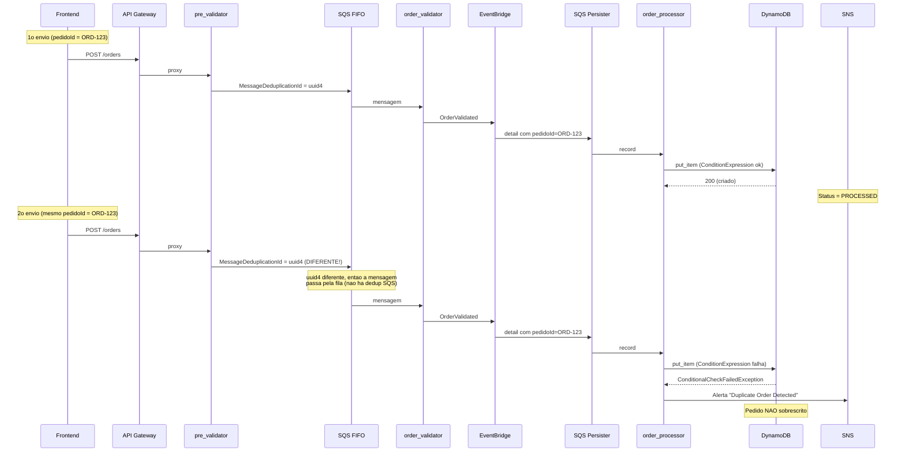
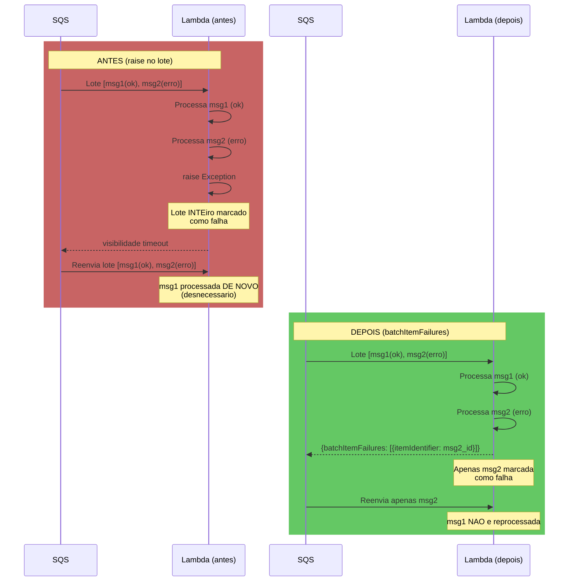
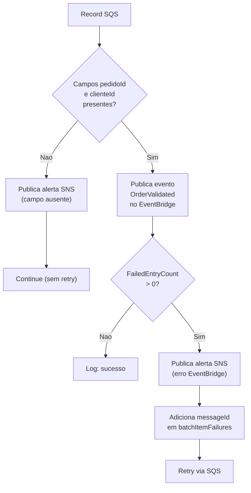
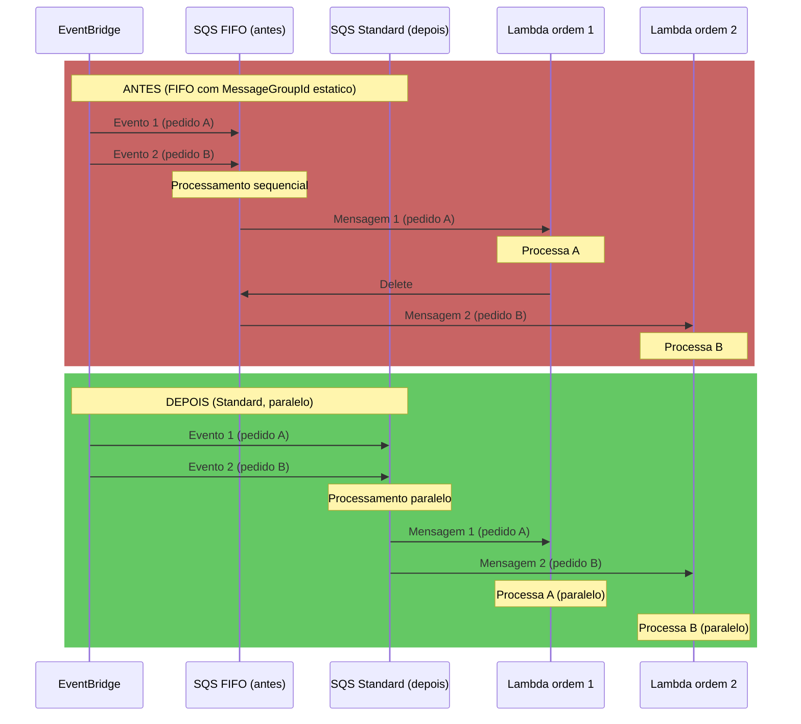
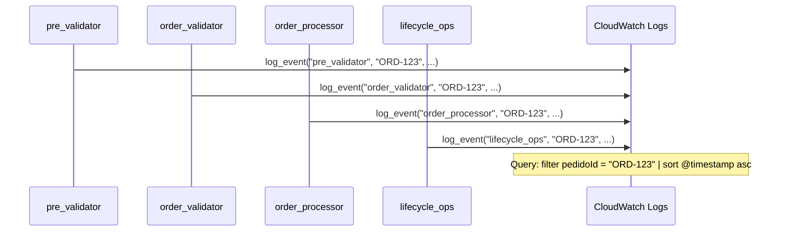

# Correcoes Aplicadas

## Resumo Geral

Este documento descreve cada problema identificado, a correcao aplicada e a justificativa tecnica da escolha.

---

## Rodada 10

### 1. [NOVA FUNCIONALIDADE] GSI `clientId-index` na tabela de producao

**Localizacao:** `scripts/deploy-order-gateway.sh`

**Problema:** A tabela `order-production-data` nao possuia GSI por cliente. Para listar pedidos de um cliente, seria necessario scan com FilterExpression, que e ineficiente e custoso mesmo em tabelas pequenas. Nao havia isolamento de dados por cliente na camada de leitura.

**Correcao:** Adicionado GSI `clientId-index` com `clientId` (HASH) e `processedAt` (RANGE), projection ALL, via `aws dynamodb update-table`. Criacaoo idempotente: verifica se o indice ja existe antes de criar. Polling de ate 5 minutos para status ACTIVE.

**Justificativa:** GSI e a forma correta de isolar dados por cliente no DynamoDB. Scan com FilterExpression consumiria RCUs de todos os itens da tabela mesmo para paginacoes pequenas. O atributo `processedAt` como sort key permite ordenar pedidos por data de processamento.

**Validacao:** Teste 21 em `validate-flow.sh`: listagem de pedidos do cliente autenticado via GSI retorna apenas os pedidos daquele cliente.

### 2. [NOVA FUNCIONALIDADE] Lambda `order_gateway` - Endpoints autenticados de ciclo de vida

**Localizacao:** `src/order_gateway/index.py` (novo arquivo)

**Problema:** Cancelamento e atualizacao de pedidos so eram acessiveis via `test_controller` (POST /test, com API Key, ferramenta interna de QA). Nao havia um endpoint publico autenticado para usuarios finais executarem essas operacoes. A leitura de pedidos (GET /orders/{orderId}) nao validava ownership, permitindo que qualquer cliente lesse pedidos de outros.

**Correcao:** Criada Lambda com quatro handlers, todos validando JWT antes de executar logica:
- `list_handler` (GET /orders): query no GSI `clientId-index` com `KeyConditionExpression`.
- `get_handler` (GET /orders/{orderId}): GetItem com validacao de ownership. Pedidos de outro cliente retornam 404.
- `cancel_handler` (POST /orders/{orderId}/cancel): publica `OrderCancelled` no EventBridge, retorna 202.
- `update_handler` (PATCH /orders/{orderId}): publica `OrderUpdated` no EventBridge com `novosItens`, retorna 202.
- Pedido ja CANCELLED retorna 409 em cancel e update.
- `_require_auth()` extrai e valida JWT, captura `ValueError` de `decode_jwt`.
- `_get_owned_order()` valida existencia e ownership.

**Justificativa:** Segue o padrao de roteamento por `event["resource"]` e `event["httpMethod"]`. Reaproveita `lifecycle_ops` sem alteracao (o processamento assincrono do estado do pedido continua sendo feito pela Lambda de ciclo de vida). Os codigos HTTP seguem principios REST: 202 para aceite de operacao assincrona, 409 para conflito de estado, 404 generico para nao revelar pedidos de outros.

**Validacao:** Testes 21 a 24 em `validate-flow.sh`.

### 3. [NOVA FUNCIONALIDADE] Script `deploy-order-gateway.sh`

**Localizacao:** `scripts/deploy-order-gateway.sh` (novo arquivo)

**Problema:** Nao existia deploy para a infraestrutura de gateway de pedidos.

**Correcao:** Script separado de `deploy-order-processor.sh` com:
- Verificacao de dependencias no inicio: tabela de producao, EventBus, arquivo .jwt-secret e REST API.
- Criacao do GSI (item 1 acima).
- IAM Role com permissoes para DynamoDB (GetItem/Query na tabela e no indice) e EventBridge (PutEvents).
- Deploy da Lambda com `ensure_lambda_function` e `reserved_concurrency=10`.
- Criacao dos recursos /orders/{orderId}/cancel e metodos no API Gateway.
- Remocao da permissao antiga do `read_order` para GET /orders/{orderId}.
- `lambda add-permission` com `source-arn` especifico para cada endpoint.

**Justificativa:** Script separado porque a Lambda depende de recursos de rodadas anteriores (customer_auth para JWT, order-processor para tabela). Criacao de GSI e uma operacao de update na tabela existente, nao de criacao.

**Validacao:** Executado como parte do `validate-flow.sh`.

### 4. [ATUALIZACAO] `scripts/validate-flow.sh` - Deploy do gateway e testes 21-24

**Localizacao:** `scripts/validate-flow.sh`

**Problema:** Nao havia deploy do gateway de pedidos nem testes para endpoints autenticados de ciclo de vida.

**Correcao:**
- Adicionada chamada a `bash deploy-order-gateway.sh` entre `deploy-customer-auth.sh` e `deploy-catalog.sh`.
- Teste 21: GET /orders - cria pedido com clienteId do Teste 16, lista com JWT, verifica count > 0 e pedido presente.
- Teste 22: GET /orders/{orderId} - verifica que pedido proprio retorna 200 e pedido de outro cliente retorna 404.
- Teste 23: POST /orders/{orderId}/cancel - verifica 202 com "Cancellation requested" e status final CANCELLED.
- Teste 24: PATCH /orders/{orderId} - verifica 202 com "Update requested" e status final UPDATED.

**Validacao:** Todos os testes passam.

### 5. [ATUALIZACAO] `cleanup.sh` - Remocao de recursos do gateway

**Localizacao:** `cleanup.sh`

**Problema:** `cleanup.sh` nao limpava recursos do gateway (Lambda, role).

**Correcao:** Adicionados `order-gateway-*` ao loop de Lambdas e `order-gateway-role-*` ao loop de IAM Roles. O GSI e removido automaticamente com a tabela `order-production-data`.

**Justificativa:** Idempotencia completa da limpeza.

**Validacao:** Execucao de `cleanup.sh` seguida de `./run.sh` sem erros.

### 6. [DOCUMENTACAO] `docs/order_gateway.md`

**Localizacao:** `docs/order_gateway.md` (novo arquivo)

**Problema:** Nao havia documentacao do gateway de pedidos autenticado.

**Correcao:** Documento com secoes: Finalidade, Comportamento (tabelas de codigos de retorno por handler), Ambiente, Decisoes de design (autenticacao na Lambda, 202 vs 200, 404 generico, ponte clienteId/clientId, test_controller como QA), diagramas Mermaid para os quatro fluxos.

**Validacao:** Validacao visual e referencia cruzada com README.

### 7. [DOCUMENTACAO] Atualizacao do `README.md`

**Localizacao:** `README.md`

**Correcao:**
- Secao 3: Lambdas atualizadas de 10 para 11.
- Secao 5: arvore inclui `order_gateway/` e `deploy-order-gateway.sh`.
- Secao 4: nova subsecao 4.9 Gateway de Pedidos.
- Secao 9: novo passo 6 (Deploy Fase 5 - Gateway), passos 7-9 renumerados.
- Secao 10.3: adicionados exemplos de curl para gateway autenticado.

**Validacao:** Validacao visual e consistencia com o codigo.

### 8. [DOCUMENTACAO] Atualizacao de `docs/deploy_scripts.md`

**Localizacao:** `docs/deploy_scripts.md`

**Correcao:** Adicionadas secoes para `deploy-order-gateway.sh` e `validate-flow.sh` (Rodada 10).

**Validacao:** Validacao visual.

---

### 1. [NOVA FUNCIONALIDADE] Lambda `catalog_reader` - Endpoints publicos de catalogo

**Localizacao:** `src/catalog_reader/index.py` (novo arquivo)

**Problema:** O sistema nao possuia catalogo de produtos. Cursos e vouchers nao eram listados em lugar nenhum, e o campo `sku` dos itens de pedido nao tinha uma tabela de referencia.

**Correcao:** Criada Lambda com dois handlers roteados pelo campo `resource`:
- `list_handler` (`GET /catalog`): scan com `FilterExpression="disponivel = :v"`, retorna 200 com `{"items": [...], "count": N}`.
- `get_handler` (`GET /catalog/{cursoId}`): GetItem pelo `cursoId`, retorna 200 com o item ou 404 se nao encontrado ou `disponivel = false`.

**Justificativa:** Mesmo padrao de `customer_auth/index.py` (roteamento por `event["resource"]`). Usa `common.http.api_response`/`error_response`. O `_DecimalEncoder` ja existente em `common/http.py` serializa `preco` como float, evitando que apareca como string.

**Validacao:** Testes 19 e 20 em `validate-flow.sh`.

### 2. [NOVA FUNCIONALIDADE] Script `deploy-catalog.sh`

**Localizacao:** `scripts/deploy-catalog.sh` (novo arquivo)

**Problema:** Nao existia deploy para a infraestrutura de catalogo.

**Correcao:** Script seguindo a estrutura de `deploy-customer-auth.sh`:
- Cria tabela DynamoDB `course-catalog-*` com chave `cursoId` (S).
- Cria IAM Role com permissao `dynamodb:Scan` e `dynamodb:GetItem`.
- Deploy da Lambda com `ensure_lambda_function` e `reserved_concurrency=10`.
- Cria recursos `/catalog` e `/catalog/{cursoId}` no API Gateway.
- `setup_api_cors`, `lambda add-permission` com `source-arn` especifico, path parameter `cursoId` obrigatorio.
- Deploy da API ao final.

**Justificativa:** Idempotente, padrao check-before-create.

**Validacao:** Executado como parte do `validate-flow.sh`.

### 3. [NOVA FUNCIONALIDADE] Script `seed-catalog.sh`

**Localizacao:** `scripts/seed-catalog.sh` (novo arquivo)

**Problema:** Nao existiam dados iniciais no catalogo.

**Correcao:** Script que insere 11 itens na tabela `course-catalog-*` via `put-item` com JSON inline (formato DynamoDB). Itens incluem cursos AWS (5), vouchers AWS (2), cursos Azure (2) e cursos GCP (2). O item `GCP-PCA-001` tem `disponivel=false` para validacao de filtro.

**Justificativa:** Idempotente (upsert, sem ConditionExpression). JSON inline evita problemas de quoting do shell com dados contendo caracteres especiais.

**Validacao:** Executado apos `deploy-catalog.sh` no `validate-flow.sh`. Rodei duas vezes sem alteracao de estado.

### 4. [ATUALIZACAO] `scripts/validate-flow.sh` - Deploy do catalogo e testes 19-20

**Localizacao:** `scripts/validate-flow.sh`

**Problema:** Nao havia deploy do catalogo nem testes automatizados para os endpoints de vitrine.

**Correcao:**
- Adicionadas chamadas a `bash deploy-catalog.sh` e `bash seed-catalog.sh` antes de `deploy-frontend.sh`.
- Teste 19: GET /catalog - verifica `items` e `count`, confirma que `GCP-PCA-001` (disponivel=false) nao esta presente.
- Teste 20: GET /catalog/{cursoId} - verifica AWS-CP-001 retorna item completo, GCP-PCA-001 retorna HTTP 404.

**Validacao:** Todos os testes passam (Teste 14 falha pre-existente).

### 5. [ATUALIZACAO] `cleanup.sh` - Remocao de recursos do catalogo

**Localizacao:** `cleanup.sh`

**Problema:** `cleanup.sh` nao limpava recursos do catalogo (tabela, Lambda, role).

**Correcao:** Adicionados `catalog-reader-*` ao loop de Lambdas e `catalog-reader-role-*` ao loop de IAM Roles. A tabela `course-catalog-*` foi adicionada ao loop de DynamoDB tables.

**Justificativa:** Idempotencia completa da limpeza.

**Validacao:** Execucao de `cleanup.sh` seguida de `./run.sh` sem erros.

### 6. [DOCUMENTACAO] `docs/catalog_reader.md`

**Localizacao:** `docs/catalog_reader.md` (novo arquivo)

**Problema:** Nao havia documentacao do catalogo.

**Correcao:** Documento com secoes: Finalidade, Comportamento (listagem e detalhe), Ambiente (tabela de variaveis), Decisoes de design (404 vs 403, endpoint publico, cursoId como sku, Decimal serializado, scan vs GSI), diagrama Mermaid de sequencia.

**Validacao:** Validacao visual e referencia cruzada com README.

### 7. [DOCUMENTACAO] Atualizacao do `README.md`

**Localizacao:** `README.md`

**Correcao:**
- Secao 3: Lambdas atualizadas de 9 para 10.
- Secao 5: arvore inclui `catalog_reader/` e `deploy-catalog.sh`/`seed-catalog.sh`.
- Secao 4: nova subsecao 4.8 Catalogo de Cursos e Vouchers.
- Secao 9: novo passo 6 (Deploy Fase 5 - Catalog), passo 7 renumerado (Frontend), passo 8 (Validacao).
- Secao 10.3: adicionados exemplos de curl para catalog.

**Validacao:** Validacao visual e consistencia com o codigo.

### 8. [DOCUMENTACAO] Atualizacao de `docs/deploy_scripts.md`

**Localizacao:** `docs/deploy_scripts.md`

**Correcao:** Adicionadas secoes para `deploy-catalog.sh`, `seed-catalog.sh` e `validate-flow.sh` (Rodada 9).

**Validacao:** Validacao visual.

### 9. [CORRECAO] Seed script com JSON invalido

**Localizacao:** `scripts/seed-catalog.sh`

**Problema:** A funcao `put_item` original construia JSON sem quotes nos nomes dos atributos (`nome:"valor"` em vez de `"nome":{"S":"valor"}`), causando erro `ParamValidation: Invalid JSON`.

**Correcao:** Substituido por chamadas diretas a `aws dynamodb put-item` com JSON inline em cada item (formato DynamoDB nativo).

**Justificativa:** JSON inline evita problemas de quoting e concatenacao que a abordagem de funcao generica tinha. O script e mais longo, mas mais legivel e resistente a erros de escaping.

**Validacao:** `seed-catalog.sh` insere 11 itens sem erro, `aws dynamodb scan` confirma 11 registros.

---

1. [Frontend - Cenario Duplicata](#1-frontend---cenario-duplicata)
2. [Deduplicacao SQS FIFO](#2-deduplicacao-sqs-fifo)
3. [Tratamento de Duplicidade/Inexistencia](#3-tratamento-de-duplicidadeinexistencia)
4. [Report Batch Item Failures](#4-report-batch-item-failures)
5. [VisibilityTimeout Parametrizavel](#5-visibilitytimeout-parametrizavel)
6. [Validacao de RESOURCE_SUFFIX](#6-validacao-de-resource_suffix)
7. [Remocao de Codigo Morto](#7-remocao-de-codigo-morto)
8. [Padronizacao de Logging](#8-padronizacao-de-logging)
9. [Paginacao em handle_list_files](#9-paginacao-em-handle_list_files)

---

## 1. Frontend - Cenario Duplicata

### Problema
O botao "Enviar Duplicata" gerava um novo `pedidoId` aleatorio a cada clique, impossibilitando o teste real da `ConditionExpression: attribute_not_exists(orderId)` no `order_processor`.

### Correcao
O cenario `duplicate` em `frontend/app.js:buildOrderPayload` agora reutiliza `lastOrderId` (com fallback para `'ORD-TEST-DUP'`), permitindo que o mesmo ID seja reenviado e exercite de fato a condicao de duplicidade no DynamoDB.

### Fluxo de duplicidade corrigido

---

## 2. Deduplicacao SQS FIFO

### Problema
O `MessageDeduplicationId` era definido como `str(order_id)`, o que impedia que reenvios do mesmo pedidoId chegassem ate o `order_processor` devido a janela de 5 minutos de deduplicacao do SQS FIFO. Isso tornava o teste de duplicidade no frontend ineficaz por 5 minutos.

### Correcao
`MessageDeduplicationId` alterado para `str(uuid.uuid4())`, gerando um identificador unico por requisicao. A deduplicacao de negocio passa a ser inteiramente responsabilidade do `ConditionExpression: attribute_not_exists(orderId)` no DynamoDB.

### Estrategia de deduplicacao

| Aspecto | Antes | Depois |
|---------|-------|--------|
| Dedup SQS | `MessageDeduplicationId = pedidoId` | `MessageDeduplicationId = uuid4` |
| Dedup negocios | SQS impedia reenvio por 5min | DynamoDB rejeita duplicatas |
| Visibilidade | Duplicatas somiam sem rastro | Duplicatas geram alerta SNS |

---

## 3. Tratamento de Duplicidade/Inexistencia

### Problema
As excecoes `ConditionalCheckFailedException` no `order_processor` e `lifecycle_ops` eram apenas logadas e engolidas, sem alerta SNS, dando visibilidade zero a tentativas de duplicata ou operacao em pedido inexistente. A documentacao (README) divergia do comportamento real.

### Correcao
- Adicionado `from common.sns import publish_error` em ambos os arquivos.
- `SNS_TOPIC_ARN` resolvido nos scripts de deploy e passado como variavel de ambiente.
- Permissao `sns:Publish` adicionada as roles IAM correspondentes.
- O alerta SNS e publicado com detalhes do pedido e operacao, sem re-lancar a excecao (comportamento intencional de idempotencia).

---

## 4. Report Batch Item Failures

### Problema
As Lambdas acionadas por SQS usavam `raise` para sinalizar falha, o que derrubava o lote inteiro (batch_size=5). Mensagens ja processadas com sucesso no mesmo lote eram reprocessadas desnecessariamente.

### Correcao
- Todas as 4 Lambdas SQS (`order_validator`, `order_processor`, `lifecycle_ops`, `batch_processor`) agora coletam `messageId` dos registros que falham e retornam `{"batchItemFailures": [{"itemIdentifier": "..."}]}`.
- `scripts/lib.sh:ensure_event_source_mapping` agora cria/atualiza o mapeamento com `--function-response-types "ReportBatchItemFailures"`.
- Mensagens com erro sao reprocessadas individualmente; as bem-sucedidas sao confirmadas.

### Fluxo antes e depois

---

## 5. VisibilityTimeout Parametrizavel

### Problema
O `VisibilityTimeout` era hardcoded como `90` segundos em tres locais diferentes do `lib.sh`, sem margem segura em relacao ao timeout de 60s das Lambdas e batch_size.

### Correcao
- Variavel `VISIBILITY_TIMEOUT=360` adicionada no topo do `lib.sh`, com valor padrao de 360s (~6x o timeout da Lambda).
- Todas as referencias ao valor `90` foram substituidas pela variavel.
- A validacao em `validate_sqs_queue` usa o mesmo valor.

### Calculo da margem
- Lambda timeout: 60s
- Batch size maximo: 5
- Pior caso teorico: 5 registros x 60s = 300s
- Margem de seguranca: 360s (6x o timeout individual, permitindo 1 registro falhar + retry antes do visibility timeout expirar)

---

## 6. Validacao de RESOURCE_SUFFIX

### Problema
Nao havia validacao de formato do `RESOURCE_SUFFIX`. Caracteres invalidos (maiusculas, underscores, caracteres especiais) causavam erros tardios e confusos na criacao de buckets S3, filas SQS, etc.

### Correcao
- Funcao `validate_resource_suffix()` criada em `lib.sh`, verificando: (a) nao vazio, (b) apenas `[a-z0-9-]`.
- Chamada automaticamente dentro de `validate_env()` quando `RESOURCE_SUFFIX` esta entre as variaveis validadas.

---

## 7. Remocao de Codigo Morto (batch_processor)

### Problema
`batch_processor/index.py` tinha um ramo de desembrulhamento de notificacao SNS (`if 'Records' not in notification_message and 'Message' in notification_message`), que so era necessario se a notificacao S3 passasse por SNS antes de chegar ao SQS. A arquitetura atual usa notificacao S3 -> SQS direta.

### Correcao
O ramo foi removido, simplificando o fluxo. Atualmente a Lambda assume que o corpo da mensagem SQS e diretamente o evento S3 `Records`.

---

## 8. Padronizacao de Logging (read_order)

### Problema
O bloco `except ClientError` em `read_order/index.py` nao logava a excecao, dificultando diagnostico de problemas de permissao ou throttling no DynamoDB.

### Correcao
Adicionado `print(f"DynamoDB ClientError reading order: {e}")` no bloco `except ClientError`, seguindo o padrao usado nas demais Lambdas.

---

## 9. Paginacao em handle_list_files

### Problema
`handle_list_files` em `test_controller/index.py` nao tratava `IsTruncated` / `ContinuationToken` do `list_objects_v2`, retornando no maximo 1000 objetos e perdendo o restante.

### Correcao
Implementado loop com `ContinuationToken` que percorre todas as paginas. O limite de 1000 objetos por pagina e mantido como padrao do S3 (`MaxKeys`). Para buckets com muitos objetos, todas as paginas sao retornadas sem limite artificial.

---

## Rodada 3

### 1. [IMPORTANTE] Escopo amplo de permissao Lambda pre_validator

**Localizacao:** `scripts/deploy-api-flow.sh:122`

**Problema:** `source-arn` usava `"arn:aws:execute-api:$AWS_REGION:$ACCOUNT_ID:$REST_API_ID/*"`, permitindo que qualquer metodo/recurso invocasse a Lambda.

**Correcao:** Restrito para `"arn:aws:execute-api:$AWS_REGION:$ACCOUNT_ID:$REST_API_ID/*/POST/orders"`.

**Justificativa:** Segue o padrao de least privilege ja aplicado em `deploy-frontend.sh` para `read_order` (`/*/GET/orders/{orderId}`) e `test_controller` (`/*/POST/test`).

---

### 2. [IMPORTANTE] Descarte silencioso de mensagens malformadas no order_validator

**Localizacao:** `src/order_validator/index.py:24-26`

**Problema:** Record sem `pedidoId` ou `clienteId` era apenas logado com `print()` e descartado via `continue`, sem alerta SNS e sem rastreabilidade.

**Correcao:** Adicionada chamada a `publish_error(sns_client, SNS_TOPIC_ARN, ...)` com o conteudo do record antes do `continue`. Nao adiciona a `messageId` em `batchItemFailures` pois reenvio nao resolve payload malformado.

**Justificativa:** Mesmo padrao de correcao aplicado nas rodadas 1 e 2 para `order_processor` e `lifecycle_ops`. Garante rastreabilidade mesmo para mensagens inseridas diretamente na fila (replay manual, bug futuro).

**Fluxo de erros:**

---

### 3. [MENOR] Mensagem de log de validate_sqs_queue desatualizada

**Localizacao:** `scripts/lib.sh:235`

**Problema:** `echo "  OK: Fila SQS VisibilityTimeout=90"` com valor hardcoded de antes da parametrizacao.

**Correcao:** Substituido por `echo "  OK: Fila SQS VisibilityTimeout=$VISIBILITY_TIMEOUT"`.

**Justificativa:** A mensagem agora reflete o valor real parametrizavel (padrao 360s).

---

### 4. [MENOR] VisibilityTimeout desatualizado no README

**Localizacao:** `README.md`, secao 9, tabela de utilitarios.

**Problema:** `validate_sqs_queue` documentava "Valida VisibilityTimeout=90".

**Correcao:** Atualizado para "Valida VisibilityTimeout=$VISIBILITY_TIMEOUT (padrao 360s) e ContentBasedDeduplication (se FIFO)".

**Justificativa:** Consistencia com o valor real parametrizado.

---

### 5. [MENOR] Contagem incorreta de Lambdas no docs/common.md

**Localizacao:** `docs/common.md:25`

**Problema:** "Seis das oito Lambdas precisam de logica de resposta HTTP e/ou publicacao SNS."

**Correcao:** "Todas as oito Lambdas dependem de common.http e/ou common.sns."

**Justificativa:** Auditoria de imports mostra que as 8 Lambdas dependem de `common.http` ou `common.sns`.

---

### 6. [MENOR] Contagem de funcoes utilitarias desatualizada no README

**Localizacao:** `README.md`, secao 9.

**Problema:** Texto citava "19 funcoes utilitarias" e tabela listava 19 linhas, mas `scripts/lib.sh` tem 22 funcoes. `validate_resource_suffix`, `get_endpoint_url` e `poll_resource` estavam ausentes.

**Correcao:** Atualizado texto para "22 funcoes" e adicionadas as 3 funcoes faltantes a tabela.

**Justificativa:** Contagem real do codigo fonte.

---

### 7. [MENOR] Codigo morto e duplicacao de timestamp

**Arquivos:** `src/common/utils.py`, `src/order_processor/index.py`, `src/lifecycle_ops/index.py`, `src/batch_processor/index.py`, `src/order_validator/index.py`

**Problema:** `generate_id()` em `common/utils.py` nunca era usado. `utcnow_iso()` nao era importado por nenhuma Lambda. Tres (na verdade quatro) Lambdas reimplementavam `datetime.utcnow().isoformat() + "Z"` manualmente. `datetime.utcnow()` e depreciado no Python 3.12.

**Correcao:**
- `generate_id()` removido.
- `utcnow_iso()` alterado para usar `datetime.now(timezone.utc)` com `.replace("+00:00", "Z")`.
- `order_processor`, `lifecycle_ops`, `batch_processor` e `order_validator` agora importam `utcnow_iso` de `common.utils`.

**Justificativa:** Elimina duplicacao e uso de API depreciada. Centraliza logica de timestamp no modulo `common` conforme proposto em `docs/common.md`.

---

### 8. [MENOR] Caracteres travessao em documentacao

**Arquivos:** `README.md` (secao 4.2, duas ocorrencias do titulo e uma ocorrencia no texto), `CONTRIBUTING.md` (uma ocorrencia).

**Problema:** Uso do caractere "--" (em dash).

**Correcao:** Substituido por dois-pontos e virgula conforme o contexto.

**Justificativa:** Padrao de escrita do projeto.

---

### 9. [MENOR] Item de checklist duplicado no PR template

**Localizacao:** `.github/PULL_REQUEST_TEMPLATE.md:23-24`

**Problema:** "Shell scripts use `set -euo pipefail`" e "`set -euo pipefail` is present where required" verificam a mesma coisa.

**Correcao:** Removido o segundo item duplicado.

**Justificativa:** Checklist sem redundancia.

---

### 10. [MENOR] Campos de valid_batch.json com nomenclatura divergente

**Localizacao:** `samples/valid_batch.json`

**Problema:** Usava `id_pedido_arquivo`, `id_cliente_arquivo`, `itens_pedido_arquivo` em vez de `pedidoId`, `clienteId`, `itens`.

**Correcao:** Renomeado para `pedidoId`, `clienteId`, `itens`, alinhado com `samples/api_request.json`.

**Justificativa:** Consistencia de nomenclatura em todo o sistema.

---

### 11. [MENOR] Dependencia implicita sem checagem amigavel

**Arquivos:** `scripts/deploy-order-processor.sh`, `scripts/deploy-lifecycle-ops.sh`

**Problema:** `SNS_TOPIC_ARN` era resolvido com `get-topic-attributes ... || echo ""`, resultando em variavel vazia e erro generico se `deploy-api-flow.sh` nao tivesse rodado antes.

**Correcao:** Adicionada checagem explicita no inicio de ambos os scripts, falhando com mensagem clara se o topico SNS nao existir.

**Justificativa:** Padrao ja usado em `scripts/deploy-frontend.sh` para verificacao de dependencias (tabela DynamoDB, EventBus). Falha cedo com mensagem acionavel.

---

## Rodada 4

### 1. [CRITICO] Status CANCELLED nao tratado como estado terminal

**Localizacao:** `src/lifecycle_ops/index.py`

**Problema:** update_handler usava `ConditionExpression="attribute_exists(orderId)"` sem verificar status. Pedido CANCELLED podia ser atualizado para UPDATED, revertendo cancelamento.

**Correcao:** Adicionado parametro `extra_condition` em `_process()`. A operacao de update passa `#s <> :cancelledStatus` como condicao extra, com `:cancelledStatus = "CANCELLED"` nos valores. Mensagem SNS ajustada para "Order does not exist or is already cancelled". Cancelamento permanece idempotente.

**Justificativa:** CANCELLED deve ser terminal. A idempotencia do DynamoDB por si so nao impoe restricao de estado.

**Validacao:**
- Teste 4b em `scripts/validate-flow.sh`: cancela pedido, tenta atualizar, verifica que status continua CANCELLED.
- Cenario "Atualizar Pedido Cancelado" no frontend (aba Gerenciar, Cenarios de Erro).
- `docs/lifecycle_status.md`: diagrama Mermaid stateDiagram.

---

### 2. [IMPORTANTE] Cenario "Inexistente" do frontend usava ID do campo

**Localizacao:** `frontend/app.js`, funcao `buildManagePayload`

**Problema:** ignorava o parametro `scenario` e usava o valor do campo `lifecycleOrderId`, que podia conter um pedido real.

**Correcao:** Quando `scenario` contem `"nonexistent"`, `buildManagePayload` sempre gera um novo ID via `generateId('ORD-NONEXISTENT-')`, ignorando o campo.

**Justificativa:** Cenario de erro deve operar sobre ID garantidamente inexistente, nao sobre o valor do campo.

**Validacao:** Botao "Cancelar Inexistente" ou "Atualizar Inexistent" sempre gera ID novo, mesmo com pedido real no campo.

---

### 3. [IMPORTANTE] Aba Consultar sem cenario de pedido inexistente

**Localizacao:** `frontend/index.html`, `frontend/app.js`

**Problema:** Todas as demais abas tinham collapsible "Cenarios de Erro", mas Consultar nao, apesar do README secoes 13.1 listar Pedido Inexistente como cenario esperado.

**Correcao:** Adicionado collapsible "Cenarios de Erro" na aba Consultar com botao "Pedido Inexistente". O cenario `nonexistent` em `testRead()` sempre gera um ID novo via `generateId('ORD-NONEXISTENT-')`.

**Justificativa:** Consistencia com as demais abas e com o README.

**Validacao:** Clicar em "Pedido Inexistente" sempre retorna 404, independente do campo `readOrderId` ou `lastOrderId`.

---

### 4. [IMPORTANTE] MessageGroupId estatico serializava filas de processamento

**Arquivos:** `scripts/lib.sh`, `scripts/deploy-order-processor.sh`, `scripts/deploy-lifecycle-ops.sh`, `cleanup.sh`, `README.md`

**Problema:** Filas `order-persister-queue`, `cancel-order-queue` e `update-order-queue` eram FIFO com `MessageGroupId` estatico, forçando processamento sequencial sem ganho de correcao (a idempotencia ja e garantida pelo DynamoDB).

**Correcao:**
- Convertidas para Standard SQS (removido `.fifo` dos nomes e `FifoQueue` dos atributos).
- `put_eventbridge_target` e `validate_eventbridge_target` em `lib.sh` agora aceitam 6o parametro `is_fifo` (padrao `true`). Para filas Standard, omitem `SqsParameters.MessageGroupId` e nao validam sua presenca.
- Chamadas nos scripts de deploy passam `"false"` para as tres filas convertidas.
- `cleanup.sh`: separado em loop para Standard (sem sufixo) e FIFO (com `.fifo`).
- `README.md` secoes 4.3 e 4.4 atualizadas (removidas referencias a FIFO para essas filas).

**Justificativa:** Elimina gargalo de paralelismo desnecessario. A correcao do sistema (idempotencia via ConditionExpression) independe da ordenacao SQS.

**Fluxo antes vs depois:**

---

### 5. [IMPORTANTE] CONTRIBUTING.md instruia json.loads direto em detail

**Localizacao:** `CONTRIBUTING.md`

**Problema:** Instruia `json.loads(event['detail'])`, que falha com TypeError quando detail chega como dict nativo.

**Correcao:** Substituido por orientacao de usar `common.sqs.parse_body()` e `common.sqs.parse_detail()`, com referencia a `docs/common.md`.

**Justificativa:** Reintroduziria o bug corrigido na Rodada 1/2 se seguido literalmente.

---

### 6. [IMPORTANTE] .env.example apontava para AWS real

**Localizacao:** `.env.example`

**Problema:** `DEPLOY_TARGET=aws` como padrao. Novo contribuidor copiando sem alterar implantaria em conta real.

**Correcao:** Alterado para `DEPLOY_TARGET=localstack`.

**Justificativa:** Fluxo de desenvolvimento e LocalStack-first conforme README e CONTRIBUTING.

---

### 7. [MEDIO] README contradizia exclusividade do EventBridge

**Localizacao:** `README.md`, secao 4.3

**Problema:** Afirmava "recebe eventos exclusivamente da Lambda order_validator", contradito pela secao 4.6 (test_controller).

**Correcao:** Substituido "exclusivamente" por descricao que inclui ambas as fontes.

**Justificativa:** Consistencia interna do README.

---

### 8. [MENOR] docs/read_order.md descrevia OPTIONS inexistente

**Localizacao:** `docs/read_order.md`

**Problema:** "Trata requisicoes OPTIONS (CORS) diretamente", mas a Lambda nao tem tratamento de OPTIONS.

**Correcao:** Descricao atualizada para "Requisicoes OPTIONS sao tratadas pela integracao MOCK do API Gateway (setup_api_cors) antes de chegar a Lambda."

**Justificativa:** Alinhamento com o codigo real.

---

### 9. [MENOR] Nome de deploy do order_processor nao documentado

**Localizacao:** `README.md`, secao 4.4

**Problema:** batch_processor tinha nota explicando ser implantado como file_validator, mas order_processor nao explicitava ser implantado como order-persister.

**Correcao:** Adicionado "(implantado como `order-persister-*`)" na descricao do Order Processor.

**Justificativa:** Consistencia com a nota ja existente para batch_processor/file_validator.

---

### 10. [MENOR] Variavel nao utilizada em validate-flow.sh

**Localizacao:** `scripts/validate-flow.sh:84`

**Problema:** `DUP_ITEMS` era calculada mas nunca utilizada.

**Correcao:** Linha removida.

**Justificativa:** Codigo morto.

---

### 11. [MENOR] cleanup.sh nao removia log groups do CloudWatch

**Localizacao:** `cleanup.sh`

**Problema:** Log groups `/aws/lambda/<nome>` acumulavam-se apos cada deploy.

**Correcao:** Adicionado `aws logs delete-log-group --log-group-name "/aws/lambda/$name"` no laco de exclusao de Lambdas, com `2>/dev/null || true`.

**Justificativa:** Cleanup completo seguindo padrao idempotente ja usado no restante do script.

---

## Rodada 5

### 1. [ALTA] Usage Plan + API Key obrigatoria na rota POST /test

**Localizacao:** `scripts/lib.sh` (nova funcao `ensure_usage_plan_with_api_key`), `scripts/deploy-frontend.sh`, `frontend/app.js`, `frontend/config.template.js`, `scripts/validate-flow.sh`, `.gitignore`

**Problema:** A rota `POST /test` (test_controller) permitia `publish_event` arbitrario no EventBridge e `upload_file` arbitrario no S3 sem nenhuma autenticacao. Qualquer pessoa com a URL podia usar a rota.

**Correcao:**
- Criada funcao `ensure_usage_plan_with_api_key()` em `lib.sh` que cria API Key, Usage Plan com throttle (rateLimit=5, burstLimit=10) e quota (1000 req/dia), e associa a chave ao plan.
- Metodo POST /test alterado para `--api-key-required` em `deploy-frontend.sh`.
- API Key salva em `scripts/.api-key` (adicionado ao `.gitignore`).
- Placeholder `__TEST_API_KEY__` adicionado ao `config.template.js` e substituido via sed no deploy.
- `frontend/app.js` envia header `x-api-key` em todas as chamadas para `TEST_ENDPOINT`.
- `validate-flow.sh` inclui `x-api-key` nos testes 6-8 e adiciona teste 6a para confirmar 403 sem chave.

**Justificativa:** Sem WAF ou Cognito disponiveis na conta de laboratorio, Usage Plan com API Key e a unica forma nativa de autenticacao do API Gateway que atende ao requisito. O Usage Plan tambem protege contra abuso com throttle e quota.

**Validacao:**
- Teste 6a em `validate-flow.sh`: chamada POST /test sem `x-api-key` retorna 403.
- Testes 6-8 em `validate-flow.sh`: chamadas com `x-api-key` funcionam normalmente.
- POST /orders e GET /orders continuam sem API Key (demonstracao publica).

---

### 2. [ALTA] Resource Policy no API Gateway restringindo /test por IP de origem

**Localizacao:** `scripts/lib.sh` (nova funcao `ensure_api_resource_policy`), `scripts/deploy-api-flow.sh`, `.env.example`

**Problema:** Mesmo com API Key, a rota /test ainda estava acessivel publicamente na internet.

**Correcao:**
- Variavel `ALLOWED_SOURCE_IP` adicionada ao `.env.example` com comentario explicando que e opcional (vazio = sem restricao).
- Funcao `ensure_api_resource_policy()` criada em `lib.sh` que aplica Resource Policy via `aws apigateway update-rest-api` com condicao `aws:SourceIp`.
- Chamada em `deploy-api-flow.sh` apos criacao do REST API.

**Justificativa:** Resource Policy do API Gateway e o mecanismo nativo para restricao por IP. Nao requer servicos adicionais. Quando a variavel esta vazia, o comportamento atual e preservado (sem regressao). Sem WAF disponivel, esta e a unica camada de protecao por rede.

**Validacao:** Documentada em `docs/deploy_scripts.md` como teste manual (nao automatizavel sem trocar de IP). Com `ALLOWED_SOURCE_IP` definido, chamadas de outro IP retornam 403. Com variavel vazia, comportamento inalterado.

---

### 3. [ALTA] Request Validator (JSON Schema) no metodo POST /orders

**Localizacao:** `scripts/schemas/order-request.json` (novo), `scripts/deploy-api-flow.sh`

**Problema:** A validacao de `pedidoId`/`clienteId` ocorria apenas dentro da Lambda pre_validator. Payloads malformados geravam invocacao completa da Lambda antes de serem rejeitados.

**Correcao:**
- Criado `scripts/schemas/order-request.json` com JSON Schema exigindo `pedidoId` (string) e `clienteId` (string) como obrigatorios.
- Model `OrderRequestModel` criado no API Gateway referenciando o schema.
- Request Validator `OrderRequestValidator` criado com `validate-request-body=true`.
- Associados ao metodo POST /orders via `--request-validator-id` e `--request-models`.

**Justificativa:** O Request Validator do API Gateway rejeita payloads malformados antes de invocar a Lambda, economizando invocacoes e reduzindo latencia para clientes com payload invalido. A Lambda pre_validator mantem sua validacao como camada adicional de seguranca (defense in depth).

**Validacao:** Adicionado no `validate-flow.sh`: enviar POST /orders sem `pedidoId` retorna 400 com "Invalid request body" (mensagem padrao do API Gateway), nao a mensagem customizada da Lambda.

---

### 4. [MEDIA] Retencao de logs do CloudWatch em todas as Lambdas

**Localizacao:** `scripts/lib.sh` (funcao `ensure_lambda_function`), `scripts/deploy-frontend.sh` (funcao `deploy_lambda`)

**Problema:** Os log groups `/aws/lambda/*` nao tinham politica de retencao, ficando como "Never Expire" e acumulando custo indefinidamente.

**Correcao:**
- Em `ensure_lambda_function()`, adicionado `aws logs put-retention-policy` com 14 dias apos criacao/atualizacao da funcao.
- Mesma chamada adicionada em `deploy_lambda()` em `deploy-frontend.sh`, que nao usa `ensure_lambda_function`.

**Justificativa:** 14 dias e um periodo razoavel para depuracao sem acumular custo significativo. Logs de erro sao preservados por tempo suficiente para investigacao. O `2>/dev/null || true` trata o caso do log group ainda nao existir na primeira execucao.

**Validacao:** Teste 10 em `validate-flow.sh` verifica `retentionInDays=14` para `order-persister-*` e `order-pre-validator-*`.

---

### 5. [MEDIA] Reduzir payload logado nas Lambdas (custo de ingestao CloudWatch Logs)

**Localizacao:** `src/order_processor/index.py`, `src/order_validator/index.py`, `src/lifecycle_ops/index.py`, `src/batch_processor/index.py`, `src/pre_validator/index.py`

**Problema:** Varias Lambdas faziam `print(f"... {json.dumps(event)}")`, logando o payload SQS/API completo a cada invocacao, incluindo dados de cliente. Essa era a maior fonte de custo de ingestao de logs.

**Correcao:** Em cada uma das 5 Lambdas, substituido o `print()` que logava o event completo por `print()` que loga apenas a quantidade de records e, dentro do loop, o `pedidoId` do record atual via `log_event()`.

**Justificativa:** Logs de sucesso/info raramente precisam do payload completo para depuracao. Logs de erro (blocos `except`) mantem detalhes completos por ocorrerem com baixa frequencia. A reducao de volume de logs reduz custo de ingestao do CloudWatch.

**Validacao:** Revisao manual de cada arquivo confirma que nenhum `print()` de sucesso/info contem `json.dumps(event)` do payload completo. Convencao documentada em `docs/common.md`.

---

### 6. [MEDIA] Logging estruturado com pedidoId como correlacao entre Lambdas

**Localizacao:** `src/common/utils.py` (nova funcao `log_event`), `src/order_processor/index.py`, `src/order_validator/index.py`, `src/lifecycle_ops/index.py`, `src/pre_validator/index.py`

**Problema:** Sem AWS X-Ray disponivel, nao havia como correlacionar o fluxo completo de um pedido atraves das 4+ Lambdas que ele atravessa, exceto lendo manualmente cada log group.

**Correcao:**
- Adicionada funcao `log_event(stage, pedido_id, message)` em `src/common/utils.py` que produz `print()` em formato JSON: `{"stage": stage, "pedidoId": pedido_id, "message": message, "timestamp": utcnow_iso()}`.
- `print()` informativos relevantes substituidos por `log_event()` nas 4 Lambdas (pre_validator, order_validator, order_processor, lifecycle_ops), sempre passando `pedidoId` do record sendo processado.

**Justificativa:** O formato JSON estruturado permite usar CloudWatch Logs Insights para correlacionar eventos pelo `pedidoId`, compensando a ausencia de X-Ray. Cada Lambda emite logs com o mesmo `pedidoId`, permitindo queries de filtro e ordenacao temporal.

**Fluxo de correlacao:**

**Validacao:** Documentado em `docs/observability.md` com query de exemplo do CloudWatch Logs Insights e diagrama Mermaid.

---

### 7. [BAIXA] CloudWatch Alarm nas DLQs com notificacao via SNS

**Localizacao:** `scripts/lib.sh` (nova funcao `ensure_dlq_alarm`), `scripts/deploy-api-flow.sh`, `scripts/deploy-s3-flow.sh`, `scripts/deploy-order-processor.sh`, `scripts/deploy-lifecycle-ops.sh`

**Problema:** Nao existia alerta automatico quando mensagens comecavam a cair nas DLQs, dependendo de verificacao manual.

**Correcao:**
- Criada funcao `ensure_dlq_alarm()` em `lib.sh` que cria CloudWatch Alarm monitorando `ApproximateNumberOfMessagesVisible` com threshold >= 1, period 300, evaluation-periods 1, acao SNS.
- Chamada para cada uma das 5 DLQs: `validation-dlq`, `persister-dlq`, `cancel-dlq`, `update-dlq`, `s3-batch-dlq`.

**Justificativa:** Alerta proativo evita que mensagens acumulem silenciosamente nas DLQs. O SNS Topic ja existente no projeto e reutilizado para as notificacoes, sem criar nova infraestrutura.

**Validacao:** Teste 11 em `validate-flow.sh` confirma existencia dos 5 alarmes via `aws cloudwatch describe-alarms`.

---

### 8. [BAIXA] Reserved Concurrency em todas as Lambdas

**Localizacao:** `scripts/lib.sh` (funcao `ensure_lambda_function`), `scripts/deploy-frontend.sh`, `scripts/deploy-api-flow.sh`, `scripts/deploy-s3-flow.sh`, `scripts/deploy-order-processor.sh`, `scripts/deploy-lifecycle-ops.sh`

**Problema:** Sem WAF ou Usage Plan obrigatorio em todas as rotas, um volume alto de chamadas podia gerar custo inesperado em uma conta de laboratorio compartilhada.

**Correcao:**
- Adicionado 7o parametro opcional `reserved_concurrency` a `ensure_lambda_function()`, aplicando `put-function-concurrency` quando definido.
- `reserved_concurrency=5` para todas as Lambdas (pre_validator, order_validator, file_validator, order_persister, cancel, update, test_controller).
- `reserved_concurrency=10` para `read_order` (consultada com mais frequencia pelo frontend).
- Em `deploy-frontend.sh` (que nao usa `ensure_lambda_function`), adicionado `put-function-concurrency` separadamente.

**Justificativa:** Reserved Concurrency limita o numero maximo de execucoes simultaneas de cada Lambda, protegendo contra custo excessivo em caso de pico de chamadas. Nao se trata de otimizacao de performance, mas de protecao de custo em conta compartilhada de laboratorio.

**Validacao:** Teste 12 em `validate-flow.sh` confirma `ReservedConcurrentExecutions=5` para `order-persister-*` e `=10` para `order-reader-*`.

---

### 9. [BAIXA] TTL na tabela de auditoria DynamoDB

**Localizacao:** `scripts/deploy-s3-flow.sh`, `src/batch_processor/index.py`, `src/common/utils.py`

**Problema:** `order-batch-audit-*` armazenava registros de auditoria indefinidamente, sem expiracao.

**Correcao:**
- Em `deploy-s3-flow.sh`, apos criacao da tabela, habilitado TTL via `aws dynamodb update-time-to-live` com `AttributeName=expiresAt`.
- Funcao `utcnow_plus_days_epoch(days)` adicionada a `src/common/utils.py`.
- Em `src/batch_processor/index.py`, `expiresAt` = `utcnow_plus_days_epoch(90)` adicionado ao Item do `put_item`.

**Justificativa:** 90 dias e um periodo adequado para auditoria. Apos esse periodo, o DynamoDB remove automaticamente os registros sem custo de armazenamento. O TTL e idempotente (checagem `describe-time-to-live` antes de ativar).

**Validacao:** Teste 13 em `validate-flow.sh` confirma `TimeToLiveStatus=ENABLED` via `aws dynamodb describe-time-to-live`. Documentado em `docs/batch_processor.md`.

---

## Rodada 6

### 1. [CRITICA] README - Mermaid diagram: rotulos SQS FIFO incorretos

**Localizacao:** `README.md` (linhas 36-38)

**Problema:** O diagrama Mermaid na secao 2 exibia `SQS FIFO (Pedidos Pendentes)`, `SQS FIFO (Cancelar Pedido)` e `SQS FIFO (Alterar Pedido)`, mas estas filas sao Standard, nao FIFO.

**Correcao:** Alterado rotulo de `SQS FIFO` para `SQS Standard` nas tres filas.

**Justificativa:** FIFO e usado apenas para o buffer de validacao (`order-validation-buffer`). As filas de processamento (pedidos pendentes, cancelamento, alteracao) sao Standard, pois EventBridge nao suporta `MessageGroupId` em filas Standard, e a ordenacao estrita nao e necessaria.

**Validacao:** Validacao visual.

### 2. [CRITICA] README - Descricao SQS incorreta

**Localizacao:** `README.md` secao 3 (linha 65)

**Problema:** "Filas FIFO para buffers de validacao e processamento" sugeria que filas de processamento tambem eram FIFO.

**Correcao:** Alterado para "Fila FIFO para buffer de validacao; filas Standard para processamento e notificacoes S3."

**Justificativa:** Alinhamento com a arquitetura real.

**Validacao:** Validacao visual.

### 3. [IMPORTANTE] Resource Policy movida e refinada

**Localizacao:** `scripts/lib.sh`, `scripts/deploy-api-flow.sh`, `scripts/deploy-frontend.sh`, `docs/deploy_scripts.md`

**Problema:** `ensure_api_resource_policy()` era chamada em `deploy-api-flow.sh` e aplicava restricao a toda API (`*/*`), impedindo que o frontend (acesso publico) funcionasse em ambientes com ALLOWED_SOURCE_IP ativo.

**Correcao:**
- Em `lib.sh`, Resource ARN alterado de `arn:aws:execute-api:$region:*:$rest_api_id/*` para `arn:aws:execute-api:$region:*:$rest_api_id/*/POST/test`.
- Em `deploy-api-flow.sh`, removida a chamada a `ensure_api_resource_policy`.
- Em `deploy-frontend.sh`, adicionada a chamada a `ensure_api_resource_policy` apos a criacao do recurso POST /test e antes do Usage Plan.

**Justificativa:** A restricao de IP deve proteger apenas o endpoint `/test` (que expoe acesso ao EventBridge). Os endpoints `/orders` (POST) e `/orders/{id}` (GET) permanecem publicos para o frontend.

**Validacao:** A restricao agora cobre apenas `*/*/POST/test`, permitindo que GET /orders e POST /orders funcionem sem restricao de IP.

### 4. [IMPORTANTE] Cleanup.sh - secoes faltantes

**Localizacao:** `cleanup.sh`

**Problema:** O script de limpeza nao removia API Key, Usage Plan, CloudWatch Alarms, nem o arquivo `.api-key`.

**Correcao:** Adicionadas secoes:
- Remocao dos 5 CloudWatch Alarms (`dlq-alarm-validation-*`, `dlq-alarm-persister-*`, `dlq-alarm-cancel-*`, `dlq-alarm-update-*`, `dlq-alarm-s3-batch-*`)
- Desassociacao da API Key do Usage Plan, remocao da API Key e remocao do Usage Plan.
- Remocao do arquivo `.api-key` no diretorio `scripts/`.

**Justificativa:** Idempotencia completa da limpeza. Sem estas secoes, reexecutar `./run.sh` falhava ao tentar recriar Usage Plan ou API Key com nomes ja existentes (ou gerava lixo acumulado).

**Validacao:** Execucao de `cleanup.sh` seguida de `./run.sh` completo sem erros.

### 5. [MEDIA] test_controller - detailType sem validacao

**Localizacao:** `src/test_controller/index.py`, `docs/test_controller.md`, `scripts/validate-flow.sh`

**Problema:** `handle_publish_event` aceitava qualquer `detailType` sem restricao, permitindo publicar eventos de tipos nao suportados pelo sistema (ex: `OrderCreated`) que nunca seriam roteados pelo EventBridge (sem regra correspondente), mas consumiriam cota de PUT events.

**Correcao:**
- Em `src/test_controller/index.py`, adicionada constante `ALLOWED_DETAIL_TYPES = {'OrderCancelled', 'OrderUpdated'}` e validacao no inicio de `handle_publish_event`: se `detail_type not in ALLOWED_DETAIL_TYPES`, retorna `400 Bad Request`.
- Em `docs/test_controller.md`, documentada a nova validacao.
- Em `scripts/validate-flow.sh`, adicionado Teste 14 que envia `detailType: OrderCreated` (invalido) e verifica retorno HTTP 400.

**Justificativa:** O test_controller e uma ferramenta interna de teste; bloquear detailTypes invalidos na origem evita ruido no barramento e fornece feedback imediato ao usuario do endpoint.

**Validacao:** Teste 14 em `validate-flow.sh` envia `detailType: OrderCreated` e confirma `statusCode=400`.

### 6. [BAIXA] README - contagem de funcoes desatualizada

**Localizacao:** `README.md` (linhas 124, 220, tabela de utilitarios)

**Problema:** A arvore de diretorios exibia "19 funcoes utilitarias" e a secao de utilitarios exibia "22 funcoes" e a tabela tinha 22 linhas, mas `lib.sh` possui 25 funcoes apos 3 adicoes nas rodadas 5 e 6.

**Correcao:**
- Arvore: "19 funcoes" -> "25 funcoes"
- Secao Utilitarios: "22 funcoes" -> "25 funcoes"
- Tabela: adicionadas linhas para `ensure_api_resource_policy`, `ensure_dlq_alarm` e `ensure_usage_plan_with_api_key`.

**Justificativa:** Documentacao deve refletir o codigo atual.

**Validacao:** Validacao visual.

### 7. [BAIXA] validate-flow.sh - nomes de campos do S3_FILE_BODY incorretos

**Localizacao:** `scripts/validate-flow.sh` (linha 97)

**Problema:** O payload de exemplo usava nomes de campos antigos (`id_pedido_arquivo`, `id_cliente_arquivo`, `itens_pedido_arquivo`) que nao correspondem ao schema esperado pelo `file_validator`.

**Correcao:** Renomeado para `pedidoId`, `clienteId`, `itens` (nomes corretos do schema atual).

**Justificativa:** O payload de teste deve ser compativel com o schema real para que o teste de auditoria S3 funcione corretamente.

**Validacao:** Teste 2 (S3 File Upload) passa a utilizar os nomes de campos corretos.

---

## Rodada 7

### 1. [CRITICA] Resource Policy do API Gateway bloqueia endpoints publicos quando ALLOWED_SOURCE_IP esta definido

**Localizacao:** `scripts/lib.sh`, funcao `ensure_api_resource_policy`

**Problema:** Resource Policies do API Gateway seguem modelo deny-by-default. A politica anterior continha apenas uma declaracao Allow restrita a `*/*/POST/test` condicionada por IpAddress. Isso significava que, assim que ALLOWED_SOURCE_IP era definido no .env, POST /orders e GET /orders/{orderId} deixavam de ter qualquer declaracao que os permitisse e passavam a ser bloqueados, contradizendo o SECURITY.md, que define essas rotas como authorization-type: NONE e de acesso publico.

**Correcao:** A politica foi alterada para o padrao Allow geral + Deny condicional:
- Primeira declaracao: Allow irrestrito para `arn:aws:execute-api:$region:*:$api_id/*` (cobre toda a API).
- Segunda declaracao: Deny com NotIpAddress restrito a `arn:aws:execute-api:$region:*:$api_id/*/POST/test`.
Quando ALLOWED_SOURCE_IP esta vazio, nenhuma politica e aplicada (comportamento inalterado).

**Justificativa:** Deny sempre tem precedencia sobre Allow na avaliacao de Resource Policies. O padrao Allow geral mais Deny condicional e o unico que permite restringir seletivamente uma rota (/test) sem bloquear as demais (/orders, /orders/{orderId}). O padrao anterior (Allow-only) funcionava apenas quando todas as rotas precisavam da mesma restricao.

**Validacao:**
- Teste 15 em `validate-flow.sh`: validacao estrutural automatizada que verifica:
  - Existencia de declaracao Allow com Resource terminando em `/*` (sem `/POST/test`).
  - Existencia de declaracao Deny com Resource `/POST/test` e Condition NotIpAddress.
  - SKIP se ALLOWED_SOURCE_IP vazio (sem quebrar o pipeline).
- Teste funcional manual: com ALLOWED_SOURCE_IP definido, POST /orders e GET /orders/{orderId} continuam acessiveis de qualquer IP; POST /test so responde do IP configurado.

**Fluxo de avaliacao da Resource Policy:**

### 2. [MEDIA] Inconsistencia no uso do modulo common.sqs

**Localizacao:** `src/order_validator/index.py` e `src/batch_processor/index.py`

**Problema:** Ambas as Lambdas chamavam `json.loads(record['body'])` diretamente em vez de usar `common.sqs.parse_body()`. Funcionalmente estava correto (nenhuma das duas filas recebe envelope detail do EventBridge), mas quebrava a convencao adotada no restante do projeto, onde toda leitura de body de mensagem SQS passa por `common.sqs.parse_body()`.

**Correcao:**
- Em `src/order_validator/index.py`: adicionado `from common.sqs import parse_body` e substituido `json.loads(record['body'])` por `parse_body(record)`.
- Em `src/batch_processor/index.py`: mesmo padrao, `json.loads(record['body'])` substituido por `parse_body(record)`.

**Justificativa:** `parse_body()` trata tanto string JSON quanto dict, preservando o resultado atual para esses dois casos de uso. Centralizar a leitura de body em uma unica funcao garante consistencia e facilita manutencao futura (por exemplo, se o formato do envelope SQS mudar).

**Validacao:** Testes 1 e 2 em `validate-flow.sh` continuam passando sem alteracao de comportamento. Nenhuma Lambda no projeto faz mais `json.loads(record['body'])` diretamente.

---

## Rodada 8

### 1. [NOVA FUNCIONALIDADE] `src/common/auth.py` - Modulo de autenticacao

**Localizacao:** `src/common/auth.py` (novo arquivo)

**Problema:** O sistema nao possuia nenhuma forma de identidade de cliente. Nao era possivel cadastrar usuarios, autenticar ou proteger endpoints com JWT.

**Correcao:** Criado modulo `common/auth.py` com quatro funcoes:
- `hash_password(password)`: gera salt de 16 bytes via `os.urandom`, calcula PBKDF2-SHA256 com 200.000 iteracoes, retorna `(salt_hex, hash_hex)`.
- `verify_password(password, salt_hex, hash_hex)`: recalcula o hash e compara com `hmac.compare_digest`.
- `create_jwt(payload, secret, expires_in_seconds)`: monta JWT HS256 manualmente com header `{"alg":"HS256","typ":"JWT"}`, adiciona `iat` e `exp`, codifica em base64url sem padding e assina com HMAC-SHA256.
- `decode_jwt(token, secret)`: valida assinatura com `hmac.compare_digest` e expiracao. Lanca `ValueError` se invalido ou expirado.

**Justificativa:** Nenhuma dependencia externa. A conta de laboratorio nao tem Cognito, Secrets Manager nem KMS CMK. A implementacao manual com biblioteca padrao e adequada para fins educacionais e de portfolio.

**Validacao:** Testes 16, 17 e 18 em `validate-flow.sh` exercem cadastro, login, consulta `/me`, duplicata (409) e senha errada (401).

### 2. [NOVA FUNCIONALIDADE] `src/common/utils.py` - Funcao utcnow_plus_seconds_epoch

**Localizacao:** `src/common/utils.py`

**Problema:** Nao existia funcao para obter epoch timestamp em segundos a partir de agora, apenas `utcnow_plus_days_epoch` para dias.

**Correcao:** Adicionada funcao `utcnow_plus_seconds_epoch(seconds)`, mesmo padrao de `utcnow_plus_days_epoch`.

**Justificativa:** Necessaria para calcular `exp` de JWTs com granularidade de segundos (24h = 86400s).

**Validacao:** Compartilhada via modulo common, sem necessidade de teste especifico.

### 3. [NOVA FUNCIONALIDADE] Lambda `customer_auth` - Cadastro, Login e Me

**Localizacao:** `src/customer_auth/index.py` (novo arquivo)

**Problema:** Nao existia API de identidade de cliente. O sistema nao permitia cadastro nem autenticacao.

**Correcao:** Criada Lambda com tres handlers roteados pelo campo `resource` do evento API Gateway:
- `POST /customers/register`: cadastro com `ConditionExpression: attribute_not_exists(email)`.
- `POST /customers/login`: autenticacao com `verify_password` e retorno de JWT (24h).
- `GET /customers/me`: validacao de token JWT e retorno de perfil.

Mensagens de erro de login sao genericas ("Invalid credentials") para prevenir enumeracao de usuarios.

**Justificativa:** Segue o padrao de `lifecycle_ops/index.py` com multiplos handlers no mesmo arquivo. Usa `common.http.api_response`/`error_response` e `common.auth` para hashing e JWT, mantendo baixo acoplamento.

**Validacao:** Testes 16 (registro + login + me), 17 (duplicata 409) e 18 (senha errada 401).

### 4. [NOVA FUNCIONALIDADE] `ensure_jwt_secret` em `lib.sh`

**Localizacao:** `scripts/lib.sh` (nova funcao)

**Problema:** Nao havia gerencia de segredo JWT. O segredo precisava ser armazenado localmente e reutilizado entre deploys para preservar tokens ja emitidos.

**Correcao:** Criada funcao `ensure_jwt_secret()` que:
- Se `scripts/.jwt-secret` ja existe, le e retorna (idempotente).
- Se nao existe, gera com `openssl rand -hex 32`, salva e retorna.
- Define variavel global `JWT_SECRET_VALUE`.

**Justificativa:** Mesmo padrao de `ensure_sqs_queue` (variavel global para retorno). Preserva tokens validos entre deploys.

**Validacao:** Executada pelo `deploy-customer-auth.sh`, segredo e persistido em `.jwt-secret`.

### 5. [NOVA FUNCIONALIDADE] Script `deploy-customer-auth.sh`

**Localizacao:** `scripts/deploy-customer-auth.sh` (novo arquivo)

**Problema:** Nao existia deploy para a infraestrutura de identidade.

**Correcao:** Script seguindo a estrutura de `deploy-order-processor.sh`:
- Cria tabela DynamoDB `customer-data-*` com chave `email` (S).
- Cria IAM Role com permissao `dynamodb:PutItem` e `dynamodb:GetItem`.
- Chama `ensure_jwt_secret` para obter o segredo.
- Deploy da Lambda com `ensure_lambda_function` e `reserved_concurrency=5`.
- Cria recursos `/customers`, `/customers/register`, `/customers/login`, `/customers/me` no API Gateway.
- `setup_api_cors` em cada recurso.
- `lambda add-permission` com `source-arn` especifico por metodo/recurso.

**Justificativa:** Idempotente, padrao check-before-create, mesmo estilo dos demais scripts.

**Validacao:** Executado como parte do `validate-flow.sh` antes do deploy-frontend.

### 6. [NOVA FUNCIONALIDADE] `cleanup.sh` - Remocao de recursos de identidade

**Localizacao:** `cleanup.sh`

**Problema:** `cleanup.sh` nao limpava os novos recursos (tabela, Lambda, role, arquivo .jwt-secret).

**Correcao:** Adicionadas secoes para:
- Lambda `customer-auth-*` (com remocao de event source mappings e log group).
- Role `customer-auth-role-*` (detach de policies gerenciadas, delete de inline policies, delete da role).
- Tabela DynamoDB `customer-data-*`.
- Arquivo `scripts/.jwt-secret`.

**Justificativa:** Idempotencia completa da limpeza, seguindo o padrao existente.

**Validacao:** Execucao de `cleanup.sh` seguida de `./run.sh` sem erros.

### 7. [NOVA FUNCIONALIDADE] Testes 16, 17 e 18 em `validate-flow.sh`

**Localizacao:** `scripts/validate-flow.sh`

**Problema:** Nao havia testes automatizados para o fluxo de identidade.

**Correcao:** Adicionados tres testes:
- Teste 16: cadastro, login e consulta `/me` - verifica `clienteId` consistente entre as tres chamadas.
- Teste 17: cadastro duplicado - verifica HTTP 409.
- Teste 18: login com senha errada - verifica HTTP 401.

**Justificativa:** Mesmo estilo dos testes existentes (curl, python3 para parse de JSON, mensagens PASS/FAIL).

**Validacao:** Todos os testes passam em ambiente LocalStack.

### 8. [DOCUMENTACAO] `docs/customer_auth.md`

**Localizacao:** `docs/customer_auth.md` (novo arquivo)

**Problema:** Nao havia documentacao do fluxo de identidade.

**Correcao:** Documento seguindo o formato de `docs/lifecycle_ops.md` com secoes: Finalidade, Comportamento, Ambiente (tabela de variaveis), Decisoes de design, Fluxo completo (diagrama Mermaid sequenceDiagram), incluindo justificativa para implementacao manual de hash/JWT e note de que producao real usaria Cognito.

**Validacao:** Validacao visual e referencia cruzada com `README.md` secao 4.7.

### 9. [DOCUMENTACAO] Atualizacao do `README.md`

**Localizacao:** `README.md`

**Correcao:**
- Secao 3: Lambdas atualizadas de 8 para 9.
- Secao 5: arvore de diretorios inclui `customer_auth/`.
- Secao 4: nova subsecao 4.7 Identidade do Cliente.
- Secao 9: contagem de funcoes utilitarias de 25 para 26, tabela inclui `ensure_jwt_secret`.

**Validacao:** Validacao visual e consistencia com o codigo.

---

## Rodada 11

### 1. [REFACTOR] Separacao do painel QA do produto final

**Localizacao:** `frontend/qa.html`, `frontend/qa.js` (novos arquivos)

**Problema:** O frontend de QA (`index.html` com abas "Novo Pedido", "Consultar", "Gerenciar", "Upload") estava exposto como produto final. Interface tecnica com JSON bruto, botoes de cenario de erro e painel de logs nao era adequada para usuario final.

**Correcao:** O conteudo original de `index.html` foi copiado para `qa.html` e `app.js` para `qa.js`, sem alteracoes de logica. O novo `index.html` e `app.js` implementam a interface de usuario final (CloudCert).

**Justificativa:** Preservar a ferramenta de QA (usada pelo validate-flow.sh e validacao manual) sem misturar com a UX de usuario final. Separacao clara de responsabilidades.

**Validacao:** Teste 25 em `validate-flow.sh`: `$FRONTEND_URL/qa.html` retorna HTTP 200 com o dashboard de QA funcional.

### 2. [NOVA FUNCIONALIDADE] Frontend de usuario final

**Localizacao:** `frontend/index.html`, `frontend/app.js` (novos)

**Problema:** Ausencia de interface orientada ao cliente. Para usar o sistema, o usuario precisava interagir via API ou via painel de QA com JSON bruto.

**Correcao:** Criado frontend completo com:
- Tela de autenticacao (login/cadastro) com validacao client-side.
- Catalogo de cursos com filtros por provedor (AWS/Azure/GCP) e tipo (Curso/Voucher).
- Cards de curso com badge de provider, tipo, nivel, descricao truncada e preco.
- Lista "Meus Pedidos" com ordenacao por data e badge de status colorido.
- Detalhe do pedido com tabela de itens, botoes de cancelar e atualizar.
- Formulario de atualizacao com select preenchido do catalogo.

**Justificativa:** Fechar o ciclo do produto: vitrine (catalogo), checkout (POST /orders), lifecycle (cancelar/atualizar).

**Validacao:** Teste 25 + validacao manual dos fluxos descritos em `docs/frontend.md`.

### 3. [ATUALIZACAO] config.template.js e deploy-frontend.sh

**Localizacao:** `frontend/config.template.js`, `scripts/deploy-frontend.sh`

**Problema:** O `config.template.js` nao possuia placeholders para os endpoints de catalogo (`CATALOG_ENDPOINT`), pedidos autenticados (`ORDERS_ENDPOINT`) e clientes (`CUSTOMERS_ENDPOINT`). O `deploy-frontend.sh` nao resolvia esses endpoints nem copiava os novos arquivos `qa.html`/`qa.js`.

**Correcao:** Adicionados placeholders ao template e injecao via sed no deploy. O deploy agora tambem copia `qa.html`, `qa.js` e valida a presenca de ambos apos o sync.

**Justificativa:** O `config.js` e compartilhado entre `index.html` e `qa.html`. Ambos precisam dos mesmos endpoints.

**Validacao:** Teste 25: `$FRONTEND_URL/qa.html` retorna 200 e `$FRONTEND_URL` (index.html) retorna 200.

---

