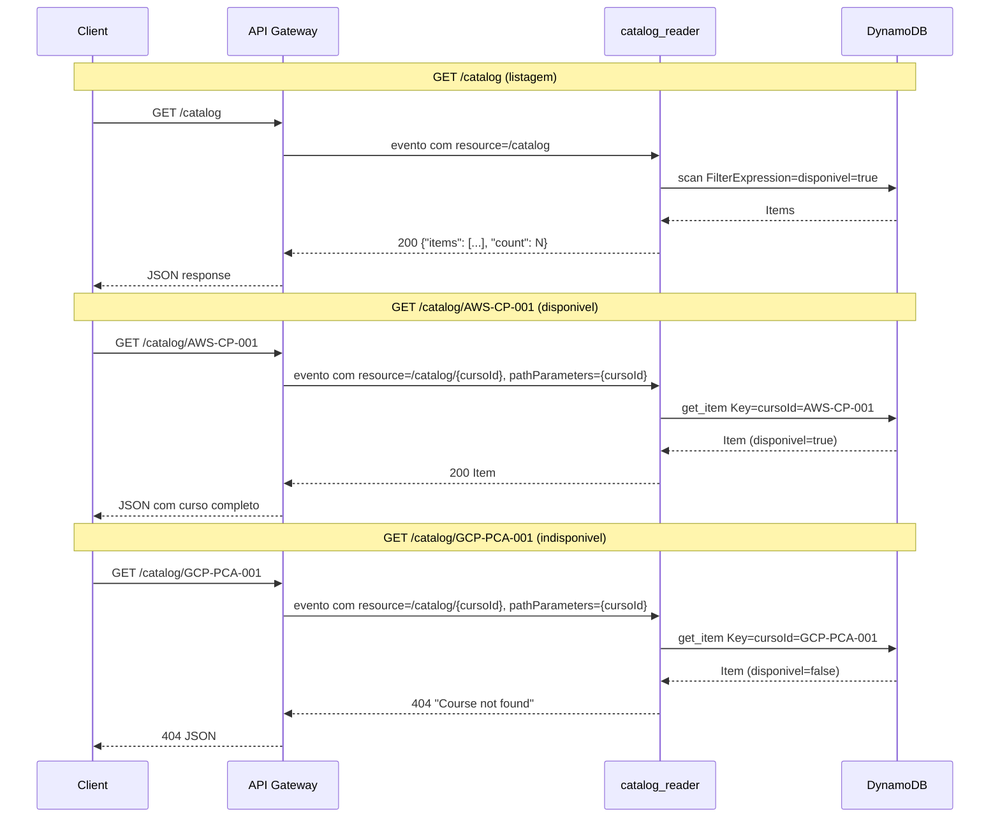

# Lambda `catalog_reader` (`src/catalog_reader/index.py`)

## Finalidade

Endpoint público de vitrine de produtos (`GET /catalog` e `GET /catalog/{cursoId}`). Integrada ao API Gateway, consulta a tabela DynamoDB `course-catalog-*` e retorna itens disponíveis.

## Comportamento

### `GET /catalog` (list_handler)

1. Executa `scan` na tabela DynamoDB com `FilterExpression="disponivel = :v"`.
2. Retorna 200 com `{"items": [...], "count": N}`.
3. Itens com `disponivel = false` nunca são retornados.
4. Se zero itens disponíveis, retorna 200 com lista vazia (não e erro).

### `GET /catalog/{cursoId}` (get_handler)

1. Extrai `cursoId` dos path parameters (`event.get("pathParameters") or {}`).
2. Executa `GetItem` no DynamoDB.
3. Se não encontrado, retorna 404 com "Course not found".
4. Se encontrado mas `disponivel = false`, retorna 404 com "Course not found" (não revela itens fora do ar).
5. Se encontrado e disponivel, retorna 200 com o item completo.

## Ambiente

| Variável | Descrição |
|----------|-----------|
| `DYNAMODB_TABLE` | Nome da tabela course-catalog-* |

## Decisões de design

### Item indisponivel retorna 404, não 403

Um item com `disponivel = false` retorna HTTP 404 (não 403) para não revelar a existência de produtos fora do ar. Atacantes não conseguem distinguir entre "produto não existe" e "produto existe mas esta indisponivel".

### Endpoint público sem autenticação

O catálogo e um endpoint público porque serve como vitrine antes do login. Clientes precisam ver os produtos disponíveis antes de se cadastrar. A autenticação so e exigida nos endpoints de compra (implementados em rodadas futuras).

### cursoId como sku de pedidos

O campo `cursoId` de cada item do catálogo se torna o campo `sku` nos itens do pedido. Essa relação conecta o catálogo ao fluxo de criação de pedidos sem acoplamento direto (nenhuma chave estrangeira e validada no momento da criação do pedido).

### Decimal serializado como float

O campo `preco` (Number do DynamoDB) chega como `Decimal` no boto3. O `_DecimalEncoder` ja existente em `common/http.py` serializa automaticamente como `float` no JSON de resposta, garantindo que `preco` nunca apareca como string.

### Scan com filtro (não consulta indexada)

Para o volume esperado (dezenas de cursos), `scan` com `FilterExpression` e adequado. Para milhares de itens, seria necessário um GSI com `disponivel` como chave de partição.

## Fluxo completo

