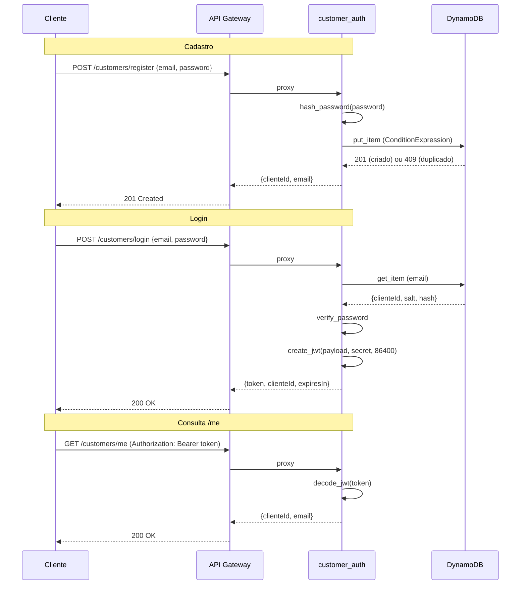

# Lambda `customer_auth` (`src/customer_auth/index.py`)

## Finalidade

Gerenciamento de identidade de clientes: cadastro, login e consulta de perfil. Exposta como tres endpoints no API Gateway existente (`/customers/register`, `/customers/login`, `/customers/me`), todos com `authorization-type: NONE`.

## Comportamento

1. **POST /customers/register**: recebe `email` e `password` no corpo JSON. Gera `clienteId` no formato `CUST-` + uuid hex truncado. Aplica hash na senha com PBKDF2-SHA256 e salt de 16 bytes. Grava na tabela DynamoDB com `ConditionExpression: attribute_not_exists(email)` para impedir cadastro duplicado. Retorna 201 com `clienteId` e `email`. Retorna 409 se email ja cadastrado.

2. **POST /customers/login**: recebe `email` e `password`. Busca o registro no DynamoDB. Verifica a senha com `verify_password`. Retorna 200 com JWT (`token`, `clienteId`, `expiresIn=86400`). Retorna 401 com mensagem generica "Invalid credentials" se email nao existe ou senha incorreta.

3. **GET /customers/me**: exige header `Authorization: Bearer <token>`. Decodifica e valida o JWT. Retorna 200 com `clienteId` e `email` do payload. Retorna 401 se token ausente, invalido ou expirado.

## Ambiente

| Variavel | Descricao |
|----------|-----------|
| `DYNAMODB_TABLE` | Nome da tabela DynamoDB de clientes (`customer-data-*`) |
| `JWT_SECRET` | Segredo HMAC para assinatura de tokens JWT |

## Decisoes de design

### Implementacao manual de hash e JWT

A conta de laboratorio nao tem acesso a Cognito, AWS Secrets Manager, AWS KMS Customer Managed Key nem SSM Parameter Store. Por isso, o hash de senha e a geracao/validacao de JWT foram implementados manualmente em `src/common/auth.py`, usando apenas a biblioteca padrao do Python 3.12 (`hashlib`, `hmac`, `base64`, `json`, `os`, `time`).

Isso e uma solucao adequada para fins educacionais e de portfolio. Em um ambiente de producao real, recomendamos:
- **Cognito User Pools** para gerenciamento completo de identidade (cadastro, login, MFA, recuperacao de senha).
- **Secrets Manager** para rotacao automatizada do JWT secret.
- **KMS** para assinatura assimetrica de tokens.

### Reutilizacao do modulo auth

`common/auth.py` foi desenhado para ser reutilizado por outras Lambdas no futuro. Qualquer Lambda que precise validar o token de quem chama pode importar `decode_jwt` de `common.auth`, passando o mesmo `JWT_SECRET`. Isso mantem baixo acoplamento: a Lambda de identidade gerencia o ciclo de vida do cliente, enquanto as demais Lambdas apenas validam tokens.

### Mensagens de erro de login

Por seguranca, `POST /customers/login` nunca revela se o email existe ou nao. A mensagem de erro e sempre "Invalid credentials", tanto para email inexistente quanto para senha incorreta. Isso dificulta ataques de enumeracao de usuarios.

## Fluxo completo

