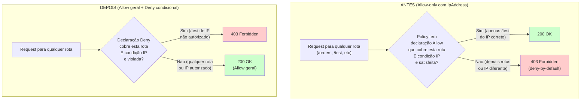

# Scripts de Deploy (`scripts/`)

## Finalidade

Infraestrutura como Codigo (IaC) via AWS CLI. Cada script provisiona um conjunto de recursos de forma idempotente.

## `lib.sh`

Biblioteca compartilhada com 20+ funções utilitarias.

### Mudancas recentes

| Função | Mudanca |
|--------|---------|
| `validate_env()` | Agora chama automaticamente `validate_resource_suffix()` quando `RESOURCE_SUFFIX` esta presente. |
| `validate_resource_suffix()` | Nova função: valida formato `[a-z0-9-]` do sufixo, falhando cedo se inválido. |
| `ensure_sqs_queue()` | `VisibilityTimeout` agora usa a variável `$VISIBILITY_TIMEOUT` (padrão 360s). |
| `validate_sqs_queue()` | Validação de VisibilityTimeout usa a mesma variável. |
| `ensure_event_source_mapping()` | Cria/atualiza mapeamento com `--function-response-types ReportBatchItemFailures`. |

## `deploy-order-processor.sh`

- Adicionado `SNS_TOPIC_ARN` nas variáveis de ambiente da Lambda.
- Adicionada permissão `sns:Publish` na role IAM.
- `validate_lambda_config` agora valida `SNS_TOPIC_ARN`.

## `deploy-lifecycle-ops.sh`

- Resolução do `SNS_TOPIC_ARN` via AWS CLI dentro da função `deploy_lifecycle_handler`.
- Adicionada permissão `sns:Publish` para alertas de pedido inexistente.
- `validate_lambda_config` agora valida `SNS_TOPIC_ARN`.

## `lib.sh` (Rodada 5)

| Função | Mudanca |
|--------|---------|
| `ensure_lambda_function()` | Agora aceita 7o parâmetro `reserved_concurrency`. Aplica `put-function-concurrency` quando definido. Tambem adiciona retention policy de 14 dias no log group. |
| `ensure_dlq_alarm()` | Nova função: cria CloudWatch Alarm monitorando `ApproximateNumberOfMessagesVisible` para DLQ, com ação SNS. Idempotente (checa existência antes de criar). |
| `ensure_api_resource_policy()` | Nova função: aplica Resource Policy no API Gateway. Usa padrão Allow geral + Deny condicional para /test. |
| `ensure_usage_plan_with_api_key()` | Nova função: cria Usage Plan com throttle (rateLimit=5, burstLimit=10) e quota (1000 req/dia), cria API Key e associa. |

## `deploy-api-flow.sh` (Rodada 5)

- Resource Policy aplicada no REST API quando `ALLOWED_SOURCE_IP` esta definido.
- Request Validator (JSON Schema) criado para metodo POST /orders, validando presença de `pedidoId` e `clienteId` antes de invocar a Lambda.

## `deploy-s3-flow.sh` (Rodada 5)

- TTL habilitado na tabela de auditoria DynamoDB (`order-batch-audit-*`) com `expiresAt` em 90 dias.
- DLQ alarm criado para `order-s3-batch-dlq-*`.

## `deploy-order-processor.sh` (Rodada 5)

- DLQ alarm criado para `order-persister-dlq-*`.

## `deploy-lifecycle-ops.sh` (Rodada 5)

- DLQ alarm criado para `cancel-order-dlq-*` e `update-order-dlq-*`.

## `deploy-frontend.sh` (Rodada 5)

- API Key obrigatoria no metodo POST /test (`--api-key-required`).
- Usage Plan criado com throttle e quota, associado ao stage prod.
- Frontend envia header `x-api-key` em todas as chamadas a /test.

## `validate-flow.sh`

- Adicionado Teste 1b: Duplicidade - reenvia o mesmo pedidoId e verifica que:
  - A API aceita (SQS dedup bypassed por uuid4).
  - O DynamoDB mantem o registro original (ConditionExpression).
- Adicionado SNS_TOPIC_ARN nas variáveis para verificação de alertas.
- Adicionado Teste 6a: POST /test sem API Key retorna 403.
- Adicionado Teste 10: Verificação de retentionInDays=14 nos log groups.
- Adicionado Teste 11: Verificação de existência dos 5 DLQ alarms.
- Adicionado Teste 12: Verificação de ReservedConcurrentExecutions configurado.
- Adicionado Teste 13: Verificação de TimeToLiveStatus=ENABLED na tabela de auditoria.

## Notas de validação manual

## `scripts/lib.sh` (Rodada 6)

- `ensure_api_resource_policy()`: Resource ARN restrito a `*/*/POST/test` (antes cobria toda a API). Movido de `deploy-api-flow.sh` para `deploy-frontend.sh`.

## `scripts/validate-flow.sh` (Rodada 6)

- Teste 14: Test Controller detailType Allowlist - envia detailType inválido (`OrderCreated`) e verifica retorno 400.

## `scripts/lib.sh` (Rodada 7)

- `ensure_api_resource_policy()`: Alterado do padrão Allow-only para Allow geral + Deny condicional. Antes, a politica tinha apenas uma declaração Allow com IpAddress, que bloqueava implicitamente as demais rotas. Agora, uma declaração Allow irrestrita cobre toda a API (Resource `/*`) e uma declaração Deny separada com NotIpAddress restringe apenas `/POST/test`.

### Resource Policy (Rodada 7 - Item 1)
A Resource Policy agora segue o padrão Allow geral + Deny condicional, que e o correto para restrição parcial em Resource Policies do API Gateway (Deny sempre precede Allow na avaliação).

Para testar a restrição de IP em /test:
1. Defina `ALLOWED_SOURCE_IP=SEU_IP/32` no .env e execute o deploy.
2. De outro IP (ou remova o header), tente chamar POST /test.
3. A resposta deve ser 403 Forbidden.
4. Com `ALLOWED_SOURCE_IP` vazio, o comportamento atual e mantido (sem restrição).
5. POST /orders e GET /orders/{orderId} continuam funcionando de qualquer IP, mesmo com ALLOWED_SOURCE_IP definido.

O Teste 15 em `validate-flow.sh` faz validação estrutural automatizada da politica (verifica a presença das declarações Allow e Deny com os Resources e Conditions corretos) sem depender de troca de IP de origem. O teste funcional completo (trocar IP de origem para confirmar 403/200) continua manual.

### Fluxo de avaliação da Resource Policy antes e depois

No fluxo "antes", o deny-by-default do API Gateway bloqueava qualquer rota não coberta por uma declaração Allow explicita. Como a única declaração Allow era para `*/POST/test` com IpAddress, as rotas `/orders` e `/orders/{orderId}` ficavam sem declaração e eram bloqueadas. No fluxo "depois", o Allow geral cobre toda a API, e apenas `/POST/test` tem um Deny condicional com NotIpAddress, que so bloqueia quando o IP não e o permitido.

## `scripts/validate-flow.sh` (Rodada 7)

- Teste 15: Resource Policy structural validation - valida estruturalmente a politica quando ALLOWED_SOURCE_IP esta definido, verificando presença de declaração Allow com Resource `/*` e declaração Deny com Resource `/POST/test` e Condition NotIpAddress. SKIP se ALLOWED_SOURCE_IP vazio.

## `deploy-catalog.sh` (Rodada 9)

- Cria tabela DynamoDB `course-catalog-*` com chave `cursoId` (S).
- Cria IAM Role com permissões `dynamodb:Scan` e `dynamodb:GetItem`.
- Deploy da Lambda `catalog-reader-*` com `reserved_concurrency=10`.
- Cria recursos `/catalog` e `/catalog/{cursoId}` no API Gateway.
- `setup_api_cors` em ambos os recursos.
- `lambda add-permission` com `source-arn` específico (`*/GET/catalog`, `*/GET/catalog/{cursoId}`).
- Path parameter `cursoId` configurado como obrigatório.

## `seed-catalog.sh` (Rodada 9)

- Script idempotente que popula a tabela `course-catalog-*` com 11 itens.
- Usa `put-item` sem `ConditionExpression` (upsert idempotente).
- Um item (`GCP-PCA-001`) e inserido com `disponível=false` para validação de filtro.
- Ao final, exibe contagem total de itens na tabela.

## `validate-flow.sh` (Rodada 9)

- Adicionada chamada a `deploy-catalog.sh` e `seed-catalog.sh` antes de `deploy-frontend.sh`.
- Teste 19: GET /catalog - verifica que items retorna lista com count > 0 e que GCP-PCA-001 (disponível=false) não esta presente.
- Teste 20: GET /catalog/{cursoId} - verifica que AWS-CP-001 retorna item completo e GCP-PCA-001 retorna 404.

## `deploy-order-gateway.sh` (Rodada 10)

Script separado de `deploy-order-processor.sh` por tres razoes:
- Adiciona GSI `clientId-index` na tabela de produção (operação de update-table, sem recriação).
- A Lambda `order_gateway` depende de `customer_auth` (JWT secret) e de `api-flow` (EventBus).
- A migração de GET /orders/{orderId} de `read_order` para `order_gateway` requer remoção de permissão antiga e adição de nova.

**Dependencias verificadas no início:** tabela de produção, EventBus, arquivo .jwt-secret, REST API.

**GSI:** Se `clientId-index` não existe, cria via `update-table` com `clientId` (HASH) e `processedAt` (RANGE), projection ALL. Polling de ate 5 minutos para status ACTIVE.

**IAM Role:** `dynamodb:GetItem` e `dynamodb:Query` na tabela e no indice; `events:PutEvents` no EventBus.

**Recursos API Gateway:** Cria `/orders/{orderId}/cancel`, adiciona GET/PATCH em `/orders/{orderId}` e GET em `/orders`. Remove a permissão antiga do `read_order` para a rota GET /orders/{orderId}.

## `validate-flow.sh` (Rodada 10)

- Adicionada chamada a `deploy-order-gateway.sh` entre `deploy-customer-auth.sh` e `deploy-catalog.sh`.
- Teste 21: GET /orders - lista apenas pedidos do cliente autenticado.
- Teste 22: GET /orders/{orderId} - valida dono (404 para pedido de outro cliente).
- Teste 23: POST /orders/{orderId}/cancel - cancelamento autenticado, verifica 202 e status final CANCELLED.
- Teste 24: PATCH /orders/{orderId} - atualização autenticada, verifica 202 e status final UPDATED.
