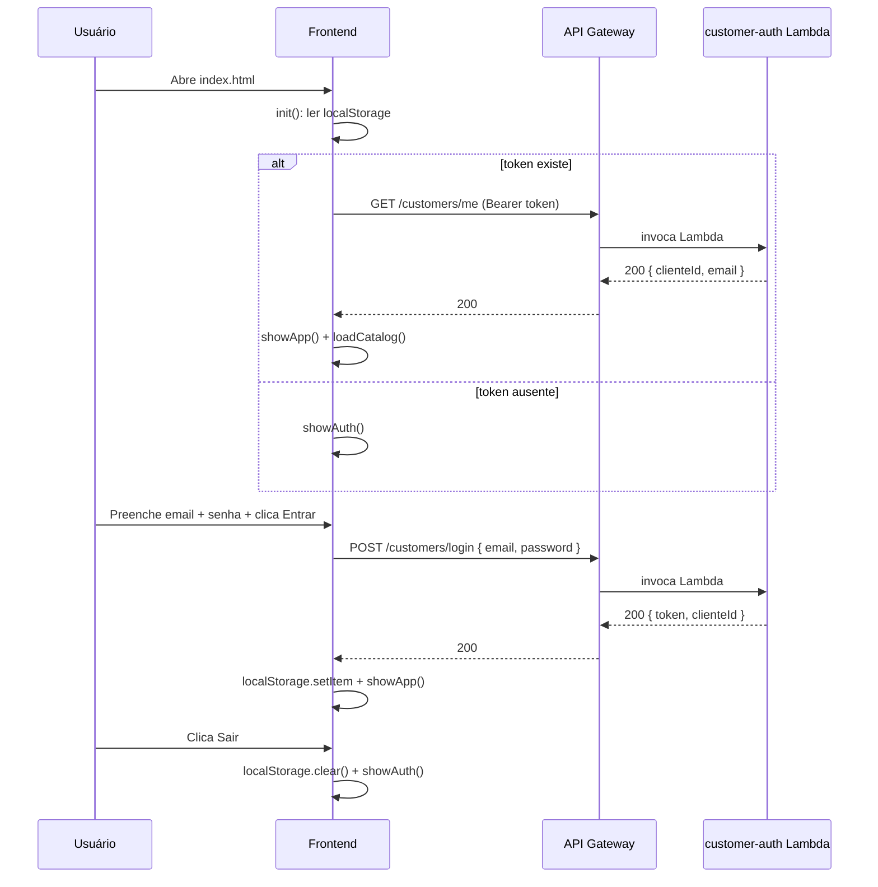
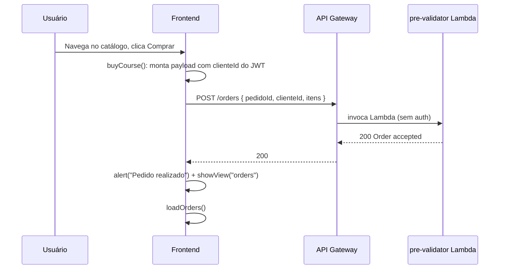
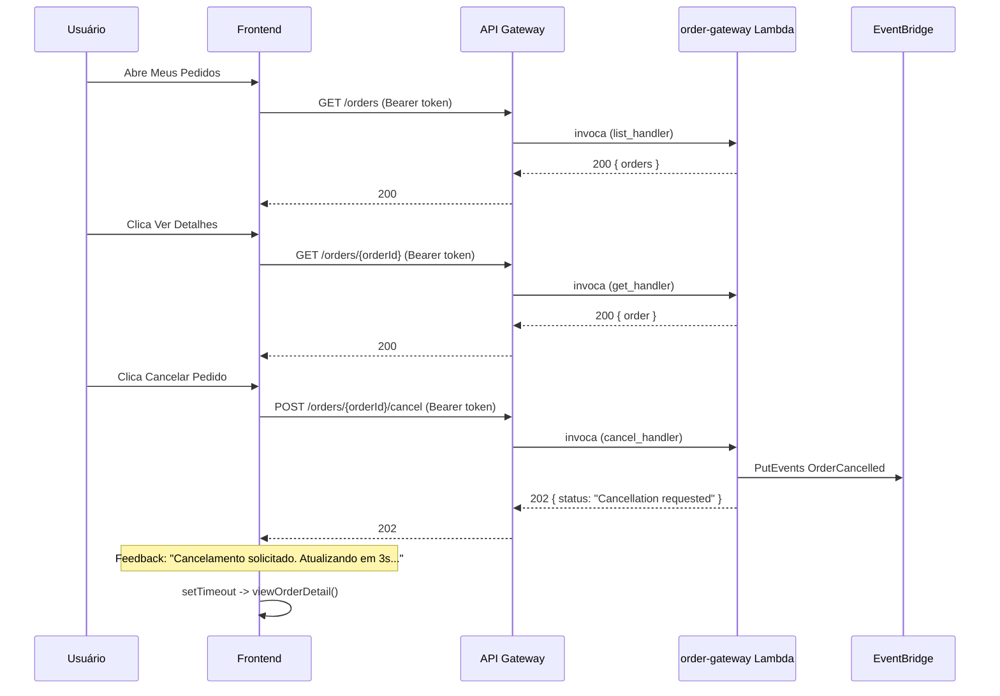

# Frontend

## Finalidade

Dois frontends servidos no mesmo bucket S3 Static Website:

- **`index.html`** / **`app.js`**: Produto para usuário final (CloudCert). Vem com autenticação JWT, catálogo de cursos, meus pedidos, cancelamento e atualização.

- **`qa.html`** / **`qa.js`**: Painel de QA interno. Usado para validação manual e automatizada dos fluxos do pipeline de deploy.

## Estrutura de arquivos

| Arquivo | Papel |
|---------|-------|
| `frontend/index.html` | Pagina principal do produto (CloudCert). Estrutura com view de auth e view do app. |
| `frontend/app.js` | Lógica do produto: autenticação, catálogo, pedidos, ciclo de vida. |
| `frontend/qa.html` | Painel de QA interno (copiado do index.html original). |
| `frontend/qa.js` | Lógica do painel de QA (copiado do app.js original). |
| `frontend/style.css` | Estilos compartilhados entre produto e QA. |
| `frontend/config.template.js` | Template com placeholders processado pelo deploy. |

## Gestao de estado

Duas chaves no `localStorage`:

- `oms_token`: string do JWT emitido por `POST /customers/login`.
- `oms_user`: objeto JSON com `clienteId` e `email` do usuário logado.

Ao carregar a página, o frontend verifica se `oms_token` existe e chama `GET /customers/me` com o token:

- Se 200: renderiza a view autenticada.
- Se 401 ou falhar: limpa `localStorage` e renderiza a view de autenticação.

O `catalogCache` e um array em memoria que armazena o resultado de `GET /catalog` para evitar refetch ao trocar filtros.

## Fluxo de autenticação

## Fluxo de compra

## Fluxo de ciclo de vida

## Decisões de design

### Injeção de clienteId no POST /orders

O `POST /orders` não exige autenticação no backend (pre-validator não valida JWT). O frontend injeta o `clienteId` do objeto `currentUser` (obtido do JWT) como campo `clienteId` do payload. Isso evita alterar o pre-validator e mantem a compatibilidade com o fluxo original.

### Feedback assíncrono para cancelamento e atualização

Cancelamento e atualização são operações assincronas via EventBridge. O frontend retorna 202 e exibe "solicitado, aguarde" porque a mudança de estado so ocorre apos o lifecycle-processor processar o evento. Apos 3 segundos o frontend faz refresh automático do detalhe.

### Preservação do QA dashboard

O QA dashboard foi preservado em vez de removido porque e usado pelo `validate-flow.sh` (Testes 6, 7, 8) e serve como ferramenta de validação do pipeline de deploy. Registrar, logar e testar o fluxo completo no QA dashboard continua funcionando normalmente em `/qa.html`.

### localStorage em vez de HttpOnly cookies

Nao ha servidor Node/backend para SSR. `localStorage` e adequado para o escopo de portfolio. Em produção, cookies HttpOnly seriam preferíveis para mitigar XSS, mas a ausência de um backend de renderização inviabiliza essa abordagem sem um proxy reverso dedicado.
