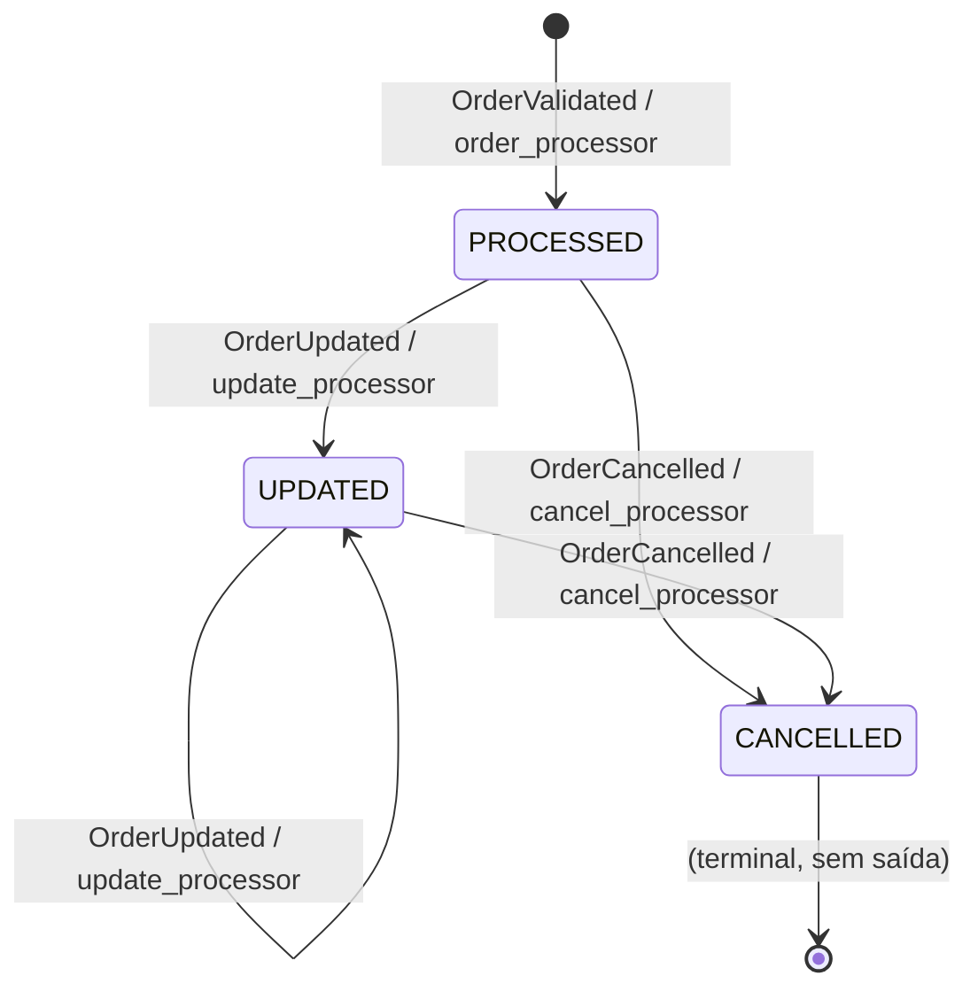

# Maquina de Estados do Pedido

## Estados

O sistema gerência tres estados de pedido na tabela DynamoDB `order-production-data`.

## Transições

| De | Para | Gatilho (DetailType) | Lambda | ConditionExpression |
|----|------|----------------------|--------|-------------------|
| (novo) | PROCESSED | OrderValidated | order_processor | `attribute_not_exists(orderId)` |
| PROCESSED | UPDATED | OrderUpdated | lifecycle_ops (update) | `attribute_exists(orderId) AND #s <> :cancelledStatus` |
| PROCESSED | CANCELLED | OrderCancelled | lifecycle_ops (cancel) | `attribute_exists(orderId)` |
| UPDATED | UPDATED | OrderUpdated | lifecycle_ops (update) | `attribute_exists(orderId) AND #s <> :cancelledStatus` |
| UPDATED | CANCELLED | OrderCancelled | lifecycle_ops (cancel) | `attribute_exists(orderId)` |
| CANCELLED | qualquer | qualquer | N/A | Bloqueado pelo `#s <> :cancelledStatus` |

## Regras de negócio

1. PROCESSED e o estado inicial, criado exclusivamente pelo order_processor.
2. UPDATED e CANCELLED são atingíveis a partir de PROCESSED ou UPDATED.
3. CANCELLED e um estado terminal: nenhuma transição de saída e permitida.
4. A tentativa de atualizar um pedido CANCELLED dispara um alerta SNS com a mensagem "Order does not exist or is already cancelled, update skipped."
5. Cancelar um pedido ja CANCELLED e idempotente (ConditionExpression falha, mas apenas loga e não publica alerta).
