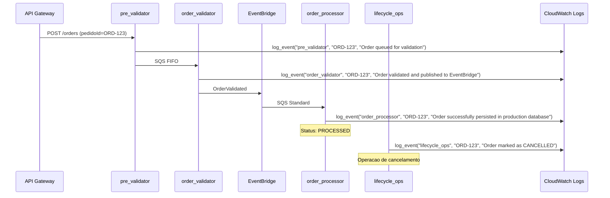

# Observabilidade com Logging Estruturado

## Finalidade

Sem AWS X-Ray disponivel na conta de laboratorio, o logging estruturado com `pedidoId` como correlacao permite rastrear a jornada completa de um pedido atraves das Lambdas usando CloudWatch Logs Insights.

## Funcao `log_event()`

Definida em `src/common/utils.py`, produz uma linha JSON por evento:

```json
{"stage": "order_processor", "pedidoId": "ORD-123", "message": "Order successfully persisted in production database", "timestamp": "2025-01-01T00:00:00Z"}
```

Campos:
- `stage`: nome da Lambda que emitiu o log (e.g., `pre_validator`, `order_validator`, `order_processor`, `lifecycle_ops`, `batch_processor`)
- `pedidoId`: identificador unico do pedido sendo processado
- `message`: descricao do evento
- `timestamp`: instante da emissao em ISO 8601

## Fluxo de correlacao



## Query no CloudWatch Logs Insights

Para visualizar a jornada completa de um pedido, execute a seguinte query no CloudWatch Logs Insights, selecionando todos os log groups das Lambdas:

```
fields @timestamp, stage, pedidoId, message
| filter pedidoId = "ORD-123"
| sort @timestamp asc
```

Resultado esperado:

| @timestamp | stage | pedidoId | message |
|------------|-------|----------|---------|
| 2025-01-01T00:00:00Z | pre_validator | ORD-123 | Order queued for validation |
| 2025-01-01T00:00:01Z | order_validator | ORD-123 | Order validated and published to EventBridge |
| 2025-01-01T00:00:02Z | order_processor | ORD-123 | Order successfully persisted in production database |

## Lambdas que emitem log estruturado

| Lambda | stage | Eventos logados |
|--------|-------|-----------------|
| pre_validator | `pre_validator` | Order queued for validation |
| order_validator | `order_validator` | Order validated and published to EventBridge |
| order_processor | `order_processor` | Order persisted, duplicate skipped |
| lifecycle_ops | `lifecycle_ops` | Order marked as CANCELLED, Order updated, condition failed |
| batch_processor | `batch_processor` | File validated successfully, error validating file |
