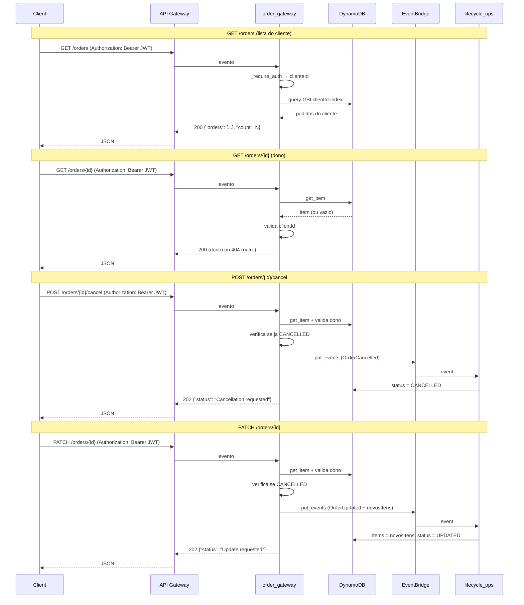

# Lambda `order_gateway` (`src/order_gateway/index.py`)

## Finalidade

Gateway de pedidos autenticado. Ponto de entrada de producao para leitura e ciclo de vida de pedidos (substitui o `test_controller` no fluxo de usuario final). Todos os handlers validam JWT antes de executar qualquer logica de negocio.

## Comportamento

### `GET /orders` (list_handler)
Retorna lista de pedidos do cliente autenticado via GSI `clientId-index`.

| Cenario | HTTP | Resposta |
|---------|------|----------|
| Token valido, pedidos existentes | 200 | `{"orders": [...], "count": N}` |
| Token valido, nenhum pedido | 200 | `{"orders": [], "count": 0}` |
| Sem token ou invalido | 401 | `{"error": "Missing or invalid Authorization header"}` |

### `GET /orders/{orderId}` (get_handler)
Retorna pedido especifico, apenas se pertencer ao cliente autenticado.

| Cenario | HTTP | Resposta |
|---------|------|----------|
| Pedido existe e e do cliente | 200 | Item completo |
| Pedido nao existe | 404 | `{"error": "Order not found"}` |
| Pedido existe mas e de outro cliente | 404 | `{"error": "Order not found"}` (mesma mensagem) |
| Sem token ou invalido | 401 | `{"error": "..."}` |

### `POST /orders/{orderId}/cancel` (cancel_handler)
Publica evento `OrderCancelled` no EventBridge (fluxo assincrono, processado por `lifecycle_ops`).

| Cenario | HTTP | Resposta |
|---------|------|----------|
| Sucesso | 202 | `{"status": "Cancellation requested", "orderId": "..."}` |
| Pedido ja cancelado | 409 | `{"error": "Order is already cancelled"}` |
| Pedido de outro cliente | 404 | `{"error": "Order not found"}` |
| EventBridge falhou | 500 | `{"error": "Failed to publish cancellation event"}` |

### `PATCH /orders/{orderId}` (update_handler)
Publica evento `OrderUpdated` no EventBridge com `novosItens`.

| Cenario | HTTP | Resposta |
|---------|------|----------|
| Sucesso | 202 | `{"status": "Update requested", "orderId": "..."}` |
| Pedido cancelado | 409 | `{"error": "Cannot update a cancelled order"}` |
| `novosItens` ausente/vazio | 400 | `{"error": "novosItens is required and must be a non-empty array"}` |
| Pedido de outro cliente | 404 | `{"error": "Order not found"}` |

## Ambiente

| Variavel | Descricao |
|----------|-----------|
| `DYNAMODB_TABLE` | Nome da tabela order-production-data-* |
| `JWT_SECRET` | Segredo para validacao de tokens JWT |
| `EVENT_BUS_NAME` | Nome do EventBridge custom bus para eventos de ciclo de vida |

## Decisoes de design

### Autenticacao na Lambda, nao no API Gateway

O API Gateway continua com `authorization-type: NONE`. A validacao do JWT ocorre dentro da Lambda. Motivo: a conta de laboratorio nao tem Cognito nem Lambda Authorizer. Um Lambda Authorizer reduziria o custo de invocacao (bloqueio antes da Lambda de negocio), mas adiciona complexidade de deploy e exige outra Lambda com seu proprio zip e permissoes. A diferenca de custo e irrelevante para este cenario educacional.

### Cancel e update retornam 202, nao 200

A operacao e assincrona. A Lambda publica um evento no EventBridge e retorna imediatamente. O estado real do pedido muda quando o `lifecycle_ops` processa o evento. Retornar 202 sinaliza que a requisicao foi aceita para processamento, mas o resultado final nao esta disponivel na resposta.

### 404 generico para pedido inexistente ou de outro cliente

Nao revelar se um pedido existe ou nao quando o cliente nao e o dono. Um atacante nao consegue distinguir entre "este orderId nunca existiu" e "este orderId existe mas nao e seu". Ambos retornam 404 com a mesma mensagem.

### Ponte clienteId / clientId

O JWT contem `clienteId` (convencao da API de identidade). O DynamoDB persiste como `clientId` (convencao do `order_processor`, que faz `str(order_detail.get('clienteId'))` ao criar o item). O `order_gateway` usa o valor de `clienteId` do JWT como argumento de busca no campo `clientId` da tabela.

### test_controller permanece como ferramenta de QA

O `test_controller` (POST /test) continua existindo como ferramenta interna de QA, permitindo que testadores publiquem eventos diretamente no EventBridge sem passar pelo fluxo de autenticacao JWT. Nao e substituido porque:
- Testes de integracao (Tests 6-8) dependem dele.
- Permite debug de fluxos de ciclo de vida sem depender do gateway.
- E protegido por API Key e Usage Plan.

## Fluxos

