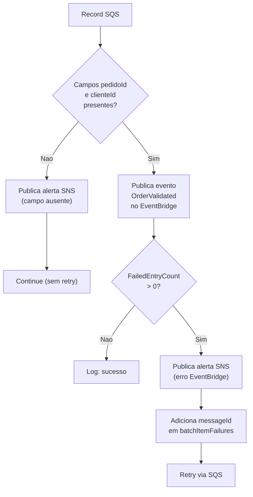

# Lambda `order_validator` (`src/order_validator/index.py`)

## Finalidade

Consome a fila SQS FIFO de validacao, publica pedidos validados no EventBridge e dispara alertas SNS em caso de falha.

## Comportamento

1. Le cada mensagem da fila SQS FIFO.
2. Se o registro nao possui `pedidoId` ou `clienteId` (campo ausente):
   - Publica alerta SNS com o conteudo do record.
   - Nao adiciona o `messageId` a `batchItemFailures` (reenvio nao resolve payload malformado).
   - Continua para o proximo record.
3. Publica evento `OrderValidated` no EventBridge com os dados do pedido.
4. Se o EventBridge falhar (`FailedEntryCount > 0`):
   - Publica alerta SNS com detalhes do erro.
   - Adiciona o `messageId` a `batchItemFailures` para reprocessamento.
5. Retorna `{"batchItemFailures": [...]}`.

## Ambiente

| Variavel | Descricao |
|----------|-----------|
| `EVENT_BUS_NAME` | Nome do barramento de eventos |
| `SNS_TOPIC_ARN` | ARN do topico SNS para alertas |

## Fluxo de erros

## Mudancas recentes

- Uso de `common.sns.publish_error()` em vez de try/except inline.
- Retorno alterado de `{'statusCode': 200}` para `{"batchItemFailures": [...]}`.
- `raise` substituido por `batch_item_failures.append(...)`.
- Campo ausente agora dispara alerta SNS (antes: descarte silencioso).
- Timestamp substituido por `common.utils.utcnow_iso()`.
